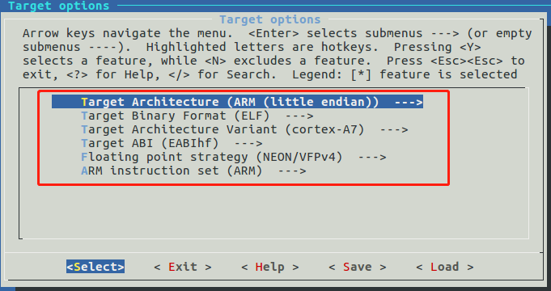
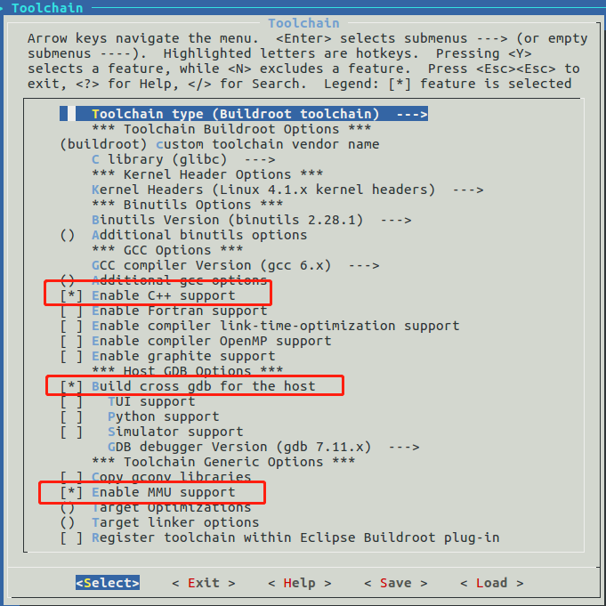
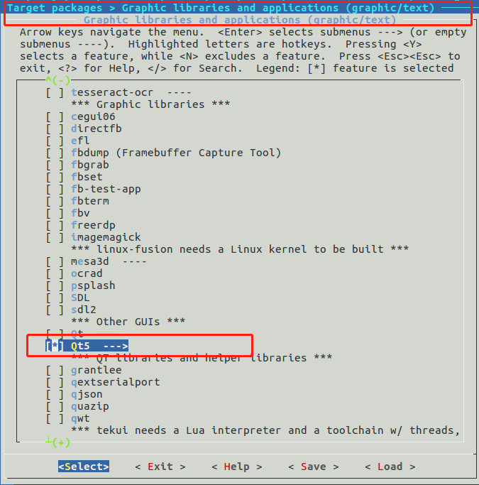
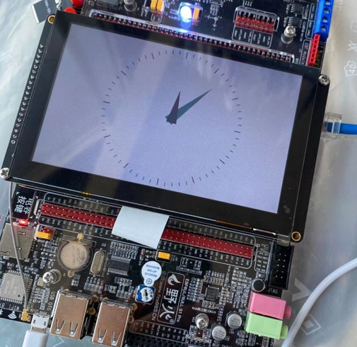

# 制作buildroot根文件系统(一)：根文件系统和Qt5例程

** 本小节的文章为网友投稿，仅供参考 **


- 主机环境：ubuntu16.04-64bit
- 硬件版本：野火imx6ull-pro emmc


官方资料总链接：-[野火i.MX 6ULL Linux开发板资料汇总](https://github.com/Embedfire/products/wiki/%E9%87%8E%E7%81%ABi.MX-6ULL-Linux%E5%BC%80%E5%8F%91%E6%9D%BF)

---


#### 一、制作根文件系统

##### 1.下载buildroot

本篇用的是 buildroot-2017.08.1.tar.gz，制作方法都一样，需要其它版本点这里：- [buildroot各版本官方下载页](https://git.busybox.net/buildroot/refs/)

```
# 新建目录
mkdir rootfs
cd rootfs

# 直接在命令行里下载
wget https://git.busybox.net/buildroot/snapshot/buildroot-2017.08.1.tar.gz

# 解压到当前目录
tar xvf buildroot-2017.08.1.tar.gz
```
##### 2.配置buildroot

- 进入配置菜单
```
cd buildroot-2017.08.1/
make menuconfig
```

- 关键配置截图

cpu平台：


armgcc:


qt5:



- 使用现成的配置

由于细节无法全面展现，新手可以使用我提供的现成配置。

点这里查看下载：[my-imx6u-buildroot2017-v1.0.config](https://github.com/Jmhh247/fireimx6-tutorial/blob/master/my-imx6u-buildroot2017-v1.0.config)

把我的配置文件复制到buildroot目录，并改名为.config。

```
cd buildroot-2017.08.1/

cp my-imx6u-buildroot2017-v1.0.config .config
```

- 查看已经配置的软件包

如果时间久忘记了，可以用来查看配置情况。
```
make show-targets
```


##### 3.编译buildroot

很简单，直接make.

```
cd buildroot-2017.08.1/

time make
```

整个编译过程较长，可能达几个小时。

##### 4.生成的根文件系统和工具链位置
生成根文件系统位置：
```
buildroot-2017.08.1/output/images/rootfs.tar
```

制作好的工具链位置：
```
# arm-gcc
buildroot-2017.08.1/output/host/bin/arm-buildroot-linux-gnueabihf-

# qmake
buildroot-2017.08.1/output/build/qt5base-5.9.1/bin/qmake
```

有了ARMGCC工具链就可以编译linux，uboot，和你的应用程序等，本篇不涉及这些，不再展开介绍。

---
二、编译Qt5自带例程

##### 1.buildroot中的Qt5自带例程位置在：
```
rootfs/buildroot-2017.08.1/output/build/qt5base-5.9.1/examples/widgets/widgets/
```

##### 2.buildroot中的Qt5自带例程编译方法

编译过程很简单，一共两步：
- 先执行qmake;
- 再执行make。

##### 3.一个例子

给出一个例子，可以直观看到整个过程：
```
vmtest@linux-test:~/work/imx6ul-fire/code-build/rootfs/buildroot-2017.08.1/output/build/qt5base-5.9.1/examples/widgets/widgets/analogclock$ /home/vmtest/work/im
x6ul-fire/code-build/rootfs/buildroot-2017.08.1/output/build/qt5base-5.9.1/bin/qmake -v
QMake version 3.1
Using Qt version 5.9.1 in /home/vmtest/work/imx6ul-fire/code-build/rootfs/buildroot-2017.08.1/output/host/arm-buildroot-linux-gnueabihf/sysroot/usr/lib
vmtest@linux-test:~/work/imx6ul-fire/code-build/rootfs/buildroot-2017.08.1/output/build/qt5base-5.9.1/examples/widgets/widgets/analogclock$ ls
analogclock.cpp  analogclock.h  analogclock.pro  main.cpp
vmtest@linux-test:~/work/imx6ul-fire/code-build/rootfs/buildroot-2017.08.1/output/build/qt5base-5.9.1/examples/widgets/widgets/analogclock$ /home/vmtest/work/im
x6ul-fire/code-build/rootfs/buildroot-2017.08.1/output/build/qt5base-5.9.1/bin/qmake analogclock.pro 
vmtest@linux-test:~/work/imx6ul-fire/code-build/rootfs/buildroot-2017.08.1/output/build/qt5base-5.9.1/examples/widgets/widgets/analogclock$ ls
analogclock.cpp  analogclock.h  analogclock.pro  main.cpp  Makefile
vmtest@linux-test:~/work/imx6ul-fire/code-build/rootfs/buildroot-2017.08.1/output/build/qt5base-5.9.1/examples/widgets/widgets/analogclock$ time make
/home/vmtest/work/imx6ul-fire/code-build/rootfs/buildroot-2017.08.1/output/host/bin/arm-buildroot-linux-gnueabihf-g++ -c -pipe -D_LARGEFILE_SOURCE -D_LARGEFILE64_SOURCE -D_FILE_OFFSET_BITS=64 -Os --sysroot=/home/vmtest/work/imx6ul-fire/code-build/rootfs/buildroot-2017.08.1/output/host/arm-buildroot-linux-gnueabihf/sysroot -O2 -O3 -fno-exceptions -Wall -W -D_REENTRANT -fPIC -DQT_NO_EXCEPTIONS -D_LARGEFILE64_SOURCE -D_LARGEFILE_SOURCE -DQT_NO_DEBUG -DQT_WIDGETS_LIB -DQT_GUI_LIB -DQT_CORE_LIB -I. -I../../../../include -I../../../../include/QtWidgets -I../../../../include/QtGui -I../../../../include/QtCore -I.moc -I../../../../mkspecs/devices/linux-buildroot-g++ -o .obj/analogclock.o analogclock.cpp
/home/vmtest/work/imx6ul-fire/code-build/rootfs/buildroot-2017.08.1/output/host/bin/arm-buildroot-linux-gnueabihf-g++ -c -pipe -D_LARGEFILE_SOURCE -D_LARGEFILE64_SOURCE -D_FILE_OFFSET_BITS=64 -Os --sysroot=/home/vmtest/work/imx6ul-fire/code-build/rootfs/buildroot-2017.08.1/output/host/arm-buildroot-linux-gnueabihf/sysroot -O2 -O3 -fno-exceptions -Wall -W -D_REENTRANT -fPIC -DQT_NO_EXCEPTIONS -D_LARGEFILE64_SOURCE -D_LARGEFILE_SOURCE -DQT_NO_DEBUG -DQT_WIDGETS_LIB -DQT_GUI_LIB -DQT_CORE_LIB -I. -I../../../../include -I../../../../include/QtWidgets -I../../../../include/QtGui -I../../../../include/QtCore -I.moc -I../../../../mkspecs/devices/linux-buildroot-g++ -o .obj/main.o main.cpp
/home/vmtest/work/imx6ul-fire/code-build/rootfs/buildroot-2017.08.1/output/host/bin/arm-buildroot-linux-gnueabihf-g++ -pipe -D_LARGEFILE_SOURCE -D_LARGEFILE64_SOURCE -D_FILE_OFFSET_BITS=64 -Os --sysroot=/home/vmtest/work/imx6ul-fire/code-build/rootfs/buildroot-2017.08.1/output/host/arm-buildroot-linux-gnueabihf/sysroot -O2 -O3 -fno-exceptions -Wall -W -dM -E -o .moc/moc_predefs.h ../../../../mkspecs/features/data/dummy.cpp
/home/vmtest/work/imx6ul-fire/code-build/rootfs/buildroot-2017.08.1/output/build/qt5base-5.9.1/bin/moc -DQT_NO_EXCEPTIONS -D_LARGEFILE64_SOURCE -D_LARGEFILE_SOURCE -DQT_NO_DEBUG -DQT_WIDGETS_LIB -DQT_GUI_LIB -DQT_CORE_LIB --include .moc/moc_predefs.h -I/home/vmtest/work/imx6ul-fire/code-build/rootfs/buildroot-2017.08.1/output/build/qt5base-5.9.1/mkspecs/devices/linux-buildroot-g++ -I/home/vmtest/work/imx6ul-fire/code-build/rootfs/buildroot-2017.08.1/output/build/qt5base-5.9.1/examples/widgets/widgets/analogclock -I/home/vmtest/work/imx6ul-fire/code-build/rootfs/buildroot-2017.08.1/output/build/qt5base-5.9.1/include -I/home/vmtest/work/imx6ul-fire/code-build/rootfs/buildroot-2017.08.1/output/build/qt5base-5.9.1/include/QtWidgets -I/home/vmtest/work/imx6ul-fire/code-build/rootfs/buildroot-2017.08.1/output/build/qt5base-5.9.1/include/QtGui -I/home/vmtest/work/imx6ul-fire/code-build/rootfs/buildroot-2017.08.1/output/build/qt5base-5.9.1/include/QtCore -I/home/vmtest/work/imx6ul-fire/code-build/rootfs/buildroot-2017.08.1/output/host/arm-buildroot-linux-gnueabihf/include/c++/6.4.0 -I/home/vmtest/work/imx6ul-fire/code-build/rootfs/buildroot-2017.08.1/output/host/arm-buildroot-linux-gnueabihf/include/c++/6.4.0/arm-buildroot-linux-gnueabihf -I/home/vmtest/work/imx6ul-fire/code-build/rootfs/buildroot-2017.08.1/output/host/arm-buildroot-linux-gnueabihf/include/c++/6.4.0/backward -I/home/vmtest/work/imx6ul-fire/code-build/rootfs/buildroot-2017.08.1/output/host/lib/gcc/arm-buildroot-linux-gnueabihf/6.4.0/include -I/home/vmtest/work/imx6ul-fire/code-build/rootfs/buildroot-2017.08.1/output/host/lib/gcc/arm-buildroot-linux-gnueabihf/6.4.0/include-fixed -I/home/vmtest/work/imx6ul-fire/code-build/rootfs/buildroot-2017.08.1/output/host/arm-buildroot-linux-gnueabihf/include -I/home/vmtest/work/imx6ul-fire/code-build/rootfs/buildroot-2017.08.1/output/host/arm-buildroot-linux-gnueabihf/sysroot/usr/include analogclock.h -o .moc/moc_analogclock.cpp
/home/vmtest/work/imx6ul-fire/code-build/rootfs/buildroot-2017.08.1/output/host/bin/arm-buildroot-linux-gnueabihf-g++ -c -pipe -D_LARGEFILE_SOURCE -D_LARGEFILE64_SOURCE -D_FILE_OFFSET_BITS=64 -Os --sysroot=/home/vmtest/work/imx6ul-fire/code-build/rootfs/buildroot-2017.08.1/output/host/arm-buildroot-linux-gnueabihf/sysroot -O2 -O3 -fno-exceptions -Wall -W -D_REENTRANT -fPIC -DQT_NO_EXCEPTIONS -D_LARGEFILE64_SOURCE -D_LARGEFILE_SOURCE -DQT_NO_DEBUG -DQT_WIDGETS_LIB -DQT_GUI_LIB -DQT_CORE_LIB -I. -I../../../../include -I../../../../include/QtWidgets -I../../../../include/QtGui -I../../../../include/QtCore -I.moc -I../../../../mkspecs/devices/linux-buildroot-g++ -o .obj/moc_analogclock.o .moc/moc_analogclock.cpp
/home/vmtest/work/imx6ul-fire/code-build/rootfs/buildroot-2017.08.1/output/host/bin/arm-buildroot-linux-gnueabihf-g++ --sysroot=/home/vmtest/work/imx6ul-fire/code-build/rootfs/buildroot-2017.08.1/output/host/arm-buildroot-linux-gnueabihf/sysroot -Wl,-O1 -Wl,--enable-new-dtags -o analogclock .obj/analogclock.o .obj/main.o .obj/moc_analogclock.o   -L/home/vmtest/work/imx6ul-fire/code-build/rootfs/buildroot-2017.08.1/output/build/qt5base-5.9.1/lib -lQt5Widgets -lQt5Gui -lQt5Core -lrt -ldl -latomic -lpthread 
 
real  0m3.491s
user  0m2.031s
sys 0m1.433s
vmtest@linux-test:~/work/imx6ul-fire/code-build/rootfs/buildroot-2017.08.1/output/build/qt5base-5.9.1/examples/widgets/widgets/analogclock$ ls
analogclock      analogclock.h    main.cpp
analogclock.cpp  analogclock.pro  Makefile
vmtest@linux-test:~/work/imx6ul-fire/code-build/rootfs/buildroot-2017.08.1/output/build/qt5base-5.9.1/examples/widgets/widgets/analogclock$ file analogclock
analogclock: ELF 32-bit LSB executable, ARM, EABI5 version 1 (SYSV), dynamically linked, interpreter /lib/ld-, for GNU/Linux 4.1.0, not stripped
vmtest@linux-test:~/work/imx6ul-fire/code-build/rootfs/buildroot-2017.08.1/output/build/qt5base-5.9.1/examples/widgets/widgets/analogclock$
```


---
#### 三、测试根文件系统


开发板用的野火出厂固件，这里只替换根文件系统。

使用NFS挂载buildroot根文件系统来测试，操作方法如下 (里面用到的IP和相关目录，需要改成你的~)：

##### 1.解压根文件系统到NFS目录内

```
cd buildroot-2017.08.1/output/images/

sudo tar xvf rootfs.tar -C /nfsroot/imx6ull-nfs/buildroot2017-v1/

sync
```

##### 2.开发板从NFS启动根文件系统

进入uboot命令行设置启动参数：

- 设置bootargs
```
setenv bootargs "console=${console},${baudrate} root=/dev/nfs ip=192.168.2.102:192.168.2.119:192.168.2.1:255.255.255.0:imx6ull:eth0:off rootwait rw nfsroot=192.168.2.119:/nfsroot/imx6ull-nfs/buildroot2017-v1 consoleblank=0 init=/sbin/init";saveenv
```
- 设置bootcmd，设置后开发板自动从NFS启动
```
setenv bootcmd "mmc dev 1;mmc dev 1; mmc rescan;fatload mmc 1 0x80800000 zImage;fatload mmc 1 0x83000000 imx6ull-14x14-evk.dtb;bootz 0x80800000 - 0x83000000"
```

到这里，一切正常的话，系统就启动了！


```
Welcome to Buildroot
buildroot login: root
# cd /
# ls
bin      lib      media    proc     sbin     usr
dev      lib32    mnt      root     sys      var
etc      linuxrc  opt      run      tmp
#

```

##### 3.运行Qt5例程

- 配置环境变量
```
export  QT_QPA_PLATFORM=linuxfb:fb=/dev/fb0
export  QT_QPA_EVDEV_TOUCHSCREEN_PARAMETERS=/dev/input/event1:inverty
```
- 运行例程

```
# export  QT_QPA_PLATFORM=linuxfb:fb=/dev/fb0
# export  QT_QPA_EVDEV_TOUCHSCREEN_PARAMETERS=/dev/input/event1:inverty
# ./analogclock

```



---
 *本篇完。*