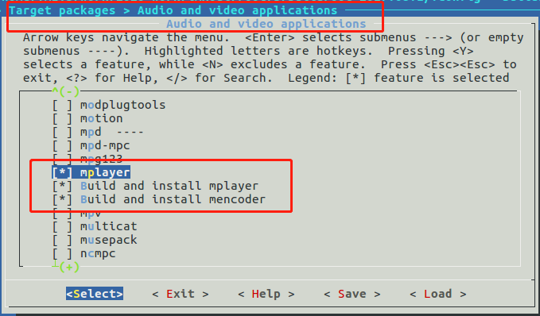
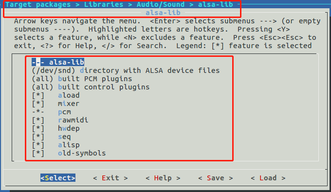
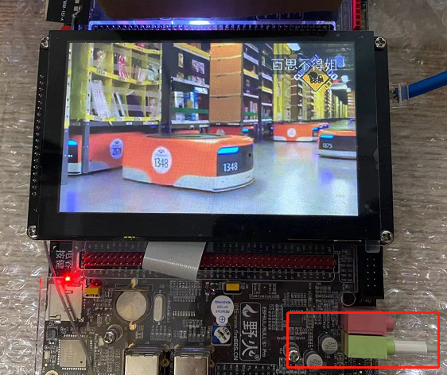

## 制作buildroot根文件系统(三)：使用mplayer播放视频


- 主机环境：ubuntu16.04-64bit
- 硬件版本：野火imx6ull-pro emmc


---


#### 一、制作根文件系统

详细的制作方法请参考：[制作buildroot根文件系统(一)：根文件系统和Qt5例程](buildroot2017-1.md)

本篇只介绍 buildroot 中关于 mplayer 的配置。

##### 1.关于 mplayer
mplayer 是一款开源多媒体播放器，基于命令行界面，以GNU通用公共许可证发布。可在各主流作业系统使用，例如Linux和其他类Unix系统、Windows及Mac OS X系统。

##### 2.配置buildroot

- 进入配置菜单
```
cd buildroot-2017.08.1/
make menuconfig
```

- 关键配置截图

选中 mplayer:


选中 alsa-lib，否则没声音：



- 使用现成的配置

由于细节无法全面展现，新手可以使用我提供的基础配置，在基础配置增加选项。

点这里查看下载：[my-imx6u-buildroot2017-v1.0.config](https://github.com/Jmhh247/fireimx6-tutorial/blob/master/my-imx6u-buildroot2017-v1.0.config)

把我的配置文件复制到buildroot目录，并改名为.config。

```
cd buildroot-2017.08.1/

cp my-imx6u-buildroot2017-v1.0.config .config
```


##### 3.编译buildroot

很简单，直接make.

```
cd buildroot-2017.08.1/

time make
```

整个编译过程较长，可能达几个小时。

##### 4.生成的根文件系统和工具链位置
生成根文件系统位置：
```
buildroot-2017.08.1/output/images/rootfs.tar
```

制作好的工具链位置：
```
# arm-gcc
buildroot-2017.08.1/output/host/bin/arm-buildroot-linux-gnueabihf-

# qmake
buildroot-2017.08.1/output/build/qt5base-5.9.1/bin/qmake
```

有了ARMGCC工具链就可以编译linux，uboot，和你的应用程序等，本篇不涉及这些，不再展开介绍。

---
#### 二、测试根文件系统


开发板用的野火出厂固件，这里只替换根文件系统。

使用NFS挂载buildroot根文件系统来测试，操作方法如下 (里面用到的IP和相关目录，需要改成你的~)：

##### 1.解压根文件系统到NFS目录内

```
cd buildroot-2017.08.1/output/images/

sudo tar xvf rootfs.tar -C /nfsroot/imx6ull-nfs/buildroot2017-v1/

sync
```

##### 2.开发板从NFS启动根文件系统

进入uboot命令行设置启动参数：

- 设置bootargs
```
setenv bootargs "console=${console},${baudrate} root=/dev/nfs ip=192.168.2.102:192.168.2.119:192.168.2.1:255.255.255.0:imx6ull:eth0:off rootwait rw nfsroot=192.168.2.119:/nfsroot/imx6ull-nfs/buildroot2017-v1 consoleblank=0 init=/sbin/init";saveenv
```
- 设置bootcmd，设置后开发板自动从NFS启动
```
setenv bootcmd “mmc dev 1;mmc dev 1; mmc rescan;fatload mmc 1 0x80800000 zImage;fatload mmc 1 0x83000000 imx6ull-14x14-evk.dtb;bootz 0x80800000 - 0x83000000”
```

到这里，一切正常的话，系统就启动了！


```
Welcome to Buildroot
buildroot login: root
# cd /
# ls
audiodump.wav  lib32          proc           test.mp4       ym.mp4
bin            linuxrc        root           testvideo.avi  yzxd.wav
dev            media          run            tmp
etc            mnt            sbin           usr
lib            opt            sys            var
#
# mplayer
MPlayer 1.3.0-6.4.0 (C) 2000-2016 MPlayer Team
Usage:   mplayer [options] [url|path/]filename

Basic options: (complete list in the man page)
 -vo <drv>        select video output driver ('-vo help' for a list)
 -ao <drv>        select audio output driver ('-ao help' for a list)
 -alang/-slang    select DVD audio/subtitle language (by 2-char country code)
 -ss <position>   seek to given (seconds or hh:mm:ss) position
 -nosound         do not play sound
 -fs              fullscreen playback (or -vm, -zoom, details in the man page)
 -x <x> -y <y>    set display resolution (for use with -vm or -zoom)
 -sub <file>      specify subtitle file to use (also see -subfps, -subdelay)
 -playlist <file> specify playlist file
 -vid x -aid y    select video (x) and audio (y) stream to play
 -fps x -srate y  change video (x fps) and audio (y Hz) rate
 -pp <quality>    enable postprocessing filter (details in the man page)
 -framedrop       enable frame dropping (for slow machines)

Basic keys: (complete list in the man page, also check input.conf)
 <-  or  ->       seek backward/forward 10 seconds
 down or up       seek backward/forward  1 minute
 pgdown or pgup   seek backward/forward 10 minutes
 < or >           step backward/forward in playlist
 p or SPACE       pause movie (press any key to continue)
 q or ESC         stop playing and quit program
 + or -           adjust audio delay by +/- 0.1 second
 o                cycle OSD mode:  none / seekbar / seekbar + timer
 * or /           increase or decrease PCM volume
 x or z           adjust subtitle delay by +/- 0.1 second
 r or t           adjust subtitle position up/down, also see -vf expand

 * * * SEE THE MAN PAGE FOR DETAILS, FURTHER (ADVANCED) OPTIONS AND KEYS * * *

#

```

---
#### 三、测试 mplayer 播放视频

##### 1.查看 mplayer 的音频输出

查看到alsa，说明音频输出是正常的，否则播放时可能没声音。
```
# mplayer -ao help
MPlayer 1.3.0-6.4.0 (C) 2000-2016 MPlayer Team
Available audio output drivers:
        oss     OSS/ioctl audio output
        alsa    ALSA-0.9.x-1.x audio output
        mpegpes DVB audio output
        v4l2    V4L2 MPEG Audio Decoder output
        null    Null audio output
        pcm     RAW PCM/WAVE file writer audio output

#
```

##### 2.使用 tinymix 配置声卡

系统启动后，声卡默认是关闭的，需要配置一下通道开关、音量等。

关于 tinyalsa 的相关介绍在这里：[制作buildroot根文件系统(二)：使用tinyalsa播放音频](buildroot2017-2.md)

- 经过测试，至少设置下面三项：
```
设置耳机音量
tinymix set 10 75

右声道
tinymix set 43 1

左声道
tinymix set 46 1
```

##### 3.使用 mplayer 播放视频
准备一段mp4或avi格式的视频，复制到根文件系统。

- 播放指令
```
mplayer -x 800 -y 480 -zoom -framedrop xxx.mp4
```

- 播放测试：
```
# ls
audiodump.wav  lib32          proc           test.mp4       ym.mp4
bin            linuxrc        root           testvideo.avi  yzxd.wav
dev            media          run            tmp
etc            mnt            sbin           usr
lib            opt            sys            var
#
# tinymix set 10 75
# tinymix set 43 1
# tinymix set 46 1
#
# mplayer -x 800 -y 480 -zoom -framedrop test.mp4
MPlayer 1.3.0-6.4.0 (C) 2000-2016 MPlayer Team

Playing test.mp4.
libavformat version 57.25.100 (internal)
libavformat file format detected.
[mov,mp4,m4a,3gp,3g2,mj2 @ 0x750618]Protocol name not provided, cannot determine if input is local or a network protocol, buffers and access patterns cannot be configured optimally without knowing the protocol
[lavf] stream 0: video (h264), -vid 0
[lavf] stream 1: audio (aac), -aid 0, -alang und
VIDEO:  [H264]  480x272  24bpp  30.000 fps  186.1 kbps (22.7 kbyte/s)
==========================================================================
Opening video decoder: [ffmpeg] FFmpeg's libavcodec codec family
libavcodec version 57.24.102 (internal)
Selected video codec: [ffh264] vfm: ffmpeg (FFmpeg H.264)
==========================================================================
Clip info:
 major_brand: isom
 minor_version: 512
 compatible_brands: isomiso2avc1mp41
 encoder: Lavf56.25.101
 copyright: jid:17043011
Load subtitles in ./
==========================================================================
Opening audio decoder: [ffmpeg] FFmpeg/libavcodec audio decoders
AUDIO: 44100 Hz, 1 ch, floatle, 16.0 kbit/1.13% (ratio: 2000->176400)
Selected audio codec: [ffaac] afm: ffmpeg (FFmpeg AAC (MPEG-2/MPEG-4 Audio))
==========================================================================
[AO OSS] audio_setup: Can't open audio device /dev/dsp: No such file or directory
AO: [alsa] 44100Hz 1ch floatle (4 bytes per sample)
Starting playback...
Could not find matching colorspace - retrying with -vf scale...
Opening video filter: [scale]
[swscaler @ 0x9945d8]bicubic scaler, from yuv420p to rgb565le using C
VO: [fbdev] 800x480 => 800x480 BGR 16-bit  [zoom]
A:   4.5 V:   3.0 A-V:  1.515 ct:  0.303   0/  0 14% 80%  1.8% 50 0 $<50>


           ************************************************
           **** Your system is too SLOW to play this!  ****
           ************************************************

Possible reasons, problems, workarounds:
- Most common: broken/buggy _audio_ driver
  - Try -ao sdl or use the OSS emulation of ALSA.
  - Experiment with different values for -autosync, 30 is a good start.
- Slow video output
  - Try a different -vo driver (-vo help for a list) or try -framedrop!
- Slow CPU
  - Don't try to play a big DVD/DivX on a slow CPU! Try some of the lavdopts,
    e.g. -vfm ffmpeg -lavdopts lowres=1:fast:skiploopfilter=all.
- Broken file
  - Try various combinations of -nobps -ni -forceidx -mc 0.
- Slow media (NFS/SMB mounts, DVD, VCD etc)
  - Try -cache 8192.
- Are you using -cache to play a non-interleaved AVI file?
  - Try -nocache.
Read DOCS/HTML/en/video.html for tuning/speedup tips.
If none of this helps you, read DOCS/HTML/en/bugreports.html.

A:  48.1 V:  33.4 A-V: 14.709 ct:  3.340   0/  0 11% 80%  1.5% 538 0 $<50>


MPlayer interrupted by signal 2 in module: filter video
A:  48.2 V:  33.4 A-V: 14.735 ct:  3.343   0/  0 11% 80%  1.5% 538 0 $<50>

Exiting... (Quit)
# 
```


插上耳机欣赏视频吧：




---
*本篇完。*