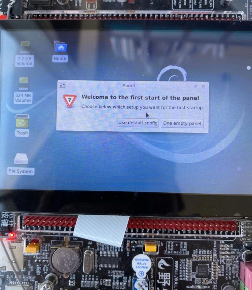
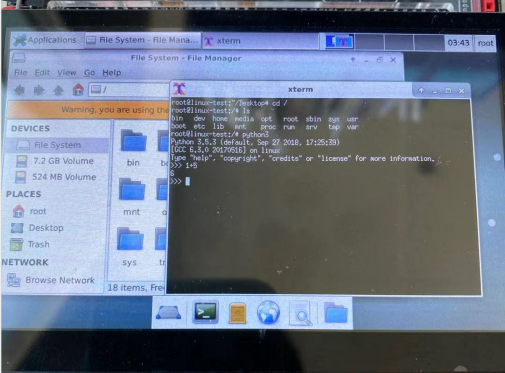

# 制作带桌面的debian9根文件系统


- 主机环境：ubuntu16.04-64bit
- 硬件版本：野火imx6ull-pro emmc


---

#### 一、准备工作

- 创建工作目录

```
mkdir -p imx6ul-debian9-rootfs/rootfs

cd imx6ul-debian9-rootfs/
```

- 安装 qemu & debootstrap

```
sudo apt install qemu-user-static -y
sudo apt install debootstrap -y
```


- 获取 debian9

由于网络问题，如果获取中出错，可以多次执行。
```
sudo debootstrap --foreign --verbose --arch=armhf  stretch rootfs http://ftp2.cn.debian.org/debian
```


出现如下log表示获取成功：
```
...

I: Extracting libmount1...
I: Extracting libsmartcols1...
I: Extracting libuuid1...
I: Extracting mount...
I: Extracting util-linux...
I: Extracting liblzma5...
I: Extracting zlib1g...
```


- 复制相关文件

写了几个脚本简化操作。

这里把相关脚本和sources.list复制到imx6ul-debian9-rootfs目录内。

脚本内容在帖子最后给出。

##### 准备工作结束后，imx6ul-debian9-rootfs目录内是这样的：

```
tree -L 1
.
├── chroot_mount.sh
├── chroot_run.sh
├── chroot_unmount.sh
├── rootfs
└── sources.list

1 directory, 4 files

```

---
#### 二、配置根文件系统


- s1: mount

先添加可执行权限，然后用脚本mount
```
chmod +x chroot_mount.sh chroot_unmount.sh chroot_run.sh

./chroot_mount.sh
```


- s2: 复制qemu
```
sudo cp /usr/bin/qemu-arm-static rootfs/usr/bin/
sudo chmod +x rootfs/usr/bin/qemu-arm-static
```


- s3: 解压 debian9

这一步花的时间比较长。(主要是这步：Unpacking the base system...)
```
sudo LC_ALL=C LANGUAGE=C LANG=C chroot rootfs /debootstrap/debootstrap --second-stage --verbose
```


出现如下log表示解压成功：
```
I: Configuring libgnutls30:armhf...
I: Configuring wget...
I: Configuring tasksel...
I: Configuring tasksel-data...
I: Configuring libc-bin...
I: Configuring systemd...
I: Base system installed successfully.

```


- s4: 替换apt镜像源

为了加速软件安装等。

先备份，然后替换成新的。
```
sudo cp rootfs/etc/apt/sources.list rootfs/etc/apt/sources.list.bak

sudo cp sources.list rootfs/etc/apt/
```

- s5: 使用chroot进入shell

用脚本操作。

```
./chroot_run.sh
```

执行完上面的脚本会进入shell了：


```
root@linux-test:/# ls
bin   dev  home  media	opt   root  sbin  sys  usr
boot  etc  lib	 mnt	proc  run   srv   tmp  var
root@linux-test:/# 

```


进入shell后就可以安装各种你需要的软件了。

```
apt update
apt upgrade
```
```
apt install net-tools
apt install python3
apt install gcc
```

- s6: 安装桌面

(需要的时间可能比较长，如果不需要桌面可以跳过这步~)

```
apt-get install xserver-xorg lightdm xfce4
```


一切正常后可以测试下gcc:

```
root@linux-test:/# gcc -v
Using built-in specs.
COLLECT_GCC=/usr/bin/gcc
COLLECT_LTO_WRAPPER=/usr/lib/gcc/arm-linux-gnueabihf/6/lto-wrapper
Target: arm-linux-gnueabihf
Configured with: ../src/configure -v --with-pkgversion='Debian 6.3.0-18+deb9u1' --with-bugurl=file:///usr/share/doc/gcc-6/README.Bugs --enable-languages=c,ada,c++,java,go,d,fortran,objc,obj-c++ --prefix=/usr --program-suffix=-6 --program-prefix=arm-linux-gnueabihf- --enable-shared --enable-linker-build-id --libexecdir=/usr/lib --without-included-gettext --enable-threads=posix --libdir=/usr/lib --enable-nls --with-sysroot=/ --enable-clocale=gnu --enable-libstdcxx-debug --enable-libstdcxx-time=yes --with-default-libstdcxx-abi=new --enable-gnu-unique-object --disable-libitm --disable-libquadmath --enable-plugin --enable-default-pie --with-system-zlib --disable-browser-plugin --enable-java-awt=gtk --enable-gtk-cairo --with-java-home=/usr/lib/jvm/java-1.5.0-gcj-6-armhf/jre --enable-java-home --with-jvm-root-dir=/usr/lib/jvm/java-1.5.0-gcj-6-armhf --with-jvm-jar-dir=/usr/lib/jvm-exports/java-1.5.0-gcj-6-armhf --with-arch-directory=arm --with-ecj-jar=/usr/share/java/eclipse-ecj.jar --with-target-system-zlib --enable-objc-gc=auto --enable-multiarch --disable-sjlj-exceptions --with-arch=armv7-a --with-fpu=vfpv3-d16 --with-float=hard --with-mode=thumb --enable-checking=release --build=arm-linux-gnueabihf --host=arm-linux-gnueabihf --target=arm-linux-gnueabihf
Thread model: posix
gcc version 6.3.0 20170516 (Debian 6.3.0-18+deb9u1) 
root@linux-test:/# 

```

有了gcc以后就可以在开发板编译程序了~


- s7: 设置账户密码

```
useradd -s '/bin/bash' -m -G adm,sudo imx6ul
```

```
passwd imx6ul
```

```
passwd root
```

- s8: 退出chroot

清除安装包
```
apt-get clean
```

退出shell
```
exit
```

取消挂载
```
./chroot_unmount.sh
```

删除qemu

```
sudo rm rootfs/usr/bin/qemu-arm-static
```


---
#### 三、打包与使用

- 打包根文件系统
```
cd rootfs/

sudo time tar cjvf ../debian9-desktop-rootfs.tar.bz2 .

```
打包后在目录 imx6ul-debian9-rootfs 里可以看到 debian9-desktop-rootfs.tar.bz2


- 使用根文件系统

测试的开发板用的野火出厂固件，这里只替换根文件系统。


根文件系统可以直接用mfg工具通过USB烧录，但是测试阶段不推荐，因为烧录过程耗时太长。


##### 推荐使用NFS挂载ubuntu根文件系统来测试，操作方法如下 (里面用到的IP需要改成你的~)：
1. 解压根文件系统到NFS目录内：

```
cd imx6ul-debian9-rootfs/

sudo tar xjvf debian9-desktop-rootfs.tar.bz2 -C /nfsroot/imx6ull-nfs/debian9-desktop-rootfs/

sync
```


2. 开发板从NFS启动根文件系统

进入uboot命令行设置启动参数：

1. 设置bootargs
```
setenv bootargs "console=${console},${baudrate} root=/dev/nfs ip=192.168.2.102:192.168.2.119:192.168.2.1:255.255.255.0:imx6ull:eth0:off rootwait rw nfsroot=192.168.2.119:/nfsroot/imx6ull-nfs/debian9-desktop-rootfs consoleblank=0 init=/sbin/init";saveenv

```
2. 设置bootcmd，设置后开发板自动从NFS启动
```
setenv bootcmd "mmc dev 1;mmc dev 1; mmc rescan;fatload mmc 1 0x80800000 zImage;fatload mmc 1 0x83000000 imx6ull-14x14-evk.dtb;bootz 0x80800000 - 0x83000000";saveenv
```

到这里，一切正常的话，就可以看到debian启动了！


部分启动log:


```
Debian GNU/Linux 9 linux-test ttymxc0

linux-test login: root

Password:
Linux linux-test 4.1.15-2.1.0+ #5 SMP PREEMPT Tue Nov 26 02:08:05 UTC 2019 armv7l

The programs included with the Debian GNU/Linux system are free software;
the exact distribution terms for each program are described in the
individual files in /usr/share/doc/*/copyright.

Debian GNU/Linux comes with ABSOLUTELY NO WARRANTY, to the extent
permitted by applicable law.
root@linux-test:~# ls
root@linux-test:~# cd /
root@linux-test:/# ls
bin   dev  home  media  opt   root  sbin  sys  usr
boot  etc  lib   mnt    proc  run   srv   tmp  var
root@linux-test:/#

```

---
开机



桌面




---
最后，整个编译过程较长，放个百度云出来，需要的朋友可以下载测试 (系统密码是：123456)：

```
链接：https://pan.baidu.com/s/1OM8p9dt82k2pJPenxLGWEw 
提取码：i9y4 
复制这段内容后打开百度网盘手机App，操作更方便哦
```


---
#### 附录部分

- 相关脚本内容：

chroot_mount.sh：
```
#! /bin/sh

sudo mount --bind /dev rootfs/dev/
sudo mount --bind /sys rootfs/sys/
sudo mount --bind /proc rootfs/proc/
sudo mount --bind /dev/pts rootfs/dev/pts/

```

chroot_unmount.sh:
```
#! /bin/sh

sudo umount rootfs/sys/
sudo umount rootfs/proc/
sudo umount rootfs/dev/pts/
sudo umount rootfs/dev/

```

chroot_run.sh:
```
#! /bin/sh

sudo LC_ALL=C LANGUAGE=C LANG=C chroot rootfs

```

- sources.list内容：


```
deb http://ftp2.cn.debian.org/debian stretch main
```


---

