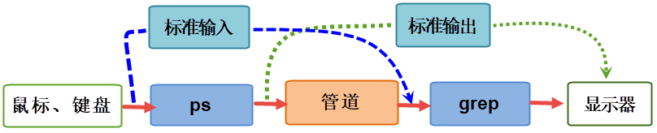
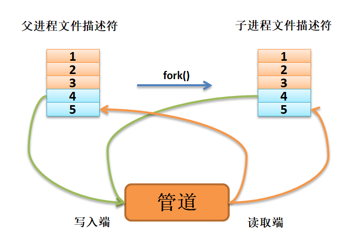
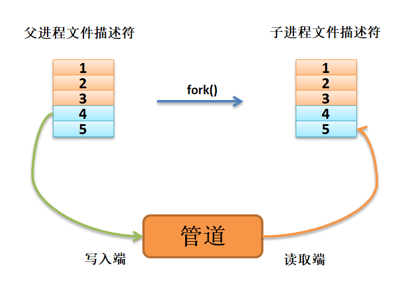
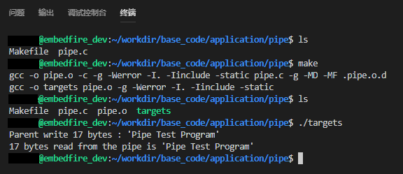
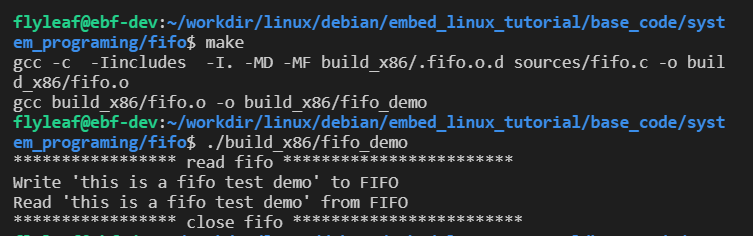

.. vim: syntax=rst

管道
====

管道的基本概念
--------------

在进入正式的学习之前，想一想管道为什么叫管道，也想一想生活中有什么跟管道相关的？
比如水管，水通过水管从一端流向另一端，那么进程间通信是不是可以模仿这种“流向”的关系呢，
很显然是可以的，数据可以从一个进程流向另一个进程，那么一个进程产生数据，然后通过管道发送给另一个进程，
另一个进程从管道的另一端读取出数据，这样一来就实现了进程间的通信了。

在上一章中，我们学过信号，一个信号从进程中产生，发送给另一个进程，这其实也是信号类型的通信，
不过由于只传递信号值，没有数据传递，在很多时候无法满足我们的需求，因此管道传输数据的功能在某些场合会很有优势。

我们可以首先做个试验，在终端中使用以下命令：

.. code:: bash

    ps -aux | grep root

    # 输出

    root         1  0.0  0.0 225376  6376 ?  Ss   10月18   0:31 /sbin/init
    root         2  0.0  0.0      0     0 ?         S    10月18   0:00 [kthreadd]
    root         4  0.0  0.0      0     0 ?         I<   10月18   0:00 [kworker/0:0H]
    root         6  0.0  0.0      0     0 ?         I<   10月18   0:00 [mm_percpu_wq]
    root         7  0.0  0.0      0     0 ?         S    10月18   0:02 [ksoftirqd/0]
    root         8  0.0  0.0      0     0 ?         I    10月18    5:35 [rcu_sched]
    root         9  0.0  0.0      0     0 ?         I    10月18    0:00 [rcu_bh]
    root        10  0.0  0.0      0     0 ?         S    10月18   0:00 [migration/0]
    root        11  0.0  0.0      0     0 ?         S    10月18   0:01 [watchdog/0]
    root        12  0.0  0.0      0     0 ?         S    10月18   0:00 [cpuhp/0]
    root        13  0.0  0.0      0     0 ?         S    10月18   0:00 [cpuhp/1]

首先ps命令我们是非常熟悉的了，就是列出当前的进程，grep命令我们也使用过，
它是一种强大的文本搜索工具，它能使用正则表达式搜索文本，那么ps与grep命令之间的“|”符号是什么呢？
它其实是一个管道，将ps命令输出的数据通过管道流向grep，其实在这里就打开了两个进程，
ps命令本应该在终端输出信息的，但是它通过管道将输出的信息作为grep命令的输入信息，
然后通过搜索之后将合适的信息显示出来，这样子就形成了我们在终端看到的信息。

读者可以验证是否打开了两个进程，使用以下命令查看当前的进程情况，
一定会在输出的最后打印两个进程相关的信息（ps、grep）：

.. code:: bash

    ps -ux | grep $USER

    # 输出（在输出的最后）

    xxx 29663 0.0 0.0 29580 1460 pts/0 R+ 07:12 0:00 ps -ux

    xxx 29664 0.0 0.0 14888 1016 pts/0 S+ 07:12 0:00 grep --color=auto xxx

什么是管道呢？当数据从一个进程连接流到另一个进程时，这之间的连接就是一个管道（pipe）。
我们通常是把一个进程的输出通过管道连接到另一个进程的输入。

对于shell命令来说，命令的连接是通过管道字符来完成的，正如“ ``ps -aux | grep root`` ”命令一样，
只需要使用“|”字符进行连接即可。

那么我们对这个"ps -aux | grep root"命令进行详细的分析，它实际上就是执行以下过程：

-  shell负责安排两个命令的标准输入和标准输出。
-  ps的标准输入来自终端鼠标、键盘等。
-  ps的标准输出传递给grep，作为grep的标准输入。
-  grep的标准输出连接到终端，即输出到显示器屏幕，最终我们看到grep的输出结果。

shell所做的工作实际上是对标准输入和标准输出流进行了重新连接，在ps命令与grep之间建立了数据管道，示意图如下：

其实，管道本质上也是一个文件，上图的过程可以看作是ps进程将输出的内容写入管道中，
grep进程从管道中读取数据，可以把它抽象成一个可读写的文件。
遵循了Linux中“一切皆文件”的设计思想，它借助VFS（虚拟文件系统）给应用程序提供操作接口，实现了管道的功能。

不过还是要注意的是：虽然管道的实现形态上是文件，但是管道本身并不占用磁盘或者其他外部存储的空间，
它占用的是内存空间，因此Linux上的管道就是一个操作方式为文件的内存缓冲区。

管道的分类
----------

Linux系统上的管道分两种类型：

-  匿名管道
-  命名管道

这两种管道也叫做无名或有名管道，为了统一，以下我们称为匿名管道和命名管道。
匿名管道最常见的形态就是我们在shell操作中最常用的“|”。它的特点是只能在父子进程中使用，
父进程在产生子进程前必须打开一个管道文件，然后fork产生子进程，
这样子进程通过拷贝父进程的进程地址空间获得同一个管道文件的描述符，
以达到使用同一个管道通信的目的。此时除了父子进程外，没人知道这个管道文件的描述符，
所以通过这个管道中的信息无法传递给其他进程。这保证了传输数据的安全性，当然也降低了管道了通用性，
于是系统还提供了命名管道，它本质是一个文件，位于文件系统中，命名管道可以让多个无相关的进程进行通讯。

匿名管道PIPE
~~~~~~~~~~~~

匿名管道（PIPE）是一种特殊的文件，但虽然它是一种文件，却没有名字，
因此一般进程无法使用open()来获取他的描述符，它只能在一个进程中被创建出来，
然后通过继承的方式将他的文件描述符传递给子进程，这就是为什么匿名管道只能用于亲缘关系进程间通信的原因。
另外，匿名管道不同于一般文件的显著之处是：它有两个文件描述符，而不是一个，一个只能用来读，
另一个只能用来写，这就是所谓的“半双工”通信方式。而且它对写操作不做任何保护，
即：假如有多个进程或线程同时对匿名管道进行写操作，那么这些数据很有可能会相互践踏，
因此一个简单的结论是：匿名管道只能用于一对一的亲缘进程通信。最后，匿名管道不能使用lseek()来进行所谓的定位，
因为他们的数据不像普通文件那样按块的方式存放在诸如硬盘、flash等块设备上。

总结来说，匿名管道有以下的特征：

-   没有名字，因此不能使用open()函数打开，但可以使用close()函数关闭。
-   只提供单向通信（半双工），也就是说，两个进程都能访问这个文件，假设进程1往文件内写东西，那么进程2就只能读取文件的内容。
-   只能用于具有血缘关系的进程间通信，通常用于父子进程建通信 。
-   管道是基于字节流来通信的。
-   依赖于文件系统，它的生命周期随进程的结束而结束。
-   写入操作不具有原子性，因此只能用于一对一的简单通信情形。
-   管道也可以看成是一种特殊的文件，对于它的读写也可以使用普通的read()和write()等函数。
    但是它又不是普通的文件，并不属于其他任何文件系统，并且只存在于内核的内存空间中，因此不能使用lseek()来定位。

命名管道FIFO
~~~~~~~~~~~~

命名管道（FIFO）与匿名管道（PIPE）是不同的，命名管道可以在多个无关的进程中交换数据（通信）。
我们知道，匿名管道的通信方式通常都由一个共同的祖先进程启动，只能在"有血缘关系"的进程中交互数据，
这给我们在不相关的的进程之间交换数据带来了不方便，因此产生了命名管道，来解决不相关进程间的通信问题。

命名管道不同于无名管道之处在于它提供了一个路径名与之关联，以一个文件形式存在于文件系统中，
这样，即使与命名管道的创建进程不存在“血缘关系”的进程，只要可以访问该命名管道文件的路径，
就能够彼此通过命名管道相互通信，因为可以通过文件的形式，那么就可以调用系统中对文件的操作，
如打开（open）、读（read）、写（write）、关闭（close）等函数，虽然命名管道文件存储在文件系统中，
但数据却是存在于内存中的，这点要区分开。

总结来说，命名管道有以下的特征：

-   有名字，存储于普通文件系统之中。
-   任何具有相应权限的进程都可以使用 open()来获取命名管道的文件描述符。
-   跟普通文件一样：使用统一的 read()/write()来读写。
-   跟普通文件不同：不能使用 lseek()来定位，原因是数据存储于内存中。
-   具有写入原子性，支持多写者同时进行写操作而数据不会互相践踏。
-   遵循先进先出（First In First Out）原则，最先被写入 FIFO的数据，最先被读出来。

pipe()函数
----------

pipe()函数用于创建一个匿名管道，一个可用于进程间通信的单向数据通道。我们可以通过man命令查看pipe函数原型：

.. code:: c

    int pipe(int pipefd[2]);

函数原型非常简单，没有任何的传入参数，注意：数组pipefd是用于返回两个引用管道末端的文件描述符，
它是一个由两个文件描述符组成的数组的指针。pipefd[0] 指管道的读取端，pipefd[1]指向管道的写端。
向管道的写入端写入数据将会由内核缓冲，即写入内存中，直到从管道的读取端读取数据为止，
而且数据遵循先进先出原则。pipe()函数还会返回一个int类型的变量，
如果为0则表示创建匿名管道成功，如果为-1则表示创建失败，并且设置errno。

匿名管道创建成功以后，创建该匿名管道的进程（父进程）同时掌握着管道的读取端和写入端，
但是想要父子进程间有数据交互，则需要以下操作：

-   父进程调用pipe()函数创建匿名管道，得到两个文件描述符pipefd[0]、pipefd[1]，分别指向管道的读取端和写入端。
-   父进程调用fork()函数启动（创建）一个子进程，那么子进程将从父进程中继承这两个文件描述符pipefd[0]、pipefd[1]，
    它们指向同一匿名管道的读取端与写入端。
-   由于匿名管道是利用环形队列实现的，数据将从写入端流入管道，从读取端流出，这样子就实现了进程间通信，
    但是这个匿名管道此时有两个读取端与两个写入端，如图  fork后子进程继承父进程文件描述符_ 所示，因此需要进行接下来的操作。
-   如果想要从父进程将数据传递给子进程，则父进程需要关闭读取端，子进程关闭写入端，如图 数据从父进程流向子进程_ 所示。
-   如果想要从子进程将数据传递给父进程，则父进程需要关闭写入端，子进程关闭读取端，如图 数据从子进程流向父进程_ 所示。
-   当不需要管道的时候，就在进程中将未关闭的一端关闭即可。

上图：fork后子进程继承父进程文件描述符

上图：数据从父进程流向子进程

.. figure:: media/pipe005.png
   :alt: 数据从子进程流向父进程
   :align: center
   :name: 数据从子进程流向父进程

上图：数据从子进程流向父进程

**实验分析:**

我们可以使用pipe()函数做一个测试实验，野火资料提供了对应的实验代码，
在system_programing/pipe目录下存在pipe.c文件，该文件内容如下所示。

.. code-block:: c
   :caption: 管道pipe示例（base_code/system_programing/pipe/sources/pipe.c文件）
   :linenos:

    #include <unistd.h>
    #include <sys/types.h>
    #include <sys/wait.h>
    #include <errno.h>
    #include <stdio.h>
    #include <stdlib.h>
    #include <string.h>

    #define MAX_DATA_LEN 256
    #define DELAY_TIME 1

    int main()
    {
        pid_t pid;
        int pipe_fd[2];                             //(1)
        char buf[MAX_DATA_LEN];
        const char data[] = "Pipe Test Program";
        int real_read, real_write;

        memset((void*)buf, 0, sizeof(buf));

        /* 创建管道 */
        if (pipe(pipe_fd) < 0)                  //(2)
        {
            printf("pipe create error\n");
            exit(1);
        }

        /* 创建一子进程 */
        if ((pid = fork()) == 0)                //(3)
        {
            /* 子进程关闭写描述符，并通过使子进程暂停 3s 等待父进程已关闭相应的读描述符 */
            close(pipe_fd[1]);
            sleep(DELAY_TIME * 3);

            /* 子进程读取管道内容 */            //(4)
            if ((real_read = read(pipe_fd[0], buf, MAX_DATA_LEN)) > 0)
            {
                printf("%d bytes read from the pipe is '%s'\n", real_read, buf);
            }

            /* 关闭子进程读描述符 */
            close(pipe_fd[0]);                  //(5)

            exit(0);
        }
        
        else if (pid > 0)                      
        {
            /* 父进程关闭读描述符，并通过使父进程暂停 1s 等待子进程已关闭相应的写描述符 */
            close(pipe_fd[0]);                  //(6)

            sleep(DELAY_TIME);

            if((real_write = write(pipe_fd[1], data, strlen(data))) != -1)  //(7)
            {
                printf("Parent write %d bytes : '%s'\n", real_write, data);
            }
            
            /*关闭父进程写描述符*/
            close(pipe_fd[1]);                  //(8)

            /*收集子进程退出信息*/
            waitpid(pid, NULL, 0);              //(9)

            exit(0);
        }
    }

-   **(1)** ：定义一个数组pipe_fd，在创建匿名管道后通过数组返回管道的文件描述符。

-   **(2)** ：调用pipe()创建一个匿名管道，创建成功则得到两个文件描述符pipe_fd[0]、pipe_fd[1]，否则返回-1。

-   **(3)** ：调用fork()创建一个子进程，如果返回值是0则表示此时运行的是子进程，
    那么在子进程中调用close()函数关闭写描述符，并使子进程睡眠 3s 等待父进程已关闭相应的读描述符。

-   **(4)** ：子进程调用read()函数读取管道内容，如果管道没有数据则子进程将被阻塞，读取到数据就将数据打印出来。
    特别地如果调用read()函数读取一个关闭了写描述符的管道，那么read()会返回0，（本例子中父进程的写描述符没有关闭）。

-   **(5)** ：调用close()函数关闭子进程读描述符。

-   **(6)** ：如果fork()函数的返回值大于0，则表示此时运行的是父进程，那么在父进程中先调用close()关闭管道的读描述符，
    并且等待1s，因为此时可能子进程先于父进程运行，暂且等待一会。

-   **(7)** ：父进程调用write()函数将数据写入管道。

-   **(8)** ：关闭父进程写描述符。

-   **(9)** ：调用waitpid()函数收集子进程退出信息并退出进程。

pipe示例的编译及测试过程如下：

.. code:: bash

    # 以下操作在 system_programing/pipe 代码目录进行
    # 编译X86版本程序
    make
    # 运行X86版本程序
    ./build_x86/pipe_demo

    # 若是想在开发板运行，可使用如下命令进行交叉编译
    make ARCH=ARM
    # 交叉编译生成的 armhf 架构程序在build_ARM目录下，
    # 复制至开发板运行即可

运行结果如下图，子进程从管道中读取到父进程写入的内容：

fifo()函数
----------

至此，我们还只能在有“血缘关系”的程序之间传递数据，即这些程序是由一个共同的祖先进程启动的。
但如果想在不相关的进程之间交换数据，我们可以用FIFO文件来完成这项工作，或者称之为命名管道。
命名管道是一种特殊类型的文件，它在文件系统中以文件名的形式存在，但它的的数据却是存储在内存中的。
我们可以在终端（命令行）上创建命名管道，也可以在程序中创建它。

比如使用mkfifo命令去创建一个命名管道，关于mkfifo命令，我们可以使用man命令查看一下它的描述：

.. code:: bash

    # 执行如下命令：
    man mkfifo

    # 输出
    名称
           mkfifo - 创建 FIFO（命名管道）

    概述
           mkfifo [选项]... 名称...

    描述
           使用给定的名称创建命名管道（FIFO）。

           必选参数对长短选项同时适用。

           -m, --mode=模式
                  将文件权限位设置为给定的模式（类似 chmod），而不是类似 a=rw 这样

           -Z     将 SELinux 安全上下文设置为默认类型

           --context[=CTX]
                  类似 -Z，或者如果指定了上下文，则将 SELinux 或者 SMACK 安全上下文设置为指定类型

           --help 显示此帮助信息并退出

我们创建一个命名管道，此时会创建一个命名管道文件test，可以通过file命令去看一下这个test文件的类型：

.. code:: bash

    # 执行如下命令
    mkfifo test
    file test
    # 以下是命令输出，可以看出它是一个命名管道类型的文件
    test: fifo (named pipe)

这个mkfifo命令实际上就是Linux系统的同名API mkfifo，在源代码里我们可以通过调用mkfifo函数创建一个命名管道，
其实就类似于创建一个文件，只不过这个文件的类型是命名管道的类型。

mkfifo()的函数原型如下：

.. code:: c

    int mkfifo(const char * pathname,mode_t mode);

mkfifo()会根据参数pathname建立特殊的FIFO文件，而参数mode为该文件的模式与权限。

mkfifo()创建的FIFO文件其他进程都可以进行读写操作，可以使用读写一般文件的方式操作它，
如open，read，write，close等。

mode模式及权限参数说明：

-   O_RDONLY：读管道。 
-   O_WRONLY：写管道。 
-   O_RDWR：读写管道。 
-   O_NONBLOCK：非阻塞。 
-   O_CREAT：如果该文件不存在，那么就创建一个新的文件，并用第三个参数为其设置权限。
-   O_EXCL：如果使用 O_CREAT 时文件存在，那么可返回错误消息。这一参数可测试文件是否存在。

函数返回值说明如下： 

-   0：成功 
-   EACCESS：参数 filename 所指定的目录路径无可执行的权限。 
-   EEXIST：参数 filename 所指定的文件已存在。 
-   ENAMETOOLONG：参数 filename 的路径名称太长。 
-   ENOENT：参数 filename 包含的目录不存在。 
-   ENOSPC：文件系统的剩余空间不足。 
-   ENOTDIR：参数 filename 路径中的目录存在但却非真正的目录。 
-   EROFS：参数 filename 指定的文件存在于只读文件系统内。

使用FIFO的过程中，当一个进程对管道进行读操作时：

-   若该管道是阻塞类型，且当前 FIFO内没有数据，则对读进程而言将一直阻塞到有数据写入。 
-   若该管道是非阻塞类型，则不论 FIFO内是否有数据，读进程都会立即执行读操作。
    即如果FIFO内没有数据，读函数将立刻返回 0。

使用FIFO的过程中，当一个进程对管道进行写操作时：

-   若该管道是阻塞类型，则写操作将一直阻塞到数据可以被写入。 
-   若该管道是非阻塞类型而不能写入全部数据，则写操作进行部分写入或者调用失败

**实验分析**

下面我们来看看具体的实例：

.. code-block:: c
   :caption: fifo()示例（base_code/system_programing/fifo/sources/fifo.c文件）
   :linenos:

    #include <sys/wait.h>
    #include <sys/types.h>
    #include <sys/stat.h>
    #include <unistd.h>
    #include <errno.h>
    #include <fcntl.h>
    #include <stdio.h>
    #include <stdlib.h>
    #include <limits.h>
    #include <string.h>

    #define MYFIFO "myfifo"    /* 命名管道文件名*/

    #define MAX_BUFFER_SIZE PIPE_BUF /* 4096 定义在于 limits.h 中*/

    void fifo_read(void)
    {
        char buff[MAX_BUFFER_SIZE];
        int fd;
        int nread;

        printf("***************** read fifo ************************\n");
        /* 判断命名管道是否已存在，若尚未创建，则以相应的权限创建*/
        if (access(MYFIFO, F_OK) == -1)                 //(4)
        {
            if ((mkfifo(MYFIFO, 0666) < 0) && (errno != EEXIST))    //(5)
            {
                printf("Cannot create fifo file\n");
                exit(1);
            }
        }

        /* 以只读阻塞方式打开命名管道 */
        fd = open(MYFIFO, O_RDONLY);                //(6)
        if (fd == -1)
        {
            printf("Open fifo file error\n");
            exit(1);
        }

        memset(buff, 0, sizeof(buff));

        if ((nread = read(fd, buff, MAX_BUFFER_SIZE)) > 0)      // (7)
        {
            printf("Read '%s' from FIFO\n", buff);
        }

       printf("***************** close fifo ************************\n");

        close(fd);                              //(8)

        exit(0);
    }

    void fifo_write(void)
    {
        int fd;
        char buff[] = "this is a fifo test demo";
        int nwrite;

        sleep(2);   //等待子进程先运行              //(9)

        /* 以只写阻塞方式打开 FIFO 管道 */
        fd = open(MYFIFO, O_WRONLY | O_CREAT, 0644);        //(10)
        if (fd == -1)
        {
            printf("Open fifo file error\n");
            exit(1);
        }

        printf("Write '%s' to FIFO\n", buff);

        /*向管道中写入字符串*/
        nwrite = write(fd, buff, MAX_BUFFER_SIZE);          //(11)

        if(wait(NULL))  //等待子进程退出
        {
            close(fd);                          //(12)
            exit(0);
        }

    }

    int main()
    {
        pid_t result;
        /*调用 fork()函数*/
        result = fork();                //(1)

        /*通过 result 的值来判断 fork()函数的返回情况，首先进行出错处理*/
        if(result == -1)
        {
            printf("Fork error\n");
        }

        else if (result == 0) /*返回值为 0 代表子进程*/
        {
            fifo_read();            //(2)
        }

        else /*返回值大于 0 代表父进程*/
        {
            fifo_write();       //(3)
        }

        return result;
    }

下面介绍这个例子的流程，我们先从main函数开始：

-   **(1):** 首先使用fork函数创建一个子进程。 
-   **(2):** 返回值为 0 代表子进程，就运行fifo_read()函数。 
-   **(3):** 返回值大于 0 代表父进程，就运行fifo_write()函数。 
-   **(4):** 在子进程中先通过access()函数判断命名管道是否已存在，若尚未创建，则以相应的权限创建
-   **(5):** 调用mkfifo()函数创建一个命名管道。 
-   **(6):** 使用open()函数以只读阻塞方式打开命名管道。 
-   **(7):** 使用read()函数读取管道的内容，由于打开的管道是阻塞的，而此时管道中没有存在任何数据，
    因此子进程会阻塞在这里，等待到管道中有数据时才恢复运行，并打印从管道中读取到的数据。
-   **(8):** 读取完毕，使用close()函数关闭管道。 
-   **(9):** 父进程休眠2秒，等待子进程先运行，因为本例子是在子进程中创建管道的。
-   **(10):** 以只写阻塞方式打开 FIFO 管道。 
-   **(11):** 向管道中写入字符串数据，当写入后管道中就存在数据了，此时处于阻塞的子进程将恢复运行，
    并将字符串数据打印出来。
-   **(12):** 等待子进程退出，并且关闭管道。

fifo例程的编译及测试过程如下：

.. code:: bash

    # 以下操作在 system_programing/fifo 代码目录进行
    # 编译X86版本程序
    make
    # 运行X86版本程序
    ./build_x86/fifo_demo

    # 若是想在开发板运行，可使用如下命令进行交叉编译
    make ARCH=ARM
    # 交叉编译生成的 armhf 架构程序在build_ARM目录下，
    # 复制至开发板运行即可

运行结果如下图：

本示例是两个进程之间的通信问题（例子中使用了父子进程，但即使是没有“血缘关系”的进程也是一样的操作），
也就是说，一个进程向FIFO文件写数据，而另一个进程在FIFO文件中读取数据。
大家可以试想这样一个问题，只使用一个FIFO文件，如果有多个进程同时向同一个FIFO文件写数据，
而只有一个读FIFO进程在同一个FIFO文件中读取数据时，会发生怎么样的情况呢？大家是不是会觉得数据相互交错混乱？
如果不做任何处理，的确会这样子，但FIFO跟 PIPE 区别的还有一个最大的不同点在于: FIFO是具有写原子特性的，
就是让写操作的原子化，怎样才能使写操作原子化呢？答案很简单，系统规定：在一个以O_WRONLY（即阻塞方式）打开的FIFO中，
如果写入的数据长度小于等待PIPE_BUF，那么或者写入全部字节，或者一个字节都不写入。
如果所有的写请求都是发往一个阻塞的FIFO的，并且每个写记请求的数据长度小于等于PIPE_BUF字节，
系统就可以确保数据决不会交错在一起。这种特性使得我们对 FIFO 进行写操作时无需担忧这个问题。

说了那么多，FIFO的应用场景是什么呢？一个典型应用是Linux的日志系统。系统的日志信息被统一安排存放在/var/log目录下，
这些日志文件都是一些普通的文本文件，在Linux系统中普通的文件可以被一个或多个进程重读多次打开，
每次打开都有一个独立的位置偏移量，如果多个进程或线程同时写文件，那么除非他们之间能相互协调好，
否则必然导致混乱。可惜需要写日志的进程根本不可能“协调好”，由于写日志的进程是毫无关联的，
因此常用的互斥手段(比如后面介绍的什么互斥锁、信号量等)是无法起作用的，
就像你无法试图通过交通法规来杜绝有人乱闯红灯一样，因为总有人可以故意无视规则，肆意践踏规则，
如何使得毫不相干的不同进程的日志信息都能完整地输送到日志文件中而不相互破坏，是一个必须要解决的问题，
一个简单高效的方案是：使用FIFO 来接收各个不相干进程的日志信息，然后让一个进程专门将 FIFO中的数据写到相应的日志文件当中。
这样做的好处是，任何进程无需对日志信息的互斥编写出任何额外的代码，只管往FIFO里面写入即可。
后台默默耕耘的日志系统服务例程会将这些信息一一地拿出来再写入日志文件，FIFO 的写入原子性保证了数据的完整无缺而且不会错乱。
