.. vim: syntax=rst

进程
====

简单了解进程
------------

在进入正题之前，我们不打算像其他书籍一样，讲一大堆原理，而是希望想通过实验现象来引导读者了解进程相关的知识，紧接着再来补充进程相关的知识点。

首先在虚拟机中打开一个终端（相信读者能阅读到此处，就已经了解什么是终端了，而由于作者用是的公司的服务器，使用ssh方式连接的，所以下文的截图有可能与读者的显示界面不是一样的，但这不会对本章的阅读造成任何影响），一般来说ubuntu中有很多shell终端，而这个终端就是一个进程，或许读者很可能打开多个终端，那么这些所有被打开的终端就一个个进程，这些进程是不一样的，独立运行在系统中，作者打开三个shell终端，这些终端各自有输入输出，互不干扰，如图37‑1所示。

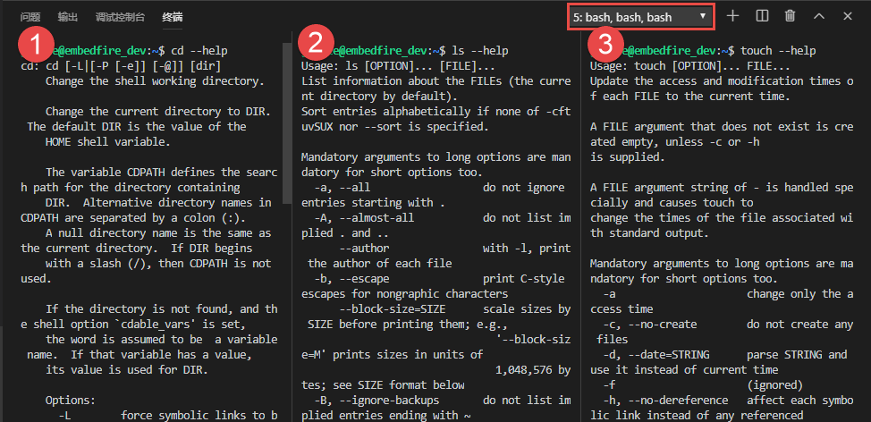

   proces002
图 37‑1 三个shell终端

每个运行中的 shell 都是一个单独的进程，假如读者从一个
shell里面调用一个程序的时候，对应的程序在一个新进程中运行，运行结束后
shell继续工作，高级的程序员经常在一个应用程序中同时启用多个协作的进程以使程序可以并行更多任务、使程序更健壮，或者可以直接利用已有的其它程序，这样子整个系统中运行的进程就可以相互配合，而不是独立运行，这就涉及到进程间的通信，这部分内容我们在后续讲解。

查看进程
--------

即使读者刚打开linux电脑，没有运行任何程序，电脑中也会有进程存在，因为系统中必须要有进程在处理一些必要的程序，以保证系统能正常运行。其实在Linux中是通过检查表记录与进程相关的信息的，进程表就像一个数据结构，它把当前加载在内存中的所有进程的有关信息保存在一个表中，其中包括进程的PID、进程的状态、命令字符串和其他一些ps命令输出的各类信息。操作系统通过进程的ID对它们进行管理，这些PID是进程表的索引，就目前的linux系统而言，系统支持可以同时运行的进程数可能只与用于建立进程表项的内存容量有关，而没有具体的数量的限制，也就是说系统有足够的内存的话，那么理论上就可以运行无数个进程。

进程ID
~~~~~~

Linux系统中的每个进程都都会被分配一个唯一的数字编号，我们称之为进程ID（ProcessID，通常也被简称为
PID）。进程ID 是一个
16位的正整数，默认取值范围是从2到32768（可以修改），由
Linux在启动新进程的时候自动依次分配，当进程被启动时，系统将按顺序选择下一个未被使用的数字作为它的PID，当PID的数值达到最大时，系统将重新选择下一个未使用的数值，新的PID重新从2开始，这是因为PID数字为1的值一般是为特殊进程init保留，即系统在运行时就存在的第一个进程，
init进程负责管理其他进程。

父进程ID
~~~~~~~~

任何进程（除init进程）都是由另一个进程启动，该进程称为被启动进程的父进程，被启动的进程称为子进程，父进程号无法在用户层修改。父进程的进程号（PID）即为子进程的父进程号（PPID）。用户可以通过调用getppid()函数来获得当前进程的父进程号。

为了更直观看到这些进程，作者就使用ps命令去查看系统中的进程情况，ps命令可以显示我们正在运行的进程、其他用户正在运行的进程或者目前在系统上运行的所有进程。输出结果如图37‑2所示，可以很明显看到，编号为1的进程是init进程。它位于\ ``/sbin/init``\ 目录中。当然，整个系统的进程可不止这一些，由于太多没法截图，就只展示这小部分的进程，读者可以自己使用下面命令去尝试一下，ps
命令可以显示当前系统中运行的进程， 其实在linux中，
ps命令有很多选项，因为它试图与很多不同 UNIX 版本的
ps命令兼容，这些选项决定显示哪些进程以及要显示的信息。

**命令:**

.. code:: bash

    ps –aux

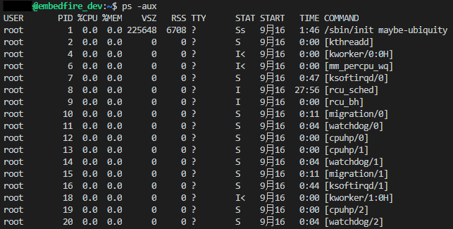

   proces003
图 37‑2 ps –aux输出结果

父进程与子进程
~~~~~~~~~~~~~~

进程启动时，启动进程为新进程的父进程，新进程是启动进程的子进程。

每个进程都有一个父进程（除了系统中如“僵尸进程”这种特殊进程外），因此，读者可以把
Linux 中的进程结构想象成一个树状结构，其中
init进程就是树的“根”；或者可以把init进程看作为操作系统的进程管理器，它是其他所有进程的祖先进程。我们将要看到的其他系统进程要么是由init进程启动的，要么是由被init进程启动的其他进程启动的。

总的来说init进程下有很多子进程，这些子进程又可能存在子进程，就像家族一样。系统中所有的父进程ID被称为PPID，不同进程的父进程是不同的，这个值只是当前进程的父进程的ID，系统中的父进程与子进程是相对而言的，就好比\ ``爷爷<->爸爸<->儿子``\ 之间的关系，爸爸相对于爷爷而言是儿子，相对于儿子而言则是爸爸。

为了更加直观看出系统中父进程与子进程，作者决定使用\ ``pstree``\ 命令将进程以树状关系列出来，具体见图
37‑3。

**命令：**

.. code:: bash

    pstree

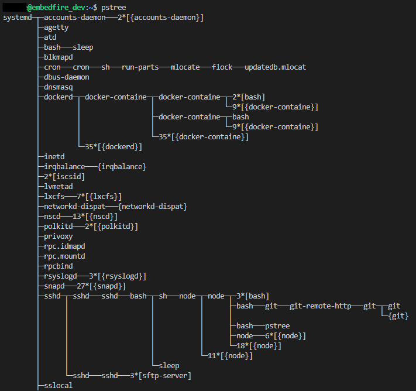

   proces004
图 37‑3 pstree命令结果

程序与进程
----------

进程相关信息也简单了解过了，可能很多读者还是有疑问，我们写的代码，它是程序，怎么变成进程了呢？那么在本小节作者就讲解一下程序与进程的关系。

程序
~~~~

程序（program）是一个普通文件，是为了完成特定任务而准备好的指令序列与数据的集合，这些指令和数据以“可执行映像”的格式保存在磁盘中。正如我们所写的一些代码，经过编译器编译后，就会生成对应的可执行文件，那么这个就是程序，或者称之为可执行程序。

进程
~~~~

进程（process）则是程序执行的具体实例，比如一个可执行文件，在执行的时候，它就是一个进程，直到该程序执行完毕。那么在程序执行的过程中，它享有系统的资源，至少包括进程的运行环境、CPU、外设、内存、进程ID等资源与信息，同样的一个程序，可以实例化为多个进程，在Linux系统下使用
ps命令可以查看到当前正在执行的进程，当这个可执行程序运行完毕后，进程也会随之被销毁（可能不是立即销毁，但是总会被销毁）。

程序并不能单独执行，只有将程序加载到内存中，系统为他分配资源后才能够执行，这种执行的程序称之为进程，也就是说进程是系统进行资源分配和调度的一个独立单位，每个进程都有自己单独的地址空间。

举个例子，我们可以看到/bin目录下有很多可执行文件，如图37‑4所示，我们在系统中打开一个终端就是一个进程，这个进程由bash可执行文件（程序）实例化而来，而一个linux系统可用打开多个终端，并且这些终端是独立运行在系统中的。

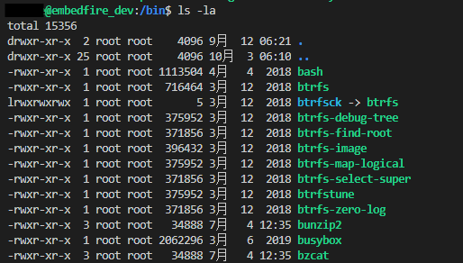

   proces005
图 37‑4 /bin目录下的可执行文件

程序变成进程
~~~~~~~~~~~~

在linux系统中，程序只是个静态的文件，而进程是一个动态的实体，进程的状态（后续讲解进程状态）会在运行过程中改变，那么问题来了，程序到底是如何变成一个进程的呢？

其实正如我们运行一个程序（可执行文件），通常在
Shell中输入命令运行就可以了，在这运行的过程中包含了程序到进程转换的过程，整个转换过程主要包含以下
3 个步骤：

1. 查找命令对应程序文件的位置。
2. 使用 fork()函数为启动一个新进程。
3. 在新进程中调用 exec
   族函数装载程序文件，并执行程序文件中的main()函数。

    补充：关于具体的函数介绍将在后续讲解。

总结
~~~~

总的来说，程序与进程有以下的关系：

1. 程序只是一系列指令序列与数据的集合，它本身没有任何运行的含义，它只是一个静态的实体。而进程则不同，它是程序在某个数据集上的执行过程，它是一个动态运行的实体，有自己的生命周期，它因启动而产生，因调度而运行，因等待资源或事件而被处于等待状态，因完成任务而被销毁。

2. 进程和程序并不是一一对应的，一个程序执行在不同的数据集上运行就会成为不同的进程，可以用进程控制块来唯一地标识系统中的每个进程。而这一点正是程序无法做到的，由于程序没有和数据产生直接的联系，既使是执行不同的数据的程序，他们的指令的集合依然是一样的，所以无法唯一地标识出这些运行于不同数据集上的程序。一般来说，一个进程肯定有一个与之对应的程序，而且有且只有一个。而一个程序有可能没有与之对应的进程（因为这个程序没有被运行），也有可能有多个进程与之对应（这个程序可能运行在多个不同的数据集上）。

3. 进程具有并发性而程序没有。

4. 进程是竞争计算机资源的基本单位，而程序不是。

进程状态
--------

在学习进程状态之前，作者决定还是先让读者看看系统中常见的进程状态，可以通过ps命令将系统中运行的进程信息打印出来，我们只需要关注STAT那一列的信息即可，进程的状态非常多种，具体见图37‑5：

**命令：**

.. code:: bash

    ps –ux

    # 输出(已删减)：
    USER   PID  %CPU  %MEM    VSZ   RSS   TTY      STAT   START    TIME     COMMAND
    xxx    11132   0.0      0.0     15492  5568  pts/1    Ss      00:45    0:00       /bin/bash
    xxx    11340   0.0      0.0     15508  5636  pts/2    Ss+    00:50    0:01       /bin/bash
    xxx    11807   0.0      0.0     14916  4572  pts/3    Ss      01:05    0:00        /bin/bash
    xxx    18319   0.0      0.0     18260   588  pts/1     Ss+     10月09   0:00      bash
    xxx    21862   0.0      0.0      7928   824     ?         S         07:57    0:00      sleep 180
    xxx    26124   0.0      0.0     29580  1540  pts/1     R+      07:58    0:00         ps -ux

由于作者用的是公司服务器，所以只将作者用户当前的进程信息输出，而不是将系统所有进程信息输出，因此ps命令不需要\ ``–a``\ 选项。

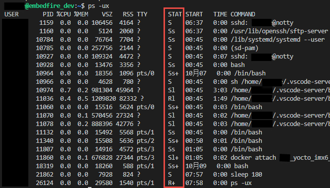

   proces006
图 37‑5 进程状态

从图37‑5中可以看到进程的状态有比较多种，有些是S，有些是Ss，还有些是Sl、Rl、R+等状态，具体是什么含义呢？其实是这些状态只是linux系统进程的一部分，还有一些状态是没有显示出来的，因为作者当前用户下的所有进程并没有处于那些状态，所以就没显示出来，下面作者就简单介绍一下linux系统中所有的进程状态，如表格
37‑1所示。

表格 37‑1 linux系统中进程状态说明

+--------+-------------------------------------------------------------------------------------------------------------------------------------------------------------------------------+
| 状态   | 说明                                                                                                                                                                          |
+========+===============================================================================================================================================================================+
| R      | 运行状态。严格来说，应该是“可运行状态”，即表示进程在运行队列中，处于正在执行或即将运行状态，只有在该状态的进程才可能在 CPU 上运行，而同一时刻可能有多个进程处于可运行状态。   |
+--------+-------------------------------------------------------------------------------------------------------------------------------------------------------------------------------+
| S      | 可中断的睡眠状态。处于这个状态的进程因为等待某种事件的发生而被挂起，比如进程在等待信号。                                                                                      |
+--------+-------------------------------------------------------------------------------------------------------------------------------------------------------------------------------+
| D      | 不可中断的睡眠状态。通常是在等待输入或输出（I/O）完成，处于这种状态的进程不能响应异步信号。                                                                                   |
+--------+-------------------------------------------------------------------------------------------------------------------------------------------------------------------------------+
| T      | 停止状态。通常是被shell的工作信号控制，或因为它被追踪，进程正处于调试器的控制之下。                                                                                           |
+--------+-------------------------------------------------------------------------------------------------------------------------------------------------------------------------------+
| Z      | 退出状态。进程成为僵尸进程。                                                                                                                                                  |
+--------+-------------------------------------------------------------------------------------------------------------------------------------------------------------------------------+
| X      | 退出状态。进程即将被回收。                                                                                                                                                    |
+--------+-------------------------------------------------------------------------------------------------------------------------------------------------------------------------------+
| s      | 进程是会话其首进程。                                                                                                                                                          |
+--------+-------------------------------------------------------------------------------------------------------------------------------------------------------------------------------+
| l      | 进程是多线程的。                                                                                                                                                              |
+--------+-------------------------------------------------------------------------------------------------------------------------------------------------------------------------------+
| +      | 进程属于前台进程组。                                                                                                                                                          |
+--------+-------------------------------------------------------------------------------------------------------------------------------------------------------------------------------+
| <      | 高优先级任务。                                                                                                                                                                |
+--------+-------------------------------------------------------------------------------------------------------------------------------------------------------------------------------+

进程状态转换
------------

从前文的介绍我们也知道，进程是动态的活动的实例，这其实指的是进程会有很多种运行状态，一会儿睡眠、一会儿暂停、一会儿又继续执行。虽然Linux操作系统是一个多用户多任务的操作系统，但对于单核的CPU系统来说，在某一时刻，只能有一个进程处于运行状态（此处的运行状态指的是占用CPU），其他进程都处于其他状态，等待系统资源，各任务根据调度算法在这些状态之间不停地切换。但由于CPU处理速率较快，使用户感觉每个进程都是同时运行。

图 37‑6
展示了Linux进程从被启动到退出的全部状态，以及这些状态发生转换时的条件。

.. figure:: media/proces007.png
   :alt: proces007

   proces007
图 37‑6 进程状态转换

1. 一般来说，一个进程的开始都是从其父进程调用fork()开始的，所以在系统一上电运行的时候，init进程就开始工作，在系统运行过程中，会不断启动新的进程，这些进程要么是由init进程启动的，要么是由被init进程启动的其他进程所启动的。

2. 一个进程被启动后，都是处于可运行状态（但是此时进程并未占用CPU运行）。处于该状态的进程可以是正在进程等待队列中排队，也可以占用CPU正在运行，我们习惯上称前者为“就绪态”，称后者为“运行态”（占用CPU运行）。

3. 当系统产生进程调度的时候，处于就绪态的进程可以占用CPU的使用权，此时进程就是处于运行态。但每个进程运行时间都是有限的，比如10毫秒，这段时间被称为“时间片”。当进程的时间片已经耗光了的情况下，如果进程还没有结束运行，那么会被系统重新放入等待队列中等待，此时进程又转变为就绪状态，等待下一次进程的调度。另外，正处于“运行态”的进程即使时间片没有耗光，也可能被别的更高优先级的进程“抢占”，被迫重新回到等到队列中等待。

4. 处于“运行态”的进程可能会等待某些事件、信号或者资源而进入“可中断睡眠态”，比如进程要读取一个管道文件数据而管道为空，或者进程要获得一个锁资源而当前锁不可获取，甚至是进程自己调用sleep()来强制将自己进入睡眠，这些情况下进程的状态都会变成“可中断睡眠态”。顾名思义，“可中断睡眠态”就是可以被中断的，能响应信号，在特定条件发生后，进程状态就会转变为“就绪态”，比如其他进程想管道文件写入数据后，或者锁资源可以被获取，或者是睡眠时间到达等情况。

5. 当然，处于“运行态”的进程还可能会进入“不可中断睡眠态”，在这种状态下的进程不能响应信号，但是这种状态非常短暂，读者几乎无法通过ps命令将其显示出来，一般处于这种状态的进程都是在等待输入或输出（I/O）完成，在等待完成后自动进入“就绪态”。

6. 当进程收到 SIGSTOP 或者 SIGTSTP
   中的其中一个信号时，进程状态会被置为“暂停态”，该状态下的进程不再参与调度，但系统资源不会被释放，直到收到SIGCONT信号后被重新置为就绪态。当进程被追踪时（典型情况是使用调试器调试应用程序的情况），收到任何信号状态都会被置为
   TASK\_TRACED状态，该状态跟暂停态是一样的，一直要等到
   SIGCONT信号后进程才会重新参与系统进程调度。

7. 进程在完成任务后会退出，那么此时进程状态就变为退出状态，这是正常的退出，比如在main函数内
   return 或者调用
   exit()函数或者线程调用pthread\_exit()都是属于正常退出。为什么作者要强调正常退出呢？因为进程也会有异常退出，比如进程收到kill信号就会被杀死，其实不管怎么死，最后内核都会调用do\_exit()函数来使得进程的状态变成“僵尸态（僵尸进程）”，这里的“僵尸”指的是进程的PCB（Process
   Control
   Block，进程控制块）。为什么一个进程的死掉之后还要把尸体（PCB）留下呢？因为进程在退出的时候，系统会将其退出信息都保存在进程控制块中，比如如果他正常退出，那进程的退出值是多少呢？如果被信号杀死？那么是哪个信号将其杀死呢？这些“死亡信息”都被一一封存在该进程的PCB当中，好让别人可以清楚地知道：我是怎么死的。那谁会关心他是怎么死的呢？那就是它的父进程，它的父进程之所以要启动它，很大的原因是要让这个进程去干某一件事情，现在这个孩子已死，那事情办得如何，因此需要把这些信息保存在进程控制块中，等着父进程去查看这些信息。
8. 当父进程去处理僵尸进程的时候，会将这个僵尸进程的状态设置为EXIT\_DEAD，即死亡态（退出态），这样子系统才能去回收僵尸进程的内存空间，否则系统将存在越来越多的僵尸进程，最后导致系统内存不足而崩溃。那么还有两个问题，假如父进程由于太忙而没能及时去处理僵尸进程的时候，要怎么处理呢？又假如在子进程变成“僵尸态”之前，它的父进程已经先它而去了（退出），那么这个子进程变成僵死态由谁处理呢？第一种情况可能不同的读者有不同的处理，父进程有别的事情要干，不能随时去处理僵尸进程。在这样的情形下，读者可以考虑使用信号异步通知机制，让一个孩子在变成僵尸的时候，给其父进程发一个信号，父进程接收到这个信号之后，再对其进行处理，在此之前父进程该干嘛就干嘛。而如果如果一个进程的父进程先退出，那么这个子进程将变成“孤儿进程”（没有父进程），那么这个进程将会被他的祖先进程收养（adopt），它的祖先进程是init（该进程是系统第一个运行的进程，他的
   PCB是从内核的启动镜像文件中直接加载的，系统中的所有其他进程都是init进程的后代）。那么当子进程退出的时候，init进程将回收这些资源。

启动新进程
----------

在linux中启动一个进程有多种方法，比如可以使用system()函数，也可以使用fork()函数去启动（在其他的一些linux书籍也称作创建进程，本书将全部称之为启动进程）一个新的进程，第一种方法相对简单，但是在使用之前应慎重考虑，因为它效率低下，而且具有不容忽视的安全风险。第二种方法相对复杂了很多，但是提供了更好的弹性、效率和安全性。

system()
~~~~~~~~

这个system
()函数是C标准库中提供的，它主要是提供了一种调用其它程序的简单方法。读者可以利用system()函数调用一些应用程序，它产生的结果与从
shell中执行这个程序基本相似。事实上，system()启动了一个运行着/bin/sh的子进程，然后将命令交由它执行。

我们举个例子，在野火提供的system_programing/system目录下，找到system.c文件，它里面的应用例程就是使用system()函数启动一个新进程ls，具体的代码如代码清单37‑1所示：

代码清单 37‑1 system.c文件源码

.. code:: c

    #include <sys/types.h>
    #include <unistd.h>
    #include <stdio.h>
    #include <stdlib.h>

    int main(void)
    {
        pid_t result;

        printf("This is a system demo!\n\n");

        /*调用 system()函数*/
        result = system("ls -l");

        printf("Done!\n\n");

        return result;
    }

在代码的第13行，就调用了这个system()函数，并且传入了一个命令“ls
-l”这个命令与在shell中运行的结果是一样的，调用
system()函数的返回值就是被调用的 shell 命令的返回值。如果系统中
shell自身无法运行，system() 函数返回 127；如果出现了其它错误，
system()函数将返回-1，为了简单，作者在这个例子中并没有检查system调用是否能够真正的工作。因为system()
函数使用 shell 调用命令，它受到系统
shell自身的功能特性和安全缺陷的限制，因此，作者并不推荐使用这种方法去启动一个进程。

我们可以尝试编译它，在system_programing/system目录下还会提供对应编译的Makefile文件，这是一个通用的Makefile文件，所有application的例程都使用这个Makefile文件编译，具体见代码清单
37‑2。

代码清单 37‑2 Makefile源码

.. code:: makefile

    CC = gcc
    SRC = $(wildcard *.c */*.c)
    OBJS = $(patsubst %.c, %.o, $(SRC))
    DEP_FILES := $(patsubst %, .%.d,$(OBJS))
    DEP_FILES := $(wildcard $(DEP_FILES))
    FLAG = -g -Werror -I. -Iinclude 
    TARGET = targets

    $(TARGET):$(OBJS)
        $(CC) -o $@ $^ $(FLAG)

    ifneq ($(DEP_FILES),)
    include $(DEP_FILES)
    endif

    %.o:%.c
        $(CC) -o $@ -c $(FLAG) $< -g -MD -MF .$@.d

    clean:
        rm -rf $(TARGET) $(OBJS)

    distclean:
        rm -rf $(DEP_FILES)

    .PHONY:clean

解释一下Makefile文件中的代码含义：

-  第3行指定编译器为 ``gcc``\ ，可以根据需要修改为 ``g++`` 或者
   ``arm-linux-gcc``\ 等交叉编译工具链，使用CC变量保存。
-  第4行是为了获取匹配模式的文件名，\ ``*.c`` 表示当前工程目录的
   c文件，\ ``*/*.c``\ 表示所有下一级目录的
   ``.c``\ 文件，这些文件名保存在SRC变量中。
-  第5行是将 ``$(SRC)`` 中的 ``.c`` 文件都替换成对应的目标
   ``.o``\ 文件，并且保存在OBJS变量中。
-  第6 - 7行将根据是有的目标文件替换成
   ``.o.d``\ 文件（隐藏的依赖文件），并且通过DEP\_FILES变量保存。
-  第8行用于指定编译选项并且保存在\ ``FLAG``\ 变量中，读者根据需要添加，比如\ ``-g、-ml、-Wall、-O2``\ 等等，在这里作者提个小建议，编译选项最后选上\ ``-Werror``\ ，这个选项的含义是存在警告就会报错，它会使我们的代码更加严谨。
-  第9行指定最终生成的可执行文件名为\ ``targets``\ 。
-  第11行的\ ``$(TARGET):$(OBJS)``\ 表示由 ``.o`` 文件链接成可执行文件。
-  注意第12行前面是一个 ``<tab>`` 键，而 ``$@``
   表示目标，也就是\ ``$(TARGET)，$^`` 表示依赖目标，也就是 ``$(OBJS)``
   ，编译选项则是\ ``$(FLAG)``\ 。
-  第14 -
   16行则是判断，判断依赖文件是否存在，如果不存在则需要包含\ ``DEP_FILES``\ 变量。
-  第18行表示将所有的\ ``.c``\ 文件编译编译成\ ``.o``\ 文件 。

-  第19行的开头也是一个\ ``<tab>``\ 键，\ ``$<``
   表示搜索到的第一个匹配的文件，而接下来的\ ``-g -MD -MF``\ 则是编译器的语法，\ ``-g``\ 表示以操作系统的本地格式产生调试信息，\ ``GDB``\ 能够使用这些调试信息进行调试；
   ``-MD -MF``\ 则表示生成文件的依赖关系，同时也把一些标准库的头文件包含了进来。本质是告诉预处理器输出一个适合
   ``make`` 的规则，用于描述各目标文件的依赖关系。

-  第21 – 25行表示清除相关的依赖文件，目标文件等。
-  ``.PHONY``\ 表示\ ``clean``\ 是个伪目标文件。

进入\ ``system_programing/system``\ 目录下，运行make命令将system.c编译，然后可以看到system_programing/system目录下多了一个可执行文件——\ ``target``\ ，然后运行这个文件，可以看到调用system()函数启动一个进程输出的结果，它与我们在shell终端中执行\ ``ls –l``\ 命令产生的结果是一致的，具体见图
37‑7。

**命令:**

.. code:: bash

    make

    # 输出：

    gcc -o system.o -c -g -Werror -I. -Iinclude system.c -g -MD -MF
    .system.o.dgcc -o targets system.o -g -Werror -I. –Iinclude

    ps:此时已生成target可执行文件

.. figure:: media/proces008.png
   :alt: proces008

   proces008
图 37‑7 system()函数运行结果与ls命令运行结果

从程序运行的结果可以看到，只有当system()函数运行完毕之后，才会输出Done，这是因为程序从上往下执行，而无法直接返回结果。虽然system()函数很有用，但它也有局限性，因为程序必须等待由system()函数启动的进程结束之后才能继续，因此我们不能立刻执行其他任务。

当然，你也可以让“ls
-l”命令在后台运行，只需在命令结束位置加上“&”即可，具体命令如下：

**命令：**

.. code:: bash

    ls –l &

如果在system()函数中使用这个命令，它也是可以在后台中运行的，那么system()函数的调用将在shell命令结束后立刻返回。由于它是一个在后台运行程序的请求，所以ps程序一启动shell就返回了，代码如代码清单37‑3所示。

代码清单 37‑3 修改system.c源码:

.. code:: c

    #include <sys/types.h>
    #include <unistd.h>
    #include <stdio.h>
    #include <stdlib.h>

    int main(void)
    {
        pid_t result;

        printf("This is a system demo!\n\n");

        /*调用 system()函数*/
        result = system("ls -l &");

        printf("Done!\n\n");

        return result;
    }

重新执行\ ``make``\ 编译，然后运行程序，实验现象具体见图 37‑8。

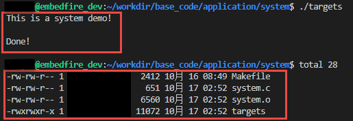

   proces009
图 37‑8 system后台运行

从图
37‑8就可以看出来，在ls命令还未来得及打印出它的所有输出结果之前，system()函数就程序就打印出字符串Done然后退出了。在system()程序退出后，ls命令继续完成它的输出。这类的处理行为往往会给用户带来很大的困惑，也不一定如用户所预料的结果一致，因此如果读者想要让进程按照自己的意愿执行，就需要能够对它们的行为做更细致的控制，接下来作者就会讲解其他方式启动新的进程。

fork()
~~~~~~

在前面的文章我们也了解到，init进程可以启动一个子进程，它通过fork()函数从原程序中创建一个完全分离的子进程，当然，这只是init进程启动子进程的第一步，后续还有其他操作的。不管怎么说，fork()函数就是可以启动一个子进程，其示意图具体见图37‑9。

在父进程中的fork()调用后返回的是新的子进程的PID。新进程将继续执行，就像原进程一样，不同之处在于，子进程中的fork()函数调用后返回的是0，父子进程可以通过返回的值来判断究竟谁是父进程，谁是子进程。

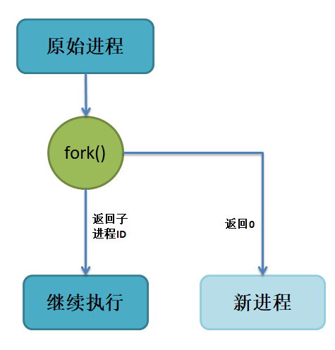

   proces010
图 37‑9 fork()示意图

fork()函数用于从一个已存在的进程中启动一个新进程，新进程称为子进程，而原进程称为父进程。使用fork()函数的本质是将父进程的内容复制一份，正如细胞分裂一样，得到的是几乎两个完全一样的细胞，因此这个启动的子进程基本上是父进程的一个复制品，但子进程与父进程有不一样的地方，作者就简单列举一下它们的联系与区别。

子进程与父进程一致的内容：

-  进程的地址空间。
-  进程上下文、代码段。
-  进程堆空间、栈空间，内存信息。
-  进程的环境变量。
-  标准 IO 的缓冲区。
-  打开的文件描述符。
-  信号响应函数。
-  当前工作路径。

子进程独有的内容：

-  进程号 PID。 PID 是身份证号码，是进程的唯一标识符。
-  记录锁。父进程对某文件加了把锁，子进程不会继承这把锁。
-  挂起的信号。这些信号是已经响应但尚未处理的信号，也就是“悬挂”的信号，子进程也不会继承这些信号。

因为子进程几乎是父进程的完全复制，所以父子两个进程会运行同一个程序，但是这种复制有一个很大的问题，那就是资源与时间都会消耗很大，当发出fork()系统调用时，内核原样复制父进程的整个地址空间并把复制的那一份分配给子进程。这种行为是非常耗时的，因为它需要做一些事情：

-  为子进程的页表分配页面。
-  为子进程的页分配页面。
-  初始化子进程的页表。
-  把父进程的页复制到子进程相应的页中

创建一个地址空间的这种方法涉及许多内存访问，消耗许多CPU周期，并且完全破坏了高速缓存中的内容，因此直接复制物理内存对系统的开销会产生很大的影响，更重要的是在大多数情况下，这样直接拷贝通常是毫无意义的，因为许多子进程通过装入一个新的程序开始它们的执行，这样就完全丢弃了所继承的地址空间。因此在linux中引入一种写时复制技术（Copy
On
Write，简称COW），我们知道，linux系统中的进程都是使用虚拟内存地址，虚拟地址与真实物理地址之间是有一个对应关系的，每个进程都有自己的虚拟地址空间，而操作虚拟地址明显比直接操作物理内存更加简便快捷，那么显而易见的，写时复制是一种可以推迟甚至避免复制数据的技术。内核此时并不复制整个进程的地址空间，而是让父子进程共享同一个地址空间（页面）。

那么写时复制的思想就是在于：父进程和子进程共享页面而不是复制页面。而共享页面就不能被修改，无论父进程和子进程何时试图向一个共享的页面写入内容时，都会产生一个错误，这时内核就把这个页复制到一个新的页面中并标记为可写。原来的页面仍然是写保护的，当还有进程试图写入时，内核检查写进程是否是这个页面的唯一属主，如果是则把这个页面标记为对这个进程是可写的。

总的来说，写时复制只会用在需要写入的时候才会复制地址空间，从而使各个进行拥有各自的地址空间，资源的复制是在需要写入的时候才会进行，在此之前，父进程与子进程都是以只读方式共享页面，这种技术使地址空间上的页的拷贝被推迟到实际发生写入的时候。而在绝大多数的时候共享的页面根本不会被写入，例如，在调用fork()函数后立即执行exec()，地址空间就无需被复制了，这样一来fork()的实际开销就是复制父进程的页表以及给子进程创建一个进程描述符。

理论相关的知识就讲解到这里就好了，作者也不打算再深入讲解，下面就看看fork()函数的使用，它的函数原型如下：

.. code:: c

    pid_t fork(void);

在fork()启动新的进程后，子进程与父进程开始并发执行，谁先执行由内核调度算法来决定。fork()函数如果成功启动了进程，会对父子进程各返回一次，其中对父进程返回子进程的
PID，对子进程返回0；如果fork()函数启动子进程失败，它将返回-1。失败通常是因为父进程所拥有的子进程数目超过了规定的限制（CHILD\_MAX），此时errno将被设为EAGAIN。如果是因为进程表里没有足够的空间用于创建新的表单或虚拟内存不足，errno变量将被设为ENOMEM。

在野火提供的system_programing/fork目录下，找到fork.c文件，它里面的应用例程就是使用fork()函数启动一个新进程，并且在进程中打印相关的信息，如在父进程中打印出“In
father process!!”等信息，例程源码具体见代码清单 37‑4。

代码清单 37‑4 fork.c源码

.. code:: c

    #include <sys/types.h>
    #include <unistd.h>
    #include <stdio.h>
    #include <stdlib.h>
    int main(void)
    {
        pid_t result;

        printf("This is a fork demo!\n\n");

        /*调用 fork()函数*/
        result = fork();

        /*通过 result 的值来判断 fork()函数的返回情况，首先进行出错处理*/
        if(result == -1) {
            printf("Fork error\n");
        }

        /*返回值为 0 代表子进程*/
        else if (result == 0) {
            printf("The returned value is %d, In child process!! My PID is %d\n\n", result, getpid());

        }

        /*返回值大于 0 代表父进程*/
        else {
            printf("The returned value is %d, In father process!! My PID is %d\n\n", result, getpid());
        }

        return result;
    }

我们来分析一下这段代码：

-  首先在第12行的时候调用了fork函数，调用fork函数后系统就会启动一个子进程，并且子进程与父进程执行的内容是一样的（代码段），读者可以通过返回值result判断fork()函数的执行结果。
-  如果result的值为-1，那代表着fork()函数执行出错，出错的原因在前文也提到，在此具体不细说。
-  如果返回的值为0，则表示此时执行的代码是子进程，那么就打印返回的结果、“In
   child process!!”与子进程的PID，进程的PID通过getpid()函数获取得到。
-  如果返回的值大于0，则表示此时执行的代码是父进程，同样也打印出返回的结果、“In
   father process!!”与父进程的PID。

在system_programing/fork目录下也提供了对应的Makefile文件，可以直接运行make进行编译，然后执行编译后生成的可执行文件“targets”，现象具体见图37‑10。

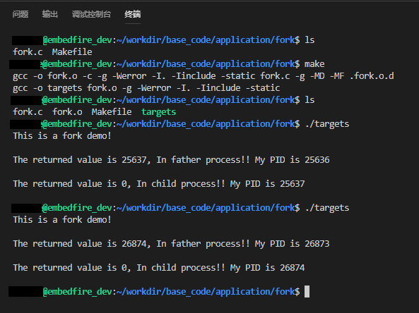

   proces011
图 37‑10 fork实验现象

细心的同学就会发现，在这个实验现象中，父进程的返回值就是子进程的PID，而子进程的返回值则是0。

exce系列函数
~~~~~~~~~~~~

事实上，使用fork()函数启动一个子进程是并没有太大作用的，因为子进程跟父进程都是一样的，子进程能干的活父进程也一样能干，因此世界各地的开发者就想方设法让子进程做不一样的事情，因此就诞生了exce系列函数，这个系列函数主要是用于替换进程的执行程序，它可以根据指定的文件名或目录名找到可执行文件，并用它来取代原调用进程的数据段、代码段和堆栈段，在执行完之后，原调用进程的内容除了进程号外，其他全部被新程序的内容替换。另外，这里的可执行文件既可以是二进制文件，也可以是Linux下任何可执行脚本文件。简单来说就是覆盖进程，举个例子，A进程调用exce系列函数启动一个进程B，此时进程B会替换进程A，进程A的内存空间、数据段、代码段等内容都将被进程B占用，进程A将不复存在。

exec 族函数有 6 个不同的 exec 函数，函数原型分别如下：

.. code:: c

     int execl(const char *path, const char *arg, ...)

     int execlp(const char *file, const char *arg, ...)

     int execle(const char *path, const char *arg, ..., char *const envp[])

     int execv(const char *path, char *const argv[])

     int execvp(const char *file, char *const argv[])

     int execve(const char *path, char *const argv[], char *const envp[])

这些函数可以分为两大类， execl、
execlp和execle的参数个数是可变的。execv、execvp和execve的第2个参数是一个字符串数组，参数以一个空指针NULL结束，无论何种函数，在调用的时候都会通过参数将这些内容传递进去，传入的参数一般都是要运行的程序（可执行文件）、脚本等。

总结来说，可以通过它们的后缀来区分他们的作用：

-  名称包含 l 字母的函数（execl、 execlp
   和execle）接收参数列表“list”作为调用程序的参数。
-  名称包含 p 字母的函数（execvp
   和execlp）接受一个程序名作为参数，然后在当前的执行路径中搜索并执行这个程序；名字不包含p字母的函数在调用时必须指定程序的完整路径，其实就是在系统环境变量“PATH”搜索可执行文件。
-  名称包含 v 字母的函数（execv、execvp 和
   execve）的命令参数通过一个数组“vector”传入。

-  

   名称包含 e 字母的函数（execve 和
   execle）比其它函数多接收一个指明环境变量列表的参数，并且可以通过参数envp传递字符串数组作为新程序的环境变量，这个envp参数的格式应为一个以
   NULL 指针作为结束标记的字符串数组，每个字符串应该表示为“environment =
       virables”的形式。

下面作者就具体某个函数做介绍：

**函数:**

.. code:: c

    int execl(const char *path, const char *arg, ...)

execl()函数用于执行参数path字符串所代表的文件路径（必须指定路径），接下来是一系列可变参数，它们代表执行该文件时传递过去的\ ``argv[0]、argv[1]… argv[n]``\ ，最后一个参数必须用空指针NULL作为结束的标志。

代码清单 37‑5 execl()函数实例

.. code:: c

    int main(void)
    {
        int err;

        printf("this is a execl function test demo!\n\n");

        err = execl("/bin/ls", "ls", "-la", NULL);

        if (err < 0) {
            printf("execl fail!\n\n");
        }
        
        printf("Done!\n\n");
    }

如以上的execlp()函数实例代码，它其实就是与我们在终端上运行“ls
-la”产生的结果是一样的。

**函数：**

.. code:: c

    int execlp(const char *file, const char *arg, ...)

execlp()函数会从PATH环境变量所指的目录中查找符合参数file的文件名（不需要指定路径），找到后便执行该文件，然后将第二个以后的参数当做该文件的\ ``argv[0]、argv[1]… argv[n]``\ ，
最后一个参数必须用空指针NULL作为结束的标志。

代码清单 37‑6 execlp()函数实例

.. code:: c

    int main(void)
    {
        int err;

        printf("this is a execlp function test demo!\n\n");

        err = execlp("ls", "ls", "-la", NULL);

        if (err < 0) {
            printf("execlp fail!\n\n");
        }
    }

**函数:**

.. code:: c

    int execle(const char *path, const char *arg, ..., char *const envp[])

execle()函数用于执行参数path字符串所代表的文件路径（必须指定路径），并为新程序复制最后一个参数所指示的环境变量（envp）。

代码清单 37‑7 execle()函数实例

.. code:: c

    int main(void)
    {
        int err;
        char *envp[] = {
            "/bin", NULL
        };

        printf("this is a execle function test demo!\n\n");

        err = execle("/bin/ls", "ls", "-la", NULL, envp);

        if (err < 0) {
            printf("execle fail!\n\n");
        }
    }

**函数：**

.. code:: c

    int execv(const char *path, char *const argv[])

execv()函数用于执行参数path字符串所代表的文件路径（必须指定路径），接着传入一个数组作为执行该文件时传递过去的参数\ ``argv[0]、argv[1]… argv[n]``\ ，以空指针NULL结束。

代码清单 37‑8 execv()函数实例

.. code:: c

    int main(void)
    {
        int err;
        char *argv[] = {
            "ls", "-la", NULL
        };

        printf("this is a execv function test demo!\n\n");

        err = execv("/bin/ls", argv);

        if (err < 0) {
            printf("execv fail!\n\n");
        }
    }

函数

.. code:: c

    int execvp(const char *path, char *const argv[])

execvp()函数会从PATH环境变量所指的目录中查找符合参数file的文件名（不需要指定路径），找到该文件后便执行该文件，接着传入一个数组作为执行该文件时传递过去的参数\ ``argv[0]、argv[1] … argv[n]``\ ，以空指针NULL结束。

代码清单 37‑9 execvp()函数实例

.. code:: c

    int main(void)
    {
        int err;
        char *argv[] = {
            "ls", "-la", NULL
        };

        printf("this is a execvp function test demo!\n\n");

        err = execvp("ls", argv);

        if (err < 0) {
            printf("execvp fail!\n\n");
        }
    }

**函数：**

.. code:: c

    int execve(const char *path, char *const argv[], char *const envp[])

execve()函数用于执行参数path字符串所代表的文件路径（必须指定路径），执行该文件时会传入一个数组作为执行该文件时传递过去的参数\ ``argv[0]、argv[1] … argv[n]``\ ，除此之外该函数还会为新程序复制最后一个参数所指示的环境变量（envp）。

代码清单 37‑10 execve ()函数实例

.. code:: c

    int main(void)
    {
        int err;
        char *argv[] = {
            "ls", "-la", NULL
        };
        char *envp[] = {
            "/bin", NULL
        };

        printf("this is a execve function test demo!\n\n");

        err = execve("/bin/ls", argv, envp);

        if (err < 0) {
            printf("execve fail!\n\n");
        }
    }

以上函数实例代码均在system_programing/exce目录下，选择对应的代码进行编译即可，该目录也提供了对应的Makefile文件，可以直接运行make进行编译，然后执行编译后生成的可执行文件“targets”，具体现象如图
37‑11所示。

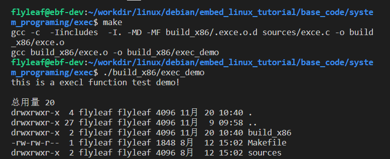

   proces012
图 37‑11 exce系列函数实验现象

程序先打印出它的第一条消息“this is a execl function test
demo!”，接着调用exec系列函数（实验中使用execl()函数），这个函数在/bin/ls目录中搜索程序ls，然后用这个程序替换targets程序，这与直接在终端中使用以下所示的shell命令一样，如图37‑12所示。

**命令：**

.. code:: bash

    ls -la

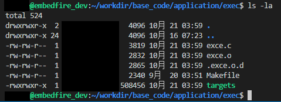

   proces013
图 37‑12 ls –la命令

注意，exce系列函数是直接将当前进程给替换掉的，当调用exce系列函数后，当前进程将不会再继续执行，我们可以测试一下，在调用exce系列函数后再打印一句话，具体代码如代码清单37‑11加粗部分所示。

代码清单 37‑11 exce系列函数测试代码

.. code:: c

    int main(void)
    {
        int err;

        printf("this is a execl function test demo!\n\n");

        err = execl("/bin/ls", "ls", "-la", NULL);

        if (err < 0) {
            printf("execl fail!\n\n");
        }
        
        printf("Done!\n\n");
    }

在程序运行后，“\ **Done!**\ ”将不被输出，因为当前进程已经被替换了，一般情况下，
exec系列函数函数是不会返回的，除非发生了错误。出现错误时，
exec系列函数将返回-1，并且会设置错误变量errno。

因此我们可以通过调用fork()复制启动一个子进程，并且在子进程中调用exec系列函数替换子进程，这样子
fork()和exec系列函数结合在一起使用就是创建一个新进程所需要的一切了。

终止进程
--------

在linux系统中，进程终止（或者称为进程退出，为了统一，下文均使用“终止”一词）的常见方式有5种，可以分为正常终止与异常终止：

**正常终止：**

-  从main函数返回。

-  调用exit()函数终止。

-  调用\_exit()函数终止。

**异常终止：**

-  调用abort()函数异常终止。

-  由系统信号终止。

在linux系统中，exit()函数定义在stdlib.h中，而\_exit()定义在unistd.h中，exit()和\_exit()函数都是用来终止进程的，当程序执行到exit()或\_exit()函数时，进程会无条件地停止剩下的所有操作，清除包括
PCB在内的各种数据结构，并终止当前进程的运行。不过这两个函数还是有区别的，具体如图37‑13所示。

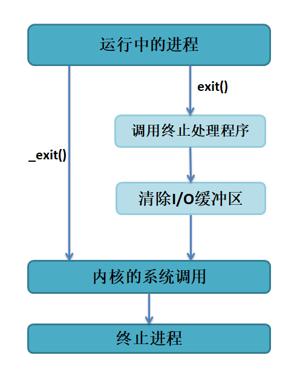

   proces014
图 37‑13 exit()和\_exit()函数的区别

从图中可以看出，\_exit()函数的作用最为简单：直接通过系统调用使进程终止运行，当然，在终止进程的时候会清除这个进程使用的内存空间，并销毁它在内核中的各种数据结构；而exit()函数则在这些基础上做了一些包装，在执行退出之前加了若干道工序：比如exit()函数在调用exit系统调用之前要检查文件的打开情况，把文件缓冲区中的内容写回文件，这就是“清除I/O缓冲”。

由于在 Linux 的标准函数库中，有一种被称作“缓冲 I/O（buffered
I/O）”操作，其特征就是对应每一个打开的文件，在内存中都有一片缓冲区。每次读文件时，会连续读出若干条记录，这样在下次读文件时就可以直接从内存的缓冲区中读取；同样，每次写文件的时候，也仅仅是写入内存中的缓冲区，等满足了一定的条件（如达到一定数量或遇到特定字符等），再将缓冲区中的内容一次性写入文件。这种技术大大增加了文件读写的速度，但也为编程带来了一些麻烦。比如有些数据，认为已经被写入文件中，实际上因为没有满足特定的条件，它们还只是被保存在缓冲区内，这时用\_exit()函数直接将进程关闭，缓冲区中的数据就会丢失。因此，若想保证数据的完整性，就一定要使用
exit()函数。

不管是那种退出方式，系统最终都会执行内核中的同一代码，这段代码用来关闭进程所用已打开的文件描述符，释放它所占用的内存和其他资源。

下面一起看看\_exit()与exit()函数的使用方法：

**头文件：**

.. code:: c

    #include <unistd.h>
    #include <stdlib.h>

**函数原型：**

.. code:: c

    void _exit(int status);
    void exit(int status);

这两个函数都会传入一个参数status，这个参数表示的是进程终止时的状态码，0表示正常终止，其他非0值表示异常终止，一般都可以使用-1或者1表示，标准C里有EXIT\_SUCCESS和EXIT\_FAILURE两个宏，表示正常与异常终止。

这些函数的使用都是非常简单的，只需要在需要终止的地方调用一下即可，此处就不深入讲解。

等待进程
--------

在linux中，当我们使用fork()函数启动一个子进程时，子进程就有了它自己的生命周期并将独立运行，在某些时候，可能父进程希望知道一个子进程何时结束，或者想要知道子进程结束的状态，甚至是等待着子进程结束，那么我们可以通过在父进程中调用wait()或者waitpid()函数让父进程等待子进程的结束。

从前面的文章我们也了解到，当一个进程调用了exit()之后，该进程并不会立刻完全消失，而是变成了一个僵尸进程。僵尸进程是一种非常特殊的进程，它已经放弃了几乎所有的内存空间，没有任何可执行代码，也不能被调度，仅仅在进程列表中保留一个位置，记载该进程的退出状态等信息供其他进程收集，除此之外，僵尸进程不再占有任何内存空间。那么无论如何，父进程都要回收这个僵尸进程，因此调用wait()或者waitpid()函数其实就是将这些僵尸进程回收，释放僵尸进程占有的内存空间，并且了解一下进程终止的状态信息。

我们可以在终端中通过man命令查看关于wait相关的函数，具体命令如下：

**命令：**

.. code:: bash

    man 2 wait

    # 输出

    NAME
           wait, waitpid, waitid - wait for process to change state

    SYNOPSIS
           #include <sys/types.h>
           #include <sys/wait.h>

           pid_t wait(int *wstatus);

           pid_t waitpid(pid_t pid, int *wstatus, int options);

           int waitid(idtype_t idtype, id_t id, siginfo_t *infop, int options);
    # ……(省略其他)

可能很多读者对man命令不了解，那我就简单说一下man命令相关的内容吧，其实在linux系统中是提供了丰富的帮助手册，当你需要查看某个命令的参数时不必到处上网查找，只要man一下即可，man命令是就是用于找出这些帮助手册的内容的，比如有什么shell命令，有什么可以调用的函数
等等。

man 命令是按照章节存储的，linux的man手册共有8个章节，具体见表格 37‑2。

**表格 37‑2 man 命令说明:**

+------------+--------------------------+---------------------------------------------+
| 章节编号   | 章节名称                 | 章节主要内容                                |
+============+==========================+=============================================+
| 1          | General Commands         | 用户在shell中可以操作的指令或者可执行文档   |
+------------+--------------------------+---------------------------------------------+
| 2          | System Calls             | 系统调用的函数与工具等                      |
+------------+--------------------------+---------------------------------------------+
| 3          | Sunroutines              | C语言库函数                                 |
+------------+--------------------------+---------------------------------------------+
| 4          | Special Files            | 设备或者特殊文件                            |
+------------+--------------------------+---------------------------------------------+
| 5          | File Formats             | 文件格式与规则                              |
+------------+--------------------------+---------------------------------------------+
| 6          | Games                    | 游戏及其他                                  |
+------------+--------------------------+---------------------------------------------+
| 7          | Macros and Conventions   | 表示宏、包及其他杂项                        |
+------------+--------------------------+---------------------------------------------+
| 8          | Maintenence Commands     | 表示系统管理员相关的命令                    |
+------------+--------------------------+---------------------------------------------+

例如我们想找与wait相关的函数，那么我们只需要输入以下命令即可：

.. code:: bash

    man 2 wait

例如我们想要了解ls命令相关的内容，我们可以直接输入以下命令，就可以看到关于ls相关的用法等内容。

**命令:**

.. code:: bash

    man ls

    # 输出

    NAME
           ls - list directory contents

    SYNOPSIS
           ls [OPTION]... [FILE]...

    DESCRIPTION
           List information about the FILEs (the current directory by default).  Sort entries alphabetically if none of -cftuvSUX nor --sort is specified.

           Mandatory arguments to long options are mandatory for short options too.

           -a, --all
                  do not ignore entries starting with .

    ……(省略其他)

    当然啦，man手册是英文的，这是属于全世界通用的技术交流语言，因此读者还是需要对英文有一定熟悉程度。

wait()
~~~~~~

我们通过man命令就知道了wait()、waitpid()函数原型，那么我们就首先了解下wait()函数。

函数原型

.. code:: bash

    pid_t wait(int *wstatus);

wait()函数在被调用的时候，系统将暂停父进程的执行，直到有信号来到或子进程结束，如果在调用wait()函数时子进程已经结束，则会立即返回子进程结束状态值。子进程的结束状态信息会由参数wstatus返回，与此同时该函数会返子进程的PID，它通常是已经结束运行的子进程的PID。状态信息允许父进程了解子进程的退出状态，如果不在意子进程的结束状态信息，则参数wstatus可以设成NULL。

wait()函数有几点需要注意的地方：

1. wait()要与fork()配套出现，如果在使用fork()之前调用wait()，wait()的返回值则为-1，正常情况下wait()的返回值为子进程的PID。
2. 参数wstatus用来保存被收集进程退出时的一些状态，它是一个指向int类型的指针，但如果我们对这个子进程是如何死掉毫不在意，只想把这个僵尸进程消灭掉，（事实上绝大多数情况下，我们都会这样做），我们就可以设定这个参数为NULL。

当然，除此之外，linux系统中还提供关于等待子进程退出的一些宏定义，我们可以使用这些宏定义来直接判断子进程退出的状态：

-  WIFEXITED(status) ：如果子进程正常结束，返回一个非零值

-  WEXITSTATUS(status)： 如果WIFEXITED非零，返回子进程退出码

-  WIFSIGNALED(status) ：子进程因为捕获信号而终止，返回非零值

-  WTERMSIG(status) ：如果WIFSIGNALED非零，返回信号代码

-  WIFSTOPPED(status)： 如果子进程被暂停，返回一个非零值

-  WSTOPSIG(status)： 如果WIFSTOPPED非零，返回一个信号代码

wait()函数使用实例如下：

代码清单 37‑12 wait()函数使用实例

.. code:: c

    #include <sys/types.h>
    #include <sys/wait.h>
    #include <unistd.h>
    #include <stdio.h>
    #include <stdlib.h>

    int main()
    {
        pid_t pid, child_pid;
        int status;

        pid = fork();                  //(1)

        if (pid < 0) {
            printf("Error fork\n");
        }
        /*子进程*/
        else if (pid == 0) {                  //(2)

            printf("I am a child process!, my pid is %d!\n\n",getpid());

            /*子进程暂停 3s*/
            sleep(3);

            printf("I am about to quit the process!\n\n");

            /*子进程正常退出*/
            exit(0);                          //(3)
        }
        /*父进程*/
        else {                                //(4)

            /*调用 wait，父进程阻塞*/
            child_pid = wait(&status);        //(5)

            /*若发现子进程退出，打印出相应情况*/
            if (child_pid == pid) {
                printf("Get exit child process id: %d\n",child_pid);
                printf("Get child exit status: %d\n\n",status);
            } else {
                printf("Some error occured.\n\n");
            }

            exit(0);
        }
    }

我们来分析一下这段代码：

代码清单 37‑12 **(1)**\ ：首先调用fork()函数启动一个子进程。

代码清单 37‑12
**(2)**\ ：如果fork()函数返回的值pid为0，则表示此时运行的是子进程，那么就让子进程输出一段信息，并且休眠3s。

代码清单37‑12
**(3)**\ ：休眠结束后调用exit()函数退出，退出状态为0，表示子进程正常退出。

代码清单 37‑12
**(4)**\ ：如果fork()函数返回的值pid不为0，则表示此时运行的是父进程，那么在父进程中调用wait(&status)函数等待子进程的退出，子进程的退出状态将保存在status变量中。

代码清单37‑12
**(5)**\ ：若发现子进程退出（通过wait()函数返回的子进程pid判断），则打印出相应信息，如子进程的pid与status。

以上函数实例代码在system_programing/wait目录下，选择对应的代码进行编译即可，该目录也提供了对应的Makefile文件，可以直接运行make进行编译，然后执行编译后生成的可执行文件“targets”，执行结果如图
37‑14所示。

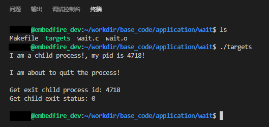

   proces015
图 37‑14 wait()函数现象

waitpid()
~~~~~~~~~

waitpid()函数
的作用和wait()函数一样，但它并不一定要等待第一个终止的子进程，它还有其他选项，比如指定等待某个pid的子进程、提供一个非阻塞版本的wait()功能等。实际上
wait()函数只是 waitpid() 函数的一个特例，在 linux内部实现 wait
函数时直接调用的就是 waitpid 函数。

函数原型

.. code:: C

    pid_t waitpid(pid_t pid, int *wstatus, int options);

waitpid()函数的参数有3个，下面就简单介绍这些参数相关的选项：

-  pid：参数pid为要等待的子进程ID，其具体含义如下：

1. pid < -1：等待进程组号为pid绝对值的任何子进程。
2. pid = -1：等待任何子进程，此时的waitpid()函数就等同于wait()函数。
3. pid
   =0：等待进程组号与目前进程相同的任何子进程，即等待任何与调用waitpid()函数的进程在同一个进程组的进程。
4. pid > 0：等待指定进程号为pid的子进程。

-  wstatus：与wait()函数一样。
-  options：参数options提供了一些另外的选项来控制waitpid()函数的行为。如果不想使用这些选项，则可以把这个参数设为0。

1. WNOHANG：如果pid指定的子进程没有终止运行，则waitpid()函数立即返回0，而不是阻塞在这个函数上等待；如果子进程已经终止运行，则立即返回该子进程的进程号与状态信息。
2. WUNTRACED：如果子进程进入了暂停状态（可能子进程正处于被追踪等情况），则马上返回。
3. WCONTINUED：如果子进程恢复通过SIGCONT信号运行，也会立即返回（这个不常用，了解一下即可）。

很显然，当waitpid()函数的参数为(-1, status,
0)时，waitpid()函数就完全退化成了wait()函数。

下面看一下waitpid()函数使用实例，具体见代码清单 37‑13。

代码清单 37‑13 waitpid()函数使用实例

.. code:: C

    #include <sys/types.h>
    #include <sys/wait.h>
    #include <unistd.h>
    #include <stdio.h>
    #include <stdlib.h>

    int main()
    {
        pid_t pid, child_pid;
        int status;

        pid = fork();

        if (pid < 0) {
            printf("Error fork\n");
        }
        /*子进程*/
        else if (pid == 0) {

            printf("I am a child process!, my pid is %d!\n\n",getpid());

            /*子进程暂停 3s*/
            sleep(3);

            printf("I am about to quit the process!\n\n");
            /*子进程正常退出*/
            exit(0);
        }
        /*父进程*/
        else {

            /*调用 waitpid，且父进程不阻塞*/
            child_pid = waitpid(pid, &status, WUNTRACED);

            /*若发现子进程退出，打印出相应情况*/
            if (child_pid == pid) {
                printf("Get exit child process id: %d\n",child_pid);
                printf("Get child exit status: %d\n\n",status);
            } else {
                printf("Some error occured.\n");
            }

            exit(0);
        }
    }

编译后运行，它的实验现象与wait()函数的是一样的。
