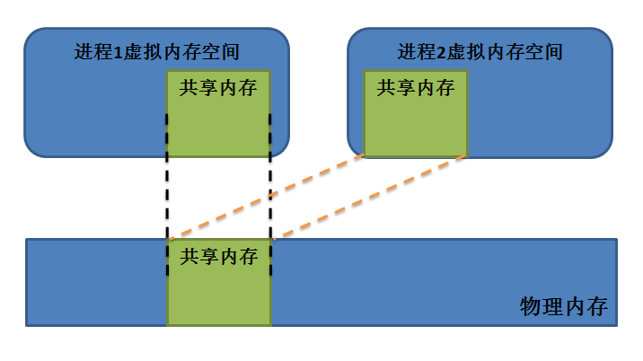

共享内存
========

共享内存基本概念
----------------

什么是共享内存？顾名思义，共享内存就是将内存进行共享，它允许多个不相关的进程访问同一个逻辑内存，直接将一块裸露的内存放在需要数据传输的进程面前，让它们自己使用。因此，共享内存是效率最高的一种IPC通信机制，它可以在多个进程之间共享和传递数据，进程间需要共享的数据被放在共享内存区域，所有需要访问该共享区域的进程都要把该共享区域映射到本进程的地址空间中去，因此所有进程都可以访问共享内存中的地址，就好像它们是由用C语言函数malloc分配的内存一样。

但是，这种共享的内存需要进程自己去维护好，如同步、互斥等工作，比如当进程1在读取共享内存的数据时，进程2却修改了共享内存中的数据，那么必然会造成数据的混乱，进程1读取到的数据就是错误的，因此，共享内存是属于临界资源，在某一时刻最多只能有一个进程对其操作（读
/
写数据），所以共享内存一般不能单独使用，而要配合信号量、互斥锁等协调机制，让各个进程在高效交换数据的同时，不会发生数据践踏、破坏等意外。

共享内存的思想非常简单，进程与进程之间虚拟内存空间本来相互独立，不能互相访问的，但是可以通过某些方式，使得相同的一块物理内存多次映射到不同的进程虚拟空间之中，这样的效果就相当于多个进程的虚拟内存空间部分重叠在一起，如图所示：

   共享内存
当进程1向共享内存写入数据后，共享内存的数据就变化了，那么进程2就能立即读取到变化了的数据，而这中间并未经过内核的拷贝，因此效率极高。

**总的来说共享内存有以下特点：**

1. 共享内存是进程间通信中效率最高的方式之一。

2. 共享内存是系统出于多个进程之间通讯的考虑，而预留的的一块内存区，因此共享内存是以传输数据为目的的。

3. 共享内存允许两个或更多进程访问同一块内存，当一个进程改变了这块地址中的内容的时候，其它进程都会察觉到这个更改。

4. 共享内存无同步无互斥。

**共享内存的优缺点：**

-  优点：使用共享内存进行进程间的通信非常方便，而且函数的接口也简单，数据的共享使进程间的数据不用传送，而是直接访问内存，加快了程序的效率。同时，它也不像匿名管道那样要求通信的进程有一定的“血缘”关系，只要是系统中的任意进程都可以对共享内存进行读写操作。

-  缺点：共享内存没有提供同步的机制，这使得我们在使用共享内存进行进程间通信时，往往要借助其他的手段（如信号量、互斥量等）来进行进程间的同步工作。

创建或获取共享内存ID
--------------------

**想要使用共享内存，必须包含以下头文件：**

.. code:: c

        #include <sys/ipc.h>
        #include <sys/shm.h>

**shmget()**

shmget()函数的主要主要是得到一个共享内存标识符或创建一个共享内存对象并返回共享内存标识符。

**函数原型：**

.. code:: c

        int shmget(key_t key, size_t size, int shmflg);

**参数：**

1. key：标识共享内存的键值，可以有以下取值：

-  0 / IPC\_PRIVATE。
   当key的取值为IPC\_PRIVATE，则函数shmget()将创建一块新的共享内存；如果key的取值为0，而参数shmflg中设置了IPC\_PRIVATE这个标志，则同样将创建一块新的共享内存。
-  大于0的32位整数：视参数shmflg来确定操作。

2. size：要创建共享内存的大小，所有的内存分配操作都是以页为单位的，所以即使只申请只有一个字节的内存，内存也会分配整整一页。

3. shmflg：表示创建的共享内存的模式标志参数，在真正使用时需要与IPC对象存取权限mode（如0600）进行“｜”运算来确定共享内存的存取权限。msgflg有多种情况：

-  IPC\_CREAT：如果内核中不存在关键字与key相等的共享内存，则新建一个共享内存；如果存在这样的共享内存，返回此共享内存的标识符。
-  IPC\_EXCL：如果内核中不存在键值与key相等的共享内存，则新建一个共享内存；如果存在这样的共享内存则报错。
-  SHM\_HUGETLB：使用“大页面”来分配共享内存，所谓的“大页面”指的是内核为了提高程序性能，对内存实行分页管理时，采用比默认尺寸（4KB）更大的分页，以减少缺页中断。Linux内核支持以2MB作为物理页面分页的基本单位。
-  SHM\_NORESERVE：不在交换分区中为这块共享内存保留空间。

**错误代码：**

当调用shmget()函数失败时将产生错误代码。

-  EACCES：指定的消息队列已存在，但调用进程没有权限访问它
-  EEXIST：key指定的消息队列已存在，而msgflg中同时指定IPC\_CREAT和IPC\_EXCL标志
-  EINVAL：创建共享内存时参数size小于SHMMIN或大于SHMMAX。
-  ENFILE：已达到系统范围内打开文件总数的限制。
-  ENOENT：给定的key不存在任何共享内存，并且未指定IPC\_CREAT。
-  ENOMEM：内存不足，无法为共享内存分配内存。
-  EACCES：没有权限。

shmget()函数的返回值是共享内存的ID。

映射共享内存
------------

**shmat()**

从前文我们就知道了，如果一个进程想要访问这个共享内存，那么需要将其映射到进程的虚拟空间中，然后再去访问它，那么shmat()函数就是把共享内存区对象映射到调用进程的地址空间。

**函数原型：**

.. code:: c

        void *shmat(int shmid, const void *shmaddr, int shmflg);

**参数：**

1. shmid：共享内存ID，通常是由shmget()函数返回的。
2. shmaddr：如果不为NULL，则系统会根据shmaddr来选择一个合适的内存区域，如果为NULL，则系统会自动选择一个合适的虚拟内存空间地址去映射共享内存。
3. shmflg：操作共享内存的方式：

-  SHM\_RDONLY：以只读方式映射共享内存。
-  SHM\_REMAP：重新映射，此时shmaddr不能为NULL。
-  NULLSHM：自动选择比shmaddr小的最大页对齐地址。

shmat()函数调用成功后返回共享内存的起始地址，这样子我们就能操作这个共享内存了。

共享内存的映射有以下注意的要点：

-  共享内存只能以只读或者可读写方式映射，无法以只写方式映射。
-  shmat()第二个参数shmaddr一般都设为NULL，让系统自动找寻合适的地址。但当其确实不为空时，那么要求SHM\_RND在shmflg必须被设置，这样的话系统将会选择比shmaddr小而又最大的页对齐地址（即为SHMLBA的整数倍）作为共享内存区域的起始地址。如果没有设置SHM\_RND，那么shmaddr必须是严格的页对齐地址。

解除共享内存的映射
------------------

**shmdt()**

shmdt()函数与shmat()函数相反，是用来解除进程与共享内存之间的映射的，在解除映射后，该进程不能再访问这个共享内存。

**函数原型：**

.. code:: c

        int shmdt(const void *shmaddr);

**参数：**

-  shmaddr：映射的共享内存的起始地址。

shmdt()函数调用成功返回0，如果出错则返回-1，并且将错误原因存于error中。

虽然shmdt()函数很简单，但是还是有注意的要点的，该函数并不删除所指定的共享内存区，而只是将先前用shmat()函数映射好的共享内存脱离当前进程，共享内存还是存在于物理内存中。

获取或设置共享内存的相关属性
----------------------------

**shmctl()**

shmctl()用于获取或者设置共享内存的相关属性的。

**函数原型：**

.. code:: c

        int shmctl(int shmid, int cmd, struct shmid_ds *buf);

**参数：**

1. shmid：共享内存标识符。
2. cmd：函数功能的控制命令，其取值如下：

-  IPC\_STAT：获取属性信息，放置到buf中。
-  IPC\_SET：设置属性信息为buf指向的内容。
-  IPC\_RMID：删除这该共享内存。
-  IPC\_INFO：获得关于共享内存的系统限制值信息。
-  SHM\_INFO：获得系统为共享内存消耗的资源信息。
-  SHM\_STAT：与IPC\_STAT具有相同的功能，但shmid为该SHM在内核中记录所有SHM信息的数组的下标，因此通过迭代所有的下标可以获得系统中所有SHM的相关信息。
-  SHM\_LOCK：禁止系统将该SHM交换至swap分区。
-  SHM\_UNLOCK：允许系统将该SHM交换至swap分。

-  buf：共享内存属性信息结构体指针，设置或者获取信息都通过该结构体，shmid\_ds结构如下：

注意：选项SHM\_LOCK不是锁定读写权限，而是锁定SHM能否与swap分区发生交换。一个SHM被交换至swap分区后如果被设置了SHM\_LOCK，那么任何访问这个SHM的进程都将会遇到页错误。进程可以通过IPC\_STAT后得到的mode来检测SHM\_LOCKED信息。

.. code:: c

        struct shmid_ds {
            struct ipc_perm shm_perm;    /* 所有权和权限 */
            size_t          shm_segsz;   /* 共享内存尺寸（字节） */
            time_t          shm_atime;   /* 最后一次映射时间 */
            time_t          shm_dtime;   /* 最后一个解除映射时间 */
            time_t          shm_ctime;   /* 最后一次状态修改时间 */
            pid_t           shm_cpid;    /* 创建者PID */
            pid_t           shm_lpid;    /* 后一次映射或解除映射者PID */
            shmatt_t        shm_nattch;  /* 映射该SHM的进程个数 */
            ...
        };

其中权限信息结构体如下：

::

        struct ipc_perm {
            key_t          __key;    /* 该共享内存的键值key */
            uid_t          uid;      /* 所有者的有效UID */
            gid_t          gid;      /* 所有者的有效GID */
            uid_t          cuid;     /* 创建者的有效UID */
            gid_t          cgid;     /* 创建者的有效GID */
            unsigned short mode;     /* 读写权限 + SHM_DEST + SHM_LOCKED 标记 */
            unsigned short __seq;    /* 序列号 */
        };

使用实例
--------

**使用共享内存的一般步骤是：**

1. 创建或获取共享内存ID。
2. 将共享内存映射至本进程虚拟内存空间的某个区域。
3. 当不再使用时，解除映射关系。
4. 当没有进程再需要这块共享内存时，删除它。

共享内存由于其特性，与进程中的其他内存段在使用习惯上有些不同。一般进程对栈空间分配可以自动回收，而堆空间通过malloc申请，free回收，这些内存在回收之后就可以认为是不存在了。但是共享内存不同，用shmdt()函数解除映射后，实际上其占用的内存还在，并仍然可以使用shmat映射使用。如果不使用shmctl()函数删除这个共享内存的话，那么它将一直保留直到系统被关闭，除此之外，我们应该配合信号量去使用共享内存，避免多进程间的随意使用造成数据踩踏。

首先我们需要使用到system V
信号量，在上一章我们就封装了这个信号量，此处不再重复赘述，然后我们需要实现两个进程，分别为共享内存写进程，共享内存读进程，在写进程中实现写数据，在读进程中将数据读取，并且打印出来，代码如下：

**读进程：**

.. code:: c

    #include <sys/types.h>
    #include <sys/shm.h>
    #include <sys/sem.h>
    #include <sys/ipc.h>
    #include <unistd.h>
    #include <stdlib.h>
    #include <stdio.h>
    #include <string.h>
    #include <sys/stat.h>
    #include <fcntl.h>
    #include <errno.h>

    #include "sem.h"

    int main(void)
    {
        int running = 1;//程序是否继续运行的标志
        char *shm = NULL;//分配的共享内存的原始首地址
        int shmid;//共享内存标识符
        int semid;//信号量标识符

        //创建共享内存
        shmid = shmget((key_t)1234, 4096, 0666 | IPC_CREAT);
        if(shmid == -1)
        {
            fprintf(stderr, "shmget failed\n");
            exit(EXIT_FAILURE);
        }

        //将共享内存连接到当前进程的地址空间
        shm = shmat(shmid, 0, 0);
        if(shm == (void*)-1)
        {
            fprintf(stderr, "shmat failed\n");
            exit(EXIT_FAILURE);
        }
        printf("\nMemory attached at %p\n", shm);

        /** 打开信号量，不存在则创建 */
        semid = semget((key_t)6666, 1, 0666|IPC_CREAT); /* 创建一个信号量*/

        if(semid == -1)
        {
            printf("sem open fail\n");
            exit(EXIT_FAILURE); 
        }

        init_sem(semid, 0);

        while(running)//读取共享内存中的数据
        {
            /** 等待心信号量 */
            if(sem_p(semid) == 0)
            {
                printf("You wrote: %s", shm);
                sleep(rand() % 3);
                
                //输入了end，退出循环（程序）
                if(strncmp(shm, "end", 3) == 0)
                    running = 0;
            }
        }

        del_sem(semid); /** 删除信号量 */

        //把共享内存从当前进程中分离
        if(shmdt(shm) == -1)
        {
            fprintf(stderr, "shmdt failed\n");
            exit(EXIT_FAILURE);
        }
        
        //删除共享内存
        if(shmctl(shmid, IPC_RMID, 0) == -1)
        {
            fprintf(stderr, "shmctl(IPC_RMID) failed\n");
            exit(EXIT_FAILURE);
        }
        exit(EXIT_SUCCESS);
    }

**写进程：**

.. code:: c

    #include <sys/types.h>
    #include <sys/shm.h>
    #include <sys/sem.h>
    #include <sys/ipc.h>
    #include <unistd.h>
    #include <stdlib.h>
    #include <stdio.h>
    #include <string.h>
    #include <sys/stat.h>
    #include <fcntl.h>
    #include <errno.h>

    #include "sem.h"

    int main()
    {
        int running = 1;
        void *shm = NULL;
        struct shared_use_st *shared = NULL;
        char buffer[BUFSIZ + 1];//用于保存输入的文本
        int shmid;
        int semid;;//信号量标识符

        //创建共享内存
        shmid = shmget((key_t)1234, 4096, 0644 | IPC_CREAT);
        if(shmid == -1)
        {
            fprintf(stderr, "shmget failed\n");
            exit(EXIT_FAILURE);
        }
        //将共享内存连接到当前进程的地址空间
        shm = shmat(shmid, (void*)0, 0);
        if(shm == (void*)-1)
        {
            fprintf(stderr, "shmat failed\n");
            exit(EXIT_FAILURE);
        }
        printf("Memory attached at %p\n", shm);

        /** 打开信号量，不存在则创建 */
        semid = semget((key_t)6666, 1, 0666|IPC_CREAT);

        if(semid == -1)
        {
            printf("sem open fail\n");
            exit(EXIT_FAILURE); 
        }

        while(running)//向共享内存中写数据
        {
            //向共享内存中写入数据
            printf("Enter some text: ");
            fgets(buffer, BUFSIZ, stdin);
            strncpy(shm, buffer, 4096);

            sem_v(semid);/* 释放信号量 */

            //输入了end，退出循环（程序）
            if(strncmp(buffer, "end", 3) == 0)
                running = 0;
        }

        //把共享内存从当前进程中分离
        if(shmdt(shm) == -1)
        {
            fprintf(stderr, "shmdt failed\n");
            exit(EXIT_FAILURE);
        }
        sleep(2);
        exit(EXIT_SUCCESS);
    }

该代码在system\_programing/shm\_read目录及system\_programing/shm\_write目录下，分别编译并且运行即可，现象如下：

**读进程：**

.. code:: bash

    ➜  shm_read git:(master) ✗ ./targets

    Memory attached at 0x7f2df8f9e000
    You wrote: embedfire
    You wrote: good
    You wrote: nice
    You wrote: 123456
    You wrote: 6666666666666
    You wrote: end

**写进程：**

在写进程中可以输入任何信息，当输入end表示结束，此时共享内存将被删除。

.. code:: bash

    ➜  shm_write git:(master) ✗ ./targets

    Memory attached at 0x7f66e44e4000
    Enter some text: embedfire
    Enter some text: good
    Enter some text: nice
    Enter some text: 123456
    Enter some text: 6666666666666
    Enter some text: end 

