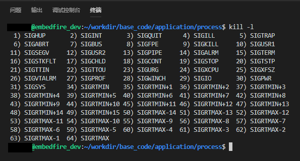
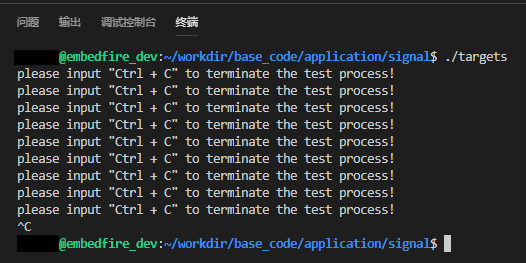
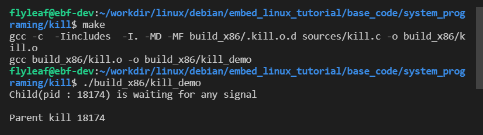
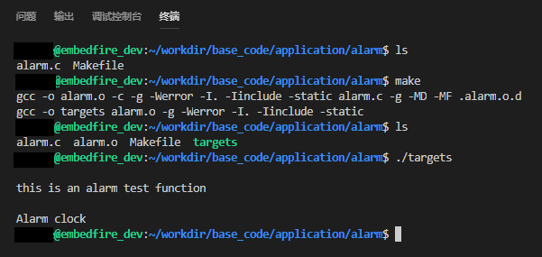
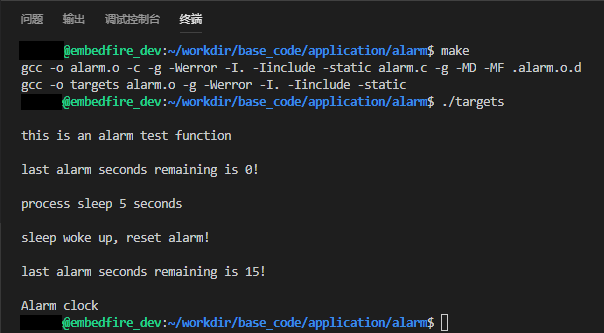
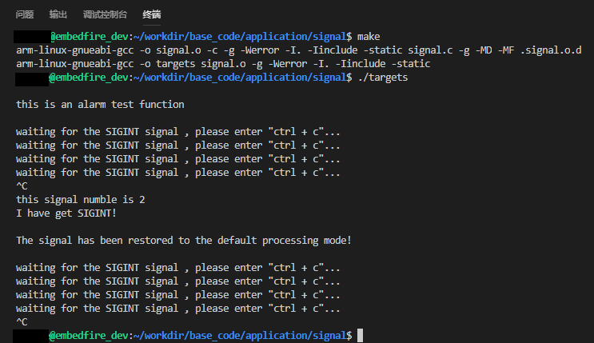
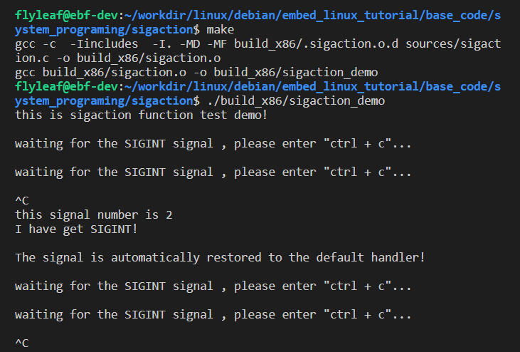

.. vim: syntax=rst

信号
====

信号的基本概念
--------------

概述
~~~~

信号（signal），又称为软中断信号，用于通知进程发生了异步事件，它是Linux系统响应某些条件而产生的一个事件，它是在软件层次上对中断机制的一种模拟，是一种异步通信方式，在原理上，一个进程收到一个信号与处理器收到一个中断请求可以说是一样的。

信号是进程间通信机制中唯一的异步通信机制，一个进程不必通过任何操作来等待信号的到达，事实上，进程也不知道信号到底什么时候到达。正如我们所了解的中断服务函数一样，在中断发生的时候，就会进入中断服务函数中去处理，同样的，当进程接收到一个信号的时候，也会相应地采取一些行动。我们可以使用术语"生成（raise）"表示一个信号的产生，使用术语"捕获（catch）"表示进程接收到一个信号。

在Linux系统中，信号可能是由于系统中某些错误而产生，也可以是摸个进程主动生成的一个信号。由于某些错误条件而生成的信号：如内存段冲突、浮点处理器错误或非法指令等，它们由shell和终端处理器生成并且引起中断。由进程主动生成的信号可以作为在进程间传递通知或修改行为的一种方式，它可以明确地由一个进程发送给另一个进程，当进程捕获了这个信号就会按照程序进行相应并且去处理它。无论何种情况，它们的编程接口都是相同的，信号可以被生成、捕获、响应或忽略。进程之间可以互相发送信号，内核也可以因为内部事件而给进程发送信号，通知进程发生了某个事件。

系统支持的信号
~~~~~~~~~~~~~~

我们可以使用kill 命令来查看系统中支持的信号种类：

**命令**

.. code:: bash

    kill -l

   signal002
图 38‑1 Linux系统支持的信号

从图中可以看出，Linux系统支持信号62种信号，每种信号名称都以SIG三个字符开头，注意，没有信号值为32和33的信号。

可以将这62中信号分为2大类：信号值为1~31的信号属性非实时信号（也称为不可靠信号），它们是从UNIX
系统中继承下来的信号，具体的作用见表格
38‑1，信号值为34~64的信号为实时信号（也被称为可靠信号）。

表格 38‑1 Linux信号种类与描述

+----------+-------------+------------------------------------------------------------------------------------------------------------------------------------------------------------------------------------------------------------------------------------------------------------------------------------------------------------------------------------------------+----------------------------------+
| 信号值   | 名称        | 描述                                                                                                                                                                                                                                                                                                                                           | 默认处理                         |
+==========+=============+================================================================================================================================================================================================================================================================================================================================================+==================================+
| 1        | SIGHUP      | 控制终端被关闭时产生。                                                                                                                                                                                                                                                                                                                         | 终止                             |
+----------+-------------+------------------------------------------------------------------------------------------------------------------------------------------------------------------------------------------------------------------------------------------------------------------------------------------------------------------------------------------------+----------------------------------+
| 2        | SIGINT      | 程序终止(interrupt)信号，在用户键入INTR字符（通常是Ctrl + C）时发出，用于通知前台进程组终止进程。                                                                                                                                                                                                                                              | 终止                             |
+----------+-------------+------------------------------------------------------------------------------------------------------------------------------------------------------------------------------------------------------------------------------------------------------------------------------------------------------------------------------------------------+----------------------------------+
| 3        | SIGQUIT     | SIGQUIT 和SIGINT类似，但由QUIT字符（通常是Ctrl + ）来控制，进程在因收到SIGQUIT退出时会产生core文件，在这个意义上类似于一个程序错误信号。                                                                                                                                                                                                       | 终止并产生转储文件（core文件）   |
+----------+-------------+------------------------------------------------------------------------------------------------------------------------------------------------------------------------------------------------------------------------------------------------------------------------------------------------------------------------------------------------+----------------------------------+
| 4        | SIGILL      | CPU检测到某进程执行了非法指令时产生，通常是因为可执行文件本身出现错误， 或者试图执行数据段、堆栈溢出时也有可能产生这个信号。                                                                                                                                                                                                                   | 终止并产生转储文件（core文件）   |
+----------+-------------+------------------------------------------------------------------------------------------------------------------------------------------------------------------------------------------------------------------------------------------------------------------------------------------------------------------------------------------------+----------------------------------+
| 5        | SIGTRAP     | 由断点指令或其它trap指令产生，由debugger使用。                                                                                                                                                                                                                                                                                                 | 终止并产生转储文件（core文件）   |
+----------+-------------+------------------------------------------------------------------------------------------------------------------------------------------------------------------------------------------------------------------------------------------------------------------------------------------------------------------------------------------------+----------------------------------+
| 6        | SIGABRT     | 调用系统函数 abort()时产生。                                                                                                                                                                                                                                                                                                                   | 终止并产生转储文件（core文件）   |
+----------+-------------+------------------------------------------------------------------------------------------------------------------------------------------------------------------------------------------------------------------------------------------------------------------------------------------------------------------------------------------------+----------------------------------+
| 7        | SIGBUS      | 总线错误时产生。一般是非法地址，包括内存地址对齐（alignment）出错。比如访问一个四个字长的整数，但其地址不是4的倍数。它与SIGSEGV的区别在于后者是由于对合法存储地址的非法访问触发的（如访问不属于自己存储空间或只读存储空间）。                                                                                                                  | 终止并产生转储文件（core文件）   |
+----------+-------------+------------------------------------------------------------------------------------------------------------------------------------------------------------------------------------------------------------------------------------------------------------------------------------------------------------------------------------------------+----------------------------------+
| 8        | SIGFPE      | 处理器出现致命的算术运算错误时产生，不仅包括浮点运算错误，还包括溢出及除数为0等其它所有的算术的错误。                                                                                                                                                                                                                                          | 终止并产生转储文件（core文件）   |
+----------+-------------+------------------------------------------------------------------------------------------------------------------------------------------------------------------------------------------------------------------------------------------------------------------------------------------------------------------------------------------------+----------------------------------+
| 9        | SIGKILL     | 系统杀戮信号。用来立即结束程序的运行，本信号不能被阻塞、处理和忽略。如果管理员发现某个进程终止不了，可尝试发送这个信号将进程杀死。                                                                                                                                                                                                             | 终止                             |
+----------+-------------+------------------------------------------------------------------------------------------------------------------------------------------------------------------------------------------------------------------------------------------------------------------------------------------------------------------------------------------------+----------------------------------+
| 10       | SIGUSR1     | 用户自定义信号。                                                                                                                                                                                                                                                                                                                               | 终止                             |
+----------+-------------+------------------------------------------------------------------------------------------------------------------------------------------------------------------------------------------------------------------------------------------------------------------------------------------------------------------------------------------------+----------------------------------+
| 11       | SIGSEGV     | 访问非法内存时产生，进程试图访问未分配给自己的内存，或试图往没有写权限的内存地址写数据。                                                                                                                                                                                                                                                       | 终止                             |
+----------+-------------+------------------------------------------------------------------------------------------------------------------------------------------------------------------------------------------------------------------------------------------------------------------------------------------------------------------------------------------------+----------------------------------+
| 12       | SIGUSR2     | 用户自定义信号。                                                                                                                                                                                                                                                                                                                               | 终止                             |
+----------+-------------+------------------------------------------------------------------------------------------------------------------------------------------------------------------------------------------------------------------------------------------------------------------------------------------------------------------------------------------------+----------------------------------+
| 13       | SIGPIPE     | 这个信号通常在进程间通信产生，比如采用FIFO（管道）通信的两个进程，读管道没打开或者意外终止就往管道写，写进程会收到SIGPIPE信号。此外用Socket通信的两个进程，写进程在写Socket的时候，读进程已经终止，也会产生这个信号。                                                                                                                          | 终止                             |
+----------+-------------+------------------------------------------------------------------------------------------------------------------------------------------------------------------------------------------------------------------------------------------------------------------------------------------------------------------------------------------------+----------------------------------+
| 14       | SIGALRM     | 定时器到期信号，计算的是实际的时间或时钟时间，alarm函数使用该信号。                                                                                                                                                                                                                                                                            | 终止                             |
+----------+-------------+------------------------------------------------------------------------------------------------------------------------------------------------------------------------------------------------------------------------------------------------------------------------------------------------------------------------------------------------+----------------------------------+
| 15       | SIGTERM     | 程序结束（terminate）信号，与SIGKILL不同的是该信号可以被阻塞和处理。通常用来要求程序自己正常退出，shell命令kill缺省产生这个信号，如果进程终止不了，才会尝试SIGKILL。                                                                                                                                                                           | 终止                             |
+----------+-------------+------------------------------------------------------------------------------------------------------------------------------------------------------------------------------------------------------------------------------------------------------------------------------------------------------------------------------------------------+----------------------------------+
| 16       | SIGSTKFLT   | 已废弃。                                                                                                                                                                                                                                                                                                                                       | 终止                             |
+----------+-------------+------------------------------------------------------------------------------------------------------------------------------------------------------------------------------------------------------------------------------------------------------------------------------------------------------------------------------------------------+----------------------------------+
| 17       | SIGCHLD     | 子进程暂停或终止时产生，父进程将收到这个信号，如果父进程没有处理这个信号，也没有等待（wait）子进程，子进程虽然终止，但是还会在内核进程表中占有表项，这时的子进程称为僵尸进程，这种情况我们应该避免。父进程默认是忽略SIGCHILD信号的，我们可以捕捉它，做成异步等待它派生的子进程终止，或者父进程先终止，这时子进程的终止自动由init进程来接管。   | 忽略                             |
+----------+-------------+------------------------------------------------------------------------------------------------------------------------------------------------------------------------------------------------------------------------------------------------------------------------------------------------------------------------------------------------+----------------------------------+
| 18       | SIGCONT     | 系统恢复运行信号，让一个停止（stopped）的进程继续执行，本信号不能被阻塞，可以用一个handler来让程序在由stopped状态变为继续执行时完成特定的工作                                                                                                                                                                                                  | 恢复运行                         |
+----------+-------------+------------------------------------------------------------------------------------------------------------------------------------------------------------------------------------------------------------------------------------------------------------------------------------------------------------------------------------------------+----------------------------------+
| 19       | SIGSTOP     | 系统暂停信号，停止进程的执行。注意它和terminate以及interrupt的区别：该进程还未结束，只是暂停执行，本信号不能被阻塞，处理或忽略。                                                                                                                                                                                                               | 暂停                             |
+----------+-------------+------------------------------------------------------------------------------------------------------------------------------------------------------------------------------------------------------------------------------------------------------------------------------------------------------------------------------------------------+----------------------------------+
| 20       | SIGTSTP     | 由控制终端发起的暂停信号，停止进程的运行，但该信号可以被处理和忽略，比如用户键入SUSP字符时（通常是Ctrl+Z）发出这个信号。                                                                                                                                                                                                                       | 暂停                             |
+----------+-------------+------------------------------------------------------------------------------------------------------------------------------------------------------------------------------------------------------------------------------------------------------------------------------------------------------------------------------------------------+----------------------------------+
| 21       | SIGTTIN     | 后台进程发起输入请求时控制终端产生该信号。                                                                                                                                                                                                                                                                                                     | 暂停                             |
+----------+-------------+------------------------------------------------------------------------------------------------------------------------------------------------------------------------------------------------------------------------------------------------------------------------------------------------------------------------------------------------+----------------------------------+
| 22       | SIGTTOU     | 后台进程发起输出请求时控制终端产生该信号。                                                                                                                                                                                                                                                                                                     | 暂停                             |
+----------+-------------+------------------------------------------------------------------------------------------------------------------------------------------------------------------------------------------------------------------------------------------------------------------------------------------------------------------------------------------------+----------------------------------+
| 23       | SIGURG      | 套接字上出现紧急数据时产生。                                                                                                                                                                                                                                                                                                                   | 忽略                             |
+----------+-------------+------------------------------------------------------------------------------------------------------------------------------------------------------------------------------------------------------------------------------------------------------------------------------------------------------------------------------------------------+----------------------------------+
| 24       | SIGXCPU     | 处理器占用时间超出限制值时产生。                                                                                                                                                                                                                                                                                                               | 终止并产生转储文件（core文件）   |
+----------+-------------+------------------------------------------------------------------------------------------------------------------------------------------------------------------------------------------------------------------------------------------------------------------------------------------------------------------------------------------------+----------------------------------+
| 25       | SIGXFSZ     | 文件尺寸超出限制值时产生。                                                                                                                                                                                                                                                                                                                     | 终止并产生转储文件（core文件）   |
+----------+-------------+------------------------------------------------------------------------------------------------------------------------------------------------------------------------------------------------------------------------------------------------------------------------------------------------------------------------------------------------+----------------------------------+
| 26       | SIGVTALRM   | 由虚拟定时器产生的虚拟时钟信号，类似于SIGALRM，但是计算的是该进程占用的CPU时间。                                                                                                                                                                                                                                                               | 终止                             |
+----------+-------------+------------------------------------------------------------------------------------------------------------------------------------------------------------------------------------------------------------------------------------------------------------------------------------------------------------------------------------------------+----------------------------------+
| 27       | SIGPROF     | 类似于SIGALRM / SIGVTALRM，但包括该进程用的CPU时间以及系统调用的时间。                                                                                                                                                                                                                                                                         | 终止                             |
+----------+-------------+------------------------------------------------------------------------------------------------------------------------------------------------------------------------------------------------------------------------------------------------------------------------------------------------------------------------------------------------+----------------------------------+
| 28       | SIGWINCH    | 窗口大小改变时发出。                                                                                                                                                                                                                                                                                                                           | 忽略                             |
+----------+-------------+------------------------------------------------------------------------------------------------------------------------------------------------------------------------------------------------------------------------------------------------------------------------------------------------------------------------------------------------+----------------------------------+
| 29       | SIGIO       | 文件描述符准备就绪, 可以开始进行输入/输出操作。                                                                                                                                                                                                                                                                                                | 终止                             |
+----------+-------------+------------------------------------------------------------------------------------------------------------------------------------------------------------------------------------------------------------------------------------------------------------------------------------------------------------------------------------------------+----------------------------------+
| 30       | SIGPWR      | 启动失败时产生。                                                                                                                                                                                                                                                                                                                               | 终止                             |
+----------+-------------+------------------------------------------------------------------------------------------------------------------------------------------------------------------------------------------------------------------------------------------------------------------------------------------------------------------------------------------------+----------------------------------+
| 31       | SIGUNUSED   | 非法的系统调用。                                                                                                                                                                                                                                                                                                                               | 终止并产生转储文件（core文件）   |
+----------+-------------+------------------------------------------------------------------------------------------------------------------------------------------------------------------------------------------------------------------------------------------------------------------------------------------------------------------------------------------------+----------------------------------+

对于表格 38‑1，有几点需要注意的地方：

1. 信号的"值"在 x86、PowerPC 和
   ARM平台下是有效的，但是别的平台的信号值也许跟这个表的不一致。
2. "描述"中注明的一些情况发生时会产生相应的信号，但并不是说该信号的产生就一定发生了这个事件。事实上，任何进程都可以使用kill()函数来产生任何信号。
3. 信号 SIGKILL 和 SIGSTOP
   是两个特殊的信号，他们不能被忽略、阻塞或捕捉，只能按缺省动作来响应。
4. 一般而言，信号的响应处理过程如下：如果该信号被阻塞，那么将该信号挂起，不对其做任何处理，等到解除对其阻塞为止。如果该信号被捕获，那么进一步判断捕获的类型，如果设置了响应函数，那么执行该响应函数；如果设置为忽略，那么直接丢弃该信号。最后才执行信号的默认处理。

非实时信号与实时信号
~~~~~~~~~~~~~~~~~~~~

Linux 系统中有许多信号，其中前面 31
个信号都有一个特殊的名字，对应一个特殊的事件，比如 信号值为1的信号
SIGHUP（Signal Hang
UP），这个信号就是通知系统关闭中断的，当系统中的一个控制终端被关闭（即挂断，
hang up）时，都会产生这个信号。

信号值为1\ :sub:`31的信号属性非实时信号，它主要是因为这类信号不支持排队，因此信号可能会丢失。比如发送多次相同的信号，进程只能收到一次，也只会处理一次，因此剩下的信号将被丢弃。而实时信号（信号值为34`\ 64的信号）则不同，它是支持排队的，发送了多少个信号给进程，进程就会处理多少次。

为什么说信号还有可靠与不可靠呢，这得从信号的处理过程来介绍了：一般来说，一个进程收到一个信号后不会被立即处理，而是在恰当时机进行处理！一般是在中断返回的时候，或者内核态返回用户态的时候
（这种情况是比较常见的处理方式）。

也就是说，即使这些信号到来了，进程也不一定会立即去处理它，因为系统不会为了处理一个信号而把当前正在运行的进程挂起，这样的话系统的资源消耗太大了，如果不是紧急信号，是不会立即处理的，所以系统一般都会选择在内核态切换回用户态的时候处理信号。比如有时候进程处于休眠状态，但是又收到了一个信号，于是系统就得把信号储存在进程唯一的
PCB（进程控制块）当中，而非实时信号则是不支持排队的，假如此时又有一个信号到来，那么它将被丢弃，这样进程就无法处理这个信号，所以它是不可靠的。对于实时信号则没有这种顾虑，因为它支持排队，信号是不会被丢弃的，这样子每个到来的信号都能得到有效处理。

信号的处理
----------

生成信号的事件一般可以归为3大类：程序错误、外部事件以及显式请求。例如零作除数、非法存储访问等，这种情况通常是由硬件而不是由Linux内核检测到的，但由内核向发生此错误的那个进程发送相应的信号；例如当用户在终端按下某些键时产生终端生成的信号，当进程超越了CPU或文件大小的限制时，内核会生成一个信号通知进程；例如使用kill()函数允许进程发送任何信号给其他进程或进程组。

信号的生成既可以是同步的，也可以是异步的。同步信号大多数是程序执行过程中出现了某个错误而产生的，由进程显式请求生成的给自己的信号也是同步的。

异步信号是接收进程可控制之外的事件所生成的信号，这类信号一般是进程无法控制的，只能被动接收，因为进程也不知道这个信号会何时发生，只能在发生的时候去处理它。一般外部事件总是异步地生成信号，异步信号可在进程运行中的任意时刻产生，进程无法预期信号到达的时刻，它所能做的只是告诉Linux内核假如有信号生成时应当采取什么行动（这相当于注册信号对应的处理）。

无论是同步还是异步信号，当信号发生时，我们可以告诉Linux内核采取如下3种动作中的任意一种：

-  忽略信号。大部分信号都可以被忽略，但有两个除外：SIGSTOP和SIGKILL绝不会被忽略。不能忽略这两个信号的原因是为了给超级用户提供杀掉或停止任何进程的一种手段。此外，尽管其他信号都可以被忽略，但其中有一些却不宜忽略。例如，若忽略硬件例外（非法指令）信号，则会导致进程的行为不确定。
-  捕获信号。这种处理是要告诉Linux内核，当信号出现时调用专门提供的一个函数。这个函数称为信号处理函数，它专门对产生信号的事件作出处理。
-  让信号默认动作起作用。系统为每种信号规定了一个默认动作，这个动作由Linux内核来完成，有以下几种可能的默认动作：

1. 终止进程并且生成内存转储文件，即写出进程的地址空间内容和寄存器上下文至进程当前目录下名为cone的文件中；
2. 终止终止进程但不生成core文件。
3. 忽略信号。
4. 暂停进程。
5. 若进程是暂停暂停，恢复进程，否则将忽略信号。

我们可以写个小程序验证一下一些控制信号，比如SIGINT 。

程序代码如下：

代码清单 38‑1 测试信号代码

.. code:: c

    int main(void)
    {
        while (1) {
            printf("please input \"Ctrl + C\" to terminate the test process!");
            sleep(1);
        }
        exit(0);
    }

编译后运行，可以看到终端中一直打印"please input "Ctrl + C" to terminate
the test process!"这句话，我们按下Ctrl +
C键，就能终止这个进程，这是因为在按下Ctrl+C组合键时会产生的SIGINT信号，将进程终止，具体见图38‑2。

   signal003
图 38‑2 测试结果

发送信号相关API函数
-------------------

发送信号的函数主要有 kill()、 raise()、alarm()，下面就依次对其进行介绍。

kill()
~~~~~~

在讲解这个函数之前，我们先用kill命令去终止一个进程吧，具体操作如下：

1. 先使用\ ``ps –ux``\ 命令查看当前有什么进程可以终止的，如果没有则可以打开一个终端，因为终端也是一个进程，我们把这个进程终止就好了。

**命令：**

.. code:: bash

    ps –ux

    # 输出
    USER   PID   %CPU  %MEM    VSZ     RSS TTY     STAT  START   TIME COMMAND
    xxx    22133   0.3     0.0        14916  4820 pts/5    Ss     07:49   0:00 /bin/bash
    xxx    22142   0.5     0.0        14916  4768 pts/6    Ss+   07:49   0:00 /bin/bash
    xxx    22151   0.0     0.0        29580  1500 pts/5    R+    07:50   0:00 ps -ux
    xxx    24331   0.0     0.0        15156  5244 pts/3    Ss+   03:12   0:00 /bin/bash

1. 可能不同的电脑输出的内容是不一样的，但是我们可以看到最后一列的进程名字（bash）就是终端，那么我们可以关闭其中一个终端，目前我打开了3个终端。
2. 输入\ ``kill 22142``\ （注意，此处的22142是PID）终止终端6进程，这样子就可以看到终端6被关闭了，kill命令的语法如下：

命令语法：

.. code:: bash

    kill [信号或选项] PID(s)

**备注：**

[信号或选项]是可选部分。

PID(s)是目标进程的ID，可以是一个进程也可以是多个进程。

如果想发送一个信号给进程，而该进程并不是当前的前台进程，就需要使用kill命令。该命令需要有一个可选的信号代码或信号名称和一个接收信号的目标进程的PID（这个PID一般需要用ps命令查出来），例如，如果要向运行在另一个终端上的PID为666的进程发送"挂断"信号（SIGHUP），可以使用如下命令：

**命令**

.. code:: bash

    kill - SIGHUP 666

    # 或者

    kill -1 666

备注：这里的-1是指信号值为1 的SIGHUP信号

演示完kill命令，就来看看Linux系统中信号操作相关的函数，kill()函数与kill系统命令一样，
可以发送信号给进程或进程组，实际上， kill
系统命令只是kill()函数的一个用户接口。这里需要注意的是，它不仅可以中止进程（实际上发出SIGKILL
信号），也可以向进程发送其他信号。

同样的，我们使用man命令去查看系统中关于kill()函数的描述：

命令

.. code:: bash

    man 2 kill

    输出

    NAME kill – 发送信号到一个进程SYNOPSIS

    #include <sys/types.h>
    #include <signal.h> 

    int kill(pid_t pid, int sig);

kill()函数的参数有两个，分别是pid与sig，还返回一个int类型的错误码。

pid的取值如下：

-  pid > 1：将信号sig发送到进程ID值为pid指定的进程。
-  pid = 0：信号被发送到所有和当前进程在同一个进程组的进程。
-  pid = -1：将sig发送到系统中所有的进程，但进程1（init）除外。
-  pid < -1：将信号sig发送给进程组号为-pid （pid绝对值）的每一个进程。

sig：信号值。

函数返回值：

-  0：发送成功。
-  -1：发送失败。

进程可以通过调用kill()函数向包括它本身在内的其他进程发送一个信号。如果程序没有发送该信号的权限，对kill函数的调用就将失败，失败的常见原因是目标进程由另一个用户所拥有。因此要想发送一个信号，发送进程必须拥有相应的权限，这通常意味着两个进程必须拥有相同的用户ID（即你只能发送信号给属于自己的进程，但超级用户可以发送信号给任何进程）。

Kill()函数会在失败时返回-1并设置errno变量。失败的原因可能是：给定的信号无效（errno设置为INVAL）、发送进程权限不够（errno设置为EPERM）、目标进程不存在（errno设置为ESRCH）等情况。

作者注：现在暂时先不讲解这个函数的使用，待讲解完raise()函数后一起写代码做实验。

raise()
~~~~~~~

raise()函数也是发送信号函数，不过与 kill()函数所不同的是，
raise()函数只是进程向自身发送信号的，而没有向其他进程发送信号，可以说kill(getpid(),sig)等同于raise(sig)。下面使用man命令查看一下raise()函数的相关信息

**头文件**

.. code:: c

    #include <signal.h>

**函数原型**

.. code:: c

    int raise(int sig);

raise()函数只有一个参数sig，它代表着发送的信号值，如果发送成功则返回0，发送失败则返回-1，发送失败的原因主要是信号无效，因为它只往自身发送信号，不存在权限问题，也不存在目标进程不存在的情况。

我们来做个小实验，实验代码在野火提供资料的system_programing/kill目录下，里面有一个kill.c源码文件，具体内容如代码清单38‑2所示。

代码清单 38‑2 kill.c实验源码文件内容

.. code:: c

    #include <unistd.h>
    #include <stdio.h>
    #include <stdlib.h>
    #include <signal.h>
    #include <sys/types.h>
    #include <sys/wait.h>

    int main(void)
    {
        pid_t pid;

        int ret;

        /* 创建一子进程 */
        if ((pid = fork()) < 0) {               // (1)
            printf("Fork error\n");
            exit(1);
        }

        if (pid == 0) {                          // (2)
            /* 在子进程中使用 raise()函数发出 SIGSTOP 信号,使子进程暂停 */
            printf("Child(pid : %d) is waiting for any signal\n\n", getpid());

            /** 子进程停在这里 */
            raise(SIGSTOP);                     // (3)

            exit(0);
        }

        else {                                  // (4)
            /** 等待一下，等子进程先执行 */
            sleep(1);

            /* 在父进程中收集子进程发出的信号(不阻塞)，并调用 kill()函数进行相应的操作 */
            if ((waitpid(pid, NULL, WNOHANG)) == 0) {       // (5)
                /** 子进程还没退出，返回为0，就发送SIGKILL信号杀死子进程 */
                if ((ret = kill(pid, SIGKILL)) == 0) {
                    printf("Parent kill %d\n\n",pid);       // (6)
                }
            }

            /** 一直阻塞直到子进程退出（杀死） */
            waitpid(pid, NULL, 0);              // (7)

            exit(0);
        }
    }

代码清单 38‑2
**(1)**\ ：fork启动一个子进程，如果返回值小于0（值为-1），则表示启动失败。

代码清单 38‑2
**(2)**\ ：如果返回值为0，则表示此时运行的是子进程，打印相关信息。

代码清单 38‑2 **(3)**\ ：在子进程中使用 raise()函数发出
SIGSTOP信号，使子进程暂停。

代码清单 38‑2
**(4)**\ ：而如果运行的是父进程，则等待一下，让子进程先执行。

代码清单 38‑2
**(5)**\ ：在父进程中使用waitpid()函数收集子进程发出的信号（不阻塞）。

代码清单 38‑2
**(6)**\ ：如果子进程还未退出，则调用kill()函数向子进程发送终止信号，子进程收到这个信号后会被杀死。

代码清单 38‑2
**(7)**\ ：使用waitpid()函数回收子进程资源，如果子进程未终止，父进程则会一直阻塞等待，直到子进程终止。

进入\ ``system_programing/kill``\ 目录下，该目录下有编译使用的Makefile文件，我们直接运行make命令即可编译生成"targets"可执行文件，然后运行该文件即可，可以看到终端输出了对应的代码，且子进程也被终止了，父进程才会退出，现象如图
38‑3所示。

   signal004
图 38‑3 kil()函数实验现象

alarm()
~~~~~~~

alarm()也称为闹钟函数，它可以在进程中设置一个定时器，当定时器指定的时间到时，它就向进程发送SIGALARM信号。如果在seconds秒内再次调用了alarm()函数设置了新的闹钟，则新的设置将覆盖前面的设置，即之前设置的秒数被新的闹钟时间取代，如果新的seconds为0，则之前设置的闹钟会被取消，并将剩下的时间返回。因此它的返回值是之前闹钟的剩余秒数，如果之前未设闹钟则返回0，以下是alarm()函数的函数原型与使用该函数需要的头文件。

**头文件**

.. code:: c

    #include <unistd.h>

**函数原型**

.. code:: c

    unsigned int alarm(unsigned int seconds);

了解了alarm()函数的功能特性和返回值的特性后，我们就可以对其测试。测试方向有两个：其一，测试常规只单独存在一个闹钟函数alarm()的程序；其二，测试程序中包含多个alarm()闹钟函数。因此整理了下面几个程序，通过比较学习更有助于理解。

代码清单 38‑3 alarm()函数测试1

.. code:: c

    int main() 
    { 
        printf("\nthis is an alarm test function\n\n");
        alarm(5);
        sleep(20); 
        printf("end!\n"); 
        return 0; 
    }

这个测试是为了验证SIGALRM信号的默认处理，实际上这个程序是定义了一个时钟alarm(5)，它的作用是让SIGALRM信号在经过5秒后传送给目前main()所在进程；接着又定义了sleep(20)，它的作用是让进程睡眠20秒的时间。当main()程序挂起5秒钟时，产生了SIGALRM信号，并且执行了该信号的默认处理函数，即执行exit(0)函数直接终止进程，在终止的时候还打印出来"Alarm
clock"，因此最后一句printf("end!n")代码是不会被执行的，测试结果如图
38‑4所示。

   signal005
图 38‑4 alarm()函数测试结果

代码清单 38‑4 alarm()函数测试2

.. code:: c

    int main() 
    {
        unsigned int seconds;

        printf("\nthis is an alarm test function\n\n");

        seconds = alarm(20);

        printf("last alarm seconds remaining is %d! \n\n", seconds);

        printf("process sleep 5 seconds\n\n");
        sleep(5); 

        printf("sleep woke up, reset alarm!\n\n");

        seconds = alarm(5);

        printf("last alarm seconds remaining is %d! \n\n", seconds);

        sleep(20); 

        printf("end!\n"); 

        return 0; 
    }

这个alarm测试代码是为了验证多次设置alarm的时候，会不会覆盖前一次的设置值，事实证明确实是会覆盖的。代码的逻辑非常简单，首先调用alarm(20)函数设置在20秒后产生一个SIGALRM信号，进程睡眠5秒后唤醒，再次设置alarm(5)函数在5秒后产生SIGALRM信号终止进程，此时上一个alarm设置就被覆盖了，并且返回剩余的时间（15秒），此时进程还需要睡眠，等待SIGALRM信号的到来，具体的实验现象见图38‑5。

   signal006
图 38‑5 alarm()函数测试结果

捕获信号相关API函数
-------------------

在前面的文章作者也简单介绍了一些信号的处理方式，有很多种，而且系统也会有默认的处理方式，很多时候我们使用信号只是通知进程而不是要杀死它，这个时候就是需要我们去捕获这个信号，然后去处理它。在Linux中，捕获信号的函数有很多，比如signal()、sigaction()等函数。

signal()
~~~~~~~~

signal()主要是用于捕获信号，可以改变进程中对信号的默认行为，我们在捕获这个信号后，也可以自定义对信号的处理行为，当收到这个信号后，应该如何去处理它，这也是我们在开发Linux最长使用的方式。

signal()这个函数一般是跟 kill()函数配套使用的，目标进程必须先使用
signal()来为某个信号设置一个响应函数，或者设置忽略某个信号，才能改变信号的默认行为，这个过程称为"信号的捕获"。对一个信号的"捕获"可以重复进行，
不过signal()函数将会返回前一次设置的信号响应函数指针。

我们可以使用man命令去查看signal()相关介绍，具体如下：

**头文件**

.. code:: c

    #include <signal.h>

**函数原型**

.. code:: c

    typedef void (*sighandler_t)(int);

    sighandler_t signal(int signum, sighandler_t handler);

这个相当复杂的函数定义说明，signal是一个带有signum和handler两个参数的函数。准备捕获或忽略的信号由参数signum指出，接收到指定的信号后将要调用的函数由参数handler指出。

signum是指定捕获的信号，如果指定的是一个无效的信号，或者尝试处理的信号是不可捕获或不可忽略的信号（如SIGKILL），errno将被设置为EINVAL。

handler是一个函数指针，它的类型是\ ``void(*sighandler_t)(int)``\ 类型，拥有一个int类型的参数，这个参数的作用就是传递收到的信号值，返回类型为void。

signal()函数会返回一个sighandler\_t类型的函数指针，这是因为调用signal()函数修改了信号的行为，需要返回之前的信号处理行为是哪个，以便让应用层知悉，如果修改信号的默认行为识别则返回对应的错误代码SIG\_ERR。

handler需要用户自定义处理信号的方式，当然还可以使用以下宏定义：

-  SIG\_IGN：忽略该信号。

-  SIG\_DFL：采用系统默认方式处理信号。

虽然这个函数是比较简单的，但是还是要注意一下：如果调用处理程序导致信号被阻塞，则从处理程序返回后，信号将被解除阻塞。无法捕获或忽略信号SIGKILL和SIGSTOP。

我们可以使用这个函数做个小实验，实验代码具体见代码清单 38‑5：

代码清单 38‑5 signal()函数实验

.. code:: c

    #include <unistd.h>
    #include <stdio.h>
    #include <stdlib.h>
    #include <signal.h>
    #include <sys/types.h>
    #include <sys/wait.h>

    /** 信号处理函数 */
    void signal_handler(int sig)            //(3)
    {
        printf("\nthis signal numble is %d \n",sig);

        if (sig == SIGINT) {
            printf("I have get SIGINT!\n\n");
            printf("The signal has been restored to the default processing mode!\n\n");
            /** 恢复信号为默认情况 */
            signal(SIGINT, SIG_DFL);        //(4)
        }

    }

    int main(void)
    {
        printf("\nthis is an alarm test function\n\n");

        /** 设置信号处理的回调函数 */
        signal(SIGINT, signal_handler);         //(1)

        while (1) {
            printf("waiting for the SIGINT signal , please enter \"ctrl + c\"...\n");
            sleep(1);                           //(2)
        }

        exit(0);
    }

解析一下这段代码：（先从第23行的main函数开始）。

代码清单38‑5
**(1)**\ ：使用signal()函数捕获SIGINT信号（这个信号可以通过按下ctrl +
c产生），当产生信号的时候就调用signal\_handler()函数去处理这个信号。

代码清单 38‑5 **(2)**\ ：在信号没有到来的时候就打印信息并且休眠。

代码清单 38‑5
**(3)**\ ：signal\_handler()是信号处理函数，它传入一个int类型的信号值，在信号传递进来的时候就将对应的信号值打印出来，在此例中我们可以看到，信号处理函数使用了一个单独的整数参数，它就是引起该函数被调用的信号值。如果需要在同一个函数中处理多个信号，这个参数就很有用。

代码清单38‑5
**(4)**\ ：如果信号是SIGINT，则打印对应的信息，并且调用signal()函数将SIGINT信号的处理恢复默认的处理（SIG\_DFL），在下一次接收到SIGINT信号的时候就不会进入这个函数里了。

我们进入\ ``system_programing/signal``\ 目录下，该目录存在代码清单38‑5所示的实验代码，还有对应的Makefile文件，我们只需使用"make"命令编译生成"targets"可执行文件，并且运行即可，在运行过程中会不断打印出"waiting
for the SIGINT signal , please enter "ctrl + c"..."，当我们按下"ctrl +
c"时，进入signal\_handler()信号处理函数，打印对应的信息，并且将SIGINT信号的处理恢复默认，因此当下一次按下"ctrl
+ c"时进程将直接退出，该实验代码的现象具体见图 38‑6。

   signal007
图 38‑6 signal()函数实验现象

sigaction()
~~~~~~~~~~~

其实，我们不推荐读者使用signal()函数接口，之所以会在上一小节介绍它，是因为读者可能会在许多老程序中看到它的应用。稍后我们会介绍一个定义更清晰、执行更可靠的sigaction()函数，这个函数的功能与signal()函数是一样的，但是API接口稍微有点不同，作者建议，以后在所有的程序中都应该使用这个函数去操作信号。

我们使用man命令来查看一下sigaction()函数的相关信息：

**命令**

.. code:: bash

    man 2 sigaction

**头文件**

.. code:: c

    #include <signal.h>

**函数原型**

.. code:: c

    int sigaction(int signum, const struct sigaction *act, struct sigaction *oldact);

这个函数的参数比signal()函数多了一些，下面就介绍一下这些参数的区别：

-  signum：指定捕获的信号值。
-  act：是一个结构体，该结构体的内容如下：

.. code:: c

      struct sigaction {
                   void     (*sa_handler)(int);
                   void     (*sa_sigaction)(int, siginfo_t *, void *);
                   sigset_t   sa_mask;
                   int        sa_flags;
                   void     (*sa_restorer)(void);
               };

sa\_handler是一个函数指针，是捕获信号后的处理函数，它也有一个int类型的参数，传入信号的值，这个函数是标准的信号处理函数。

sa\_sigaction则是扩展信号处理函数，它也是一个函数指针，但它比标准信号处理函数复杂的多，事实上如果选择扩展接口的话，信号的接收进程不仅可以接收到int
型的信号值，还会接收到一个 siginfo\_t类
型的结构体指针，还有一个void类型的指针，还有需要注意的就是，不要同时使用sa\_handler和sa\_sigaction，因为这两个处理函数是有联合的部分（联合体）。关于siginfo\_t类型的结构体我们在后续讲解。

sa\_mask是信号掩码，它指定了在执行信号处理函数期间阻塞的信号的掩码，被设置在该掩码中的信号，在进程响应信号期间被临时阻塞。除非使用SA\_NODEFER标志，否则即使是当前正在处理的响应的信号再次到来的时候也会被阻塞。

re\_restorer则是一个已经废弃的成员变量，不要使用。

oldact：返回原有的信号处理参数，一般设置为NULL即可。

sa\_flags是指定一系列用于修改信号处理过程行为的标志，由下面的0个或多个标志组合而成：

-  SA\_NOCLDSTOP：如果signum是SIGCHLD，则在子进程停止或恢复时，不会传信号给调用sigaction()函数的进程。即当它们接收到SIGSTOP、SIGTSTP、SIGTTIN或SIGTTOU（停止）中的一种时或接收到SIGCONT（恢复）时，父进程不会收到通知。仅当为SIGCHLD建立处理程序时，此标志才有意义

-  SA\_NOCLDWAIT：从Linux
   2.6开始就存在这个标志了，它表示父进程在它的子进程终止时不会收到
   SIGCHLD 信号，这时子进程终止则不会成为僵尸进程。
-  SA\_NODEFER：不要阻止从其自身的信号处理程序中接收信号，使进程对信号的屏蔽无效，即在信号处理函数执行期间仍能接收这个信号，仅当建立信号处理程序时，此标志才有意义。
-  SA\_RESETHAND：信号处理之后重新设置为默认的处理方式。
-  SA\_SIGINFO：从Linux 2.2开始就存在这个标志了，使用
   sa\_sigaction成员而不是使用sa\_handler 成员作为信号处理函数。

当在asa\_flags中指定SA\_SIGINFO标志时，信号处理程序地址将通过sa\_sigaction字段传递。该处理程序采用三个参数，如下所示：

.. code:: c

    void handler(int sig, siginfo_t *info, void *ucontext)
    {

        ...

    }

info指向siginfo\_t的指针，它是一个包含有关信号的更多信息的结构，具体成员变量如下所示：

.. code:: c

    siginfo_t {
                   int      si_signo;     /* 信号数值 */
                   int      si_errno;     /* 错误值 */
                   int      si_code;      /* 信号代码 */
                   int      si_trapno;   /*导致硬件生成信号的陷阱号，在大多数体系结构中未使用*/
                   pid_t    si_pid;       /* 发送信号的进程ID */
                   uid_t    si_uid;       /*发送信号的真实用户ID */
                   int      si_status;    /* 退出值或信号状态*/
                   clock_t  si_utime;     /*消耗的用户时间*/
                   clock_t  si_stime;     /*消耗的系统时间*/
                   sigval_t si_value;     /*信号值*/
                   int      si_int;       /* POSIX.1b 信号*/
                   void    *si_ptr;      
                   int      si_overrun;   /*计时器溢出计数*/
                   int      si_timerid;   /* 计时器ID */
                   void    *si_addr;      /*导致故障的内存位置 */
                   long     si_band;     
                   int      si_fd;        /* 文件描述符*/
                   short    si_addr_lsb;  /*地址的最低有效位 (从Linux 2.6.32开始存在) */
                   void    *si_lower;     /*地址冲突时的下限*/
                   void    *si_upper;     /*地址冲突时的上限 (从Linux 3.19开始存在) */
                   int      si_pkey;      /*导致的PTE上的保护密钥*/
                   void    *si_call_addr; /*系统调用指令的地址*/
                   int      si_syscall;   /*尝试的系统调用次数*/
                   unsigned int si_arch;  /* 尝试的系统调用的体系结构*/
               }

上面的成员变量绝大部分我们是几乎使用不到的，因为我们如果是对信号的简单处理，直接使用sa\_handler处理即可，根本无需配置siginfo\_t这些比较麻烦的信息。

我们可以进入\ ``system_programing/sigaction``\ 目录下，里面有一个sigaction.c文件与Makefile文件，sigaction.c就是我们的实验代码，具体见代码清单38‑6。

代码清单 38‑6 sigaction.c文件内容

.. code:: c

    #include <unistd.h>
    #include <stdio.h>
    #include <stdlib.h>
    #include <signal.h>
    #include <sys/types.h>
    #include <sys/wait.h>

    /** 信号处理函数 */
    void signal_handler(int sig)                    //(1)
    {
        printf("\nthis signal numble is %d \n",sig);

        if (sig == SIGINT) {
            printf("I have get SIGINT!\n\n");
            printf("The signal is automatically restored to the default handler!\n\n");
            /** 信号自动恢复为默认处理函数 */
        }

    }

    int main(void)
    {
        struct sigaction act;

        printf("this is sigaction function test demo!\n\n");

        /** 设置信号处理的回调函数 */
        act.sa_handler = signal_handler;            //(2)
        
        /* 清空屏蔽信号集 */
        sigemptyset(&act.sa_mask);                  //(3)

        /** 在处理完信号后恢复默认信号处理 */
        act.sa_flags = SA_RESETHAND;                //(4)

        sigaction(SIGINT, &act, NULL);              //(5)

        while (1)
        {
            printf("waiting for the SIGINT signal , please enter \"ctrl + c\"...\n\n");
            sleep(1);
        }
        
        exit(0);
    }

代码清单38‑6
**(1)**\ ：信号处理函数signal\_handler()与signal实验的信号处理函数几乎是一样的，但是这里并没有在函数中让信号恢复默认处理，这是因为设置了sa\_flags成员变量，在处理完信号后自动恢复默认的处理。

代码清单38‑6
**(2)**\ ：设置信号处理的回调函数，在这个实验使用sa\_handler作为信号处理成员变量而不是sa\_sigaction。

代码清单38‑6
**(3)**\ ：调用sigemptyset()函数清空进程屏蔽的信号集，即在信号处理的时候不会屏蔽任何信号。

代码清单38‑6
**(4)**\ ：设置sa\_flags成员变量为SA\_RESETHAND，在处理完信号后恢复默认信号处理。

代码清单 38‑6 **(5)**\ ：调用sigaction()函数捕获SIGINT信号。

进入system_programing/sigaction目录下，直接使用make命令编译代码，然后运行生成的targets可执行文件，根据终端输出的提示按下两次"ctrl
+ c"，就可以看到如图 38‑7所示的实验现象。

   signal008
图 38‑7 sigaction实验现象

实验解说：第一次按下"ctrl +
c"时产生SIGINT信号，被sigaction()函数捕获，并且进入信号处理函数signal\_handler()，打印对应的信息"I
have get
SIGINT!"，在处理完毕后恢复SIGINT信号的默认处理（即终止进程），在第二次按下"ctrl
+ c"时，就会直接终止进程而不会有任何输出。

信号集
------

在Linux系统中有一个能表示多个信号集合的数据类型sigset\_t——信号集（signalset），它在头文件signal.h中被定义，此外还定义了用来处理信号集的函数。这些函数中使用信号集这个数据类型，以告诉内核不允许发生该信号集中的信号。正如上一节所述的信号掩码就是这种数据类型，不过由于信号种类数目可能超过一个整型变量所包含的位数，所以一般而言，不能用整型量中的一位代表一种信号，所以POSIX.1定义数据类型sigset\_t以包含一个信号集，并且定义了下列五个处理信号集的函数，以修改进程在接收到信号时的行为：

**头文件**

.. code:: c

    #include <signal.h>

函数原型

.. code:: c

    int sigemptyset(sigset_t *set);

    int sigfillset(sigset_t *set);

    int sigaddset(sigset_t *set, int signum);

    int sigdelset(sigset_t *set, int signum);

    int sigismember(const sigset_t *set, int signum);

见名知义，这些函数执行的操作如它们的名字一样，sigemptyset()函数是将信号集初始化为空，使进程不会屏蔽任何信号；sigfillset()函数将信号集初始化为包含所有已定义的信号，刚好与igemptyset()函数是相对立的。

所有应用程序在使用信号集前，要对该信号集调用sigemptyset()函数或sigfillset()函数将信号初始化一次，这是因为C编译器会将不赋初值的外部和静态度量都初始化为0，而这是否与给定系统上信号集的实现相对应并不清楚。

一旦已经初始化了一个信号集，以后就可在该信号集中增、删特定的信号。sigaddset()函数会将一个信号添加到现有的信号集中，sigdelset()函数则是从现有的信号集中删除一个信号。在两个函数在操作信号集成功时返回0，失败时返回-1并设置errno。不过只有一个错误代码被定义了，即当给定的信号无效时，
errno将设置为EINVAL。

函数sigismember()用于判断一个给定的信号是否是一个信号集的成员。如果是就返回1；如果不是，它就返回0；如果给定的信号无效，它就返回-1并设置errno为EINVAL。
