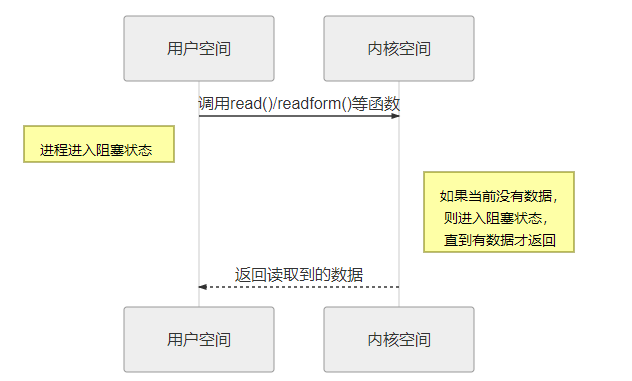
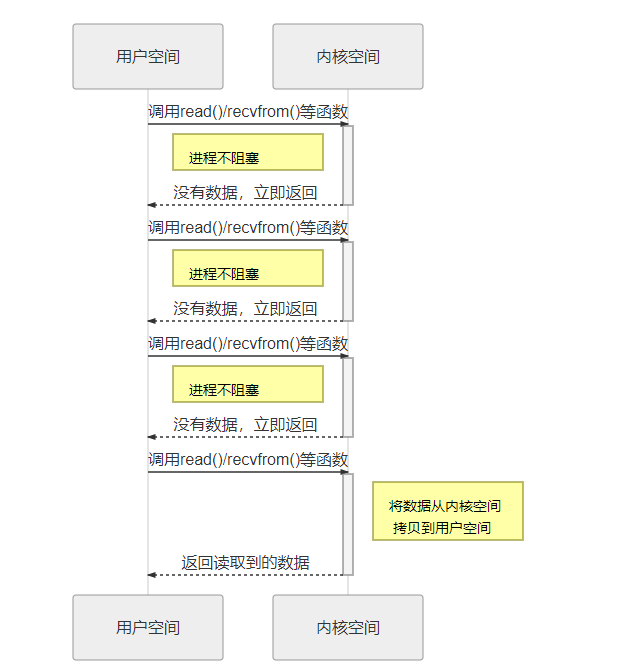
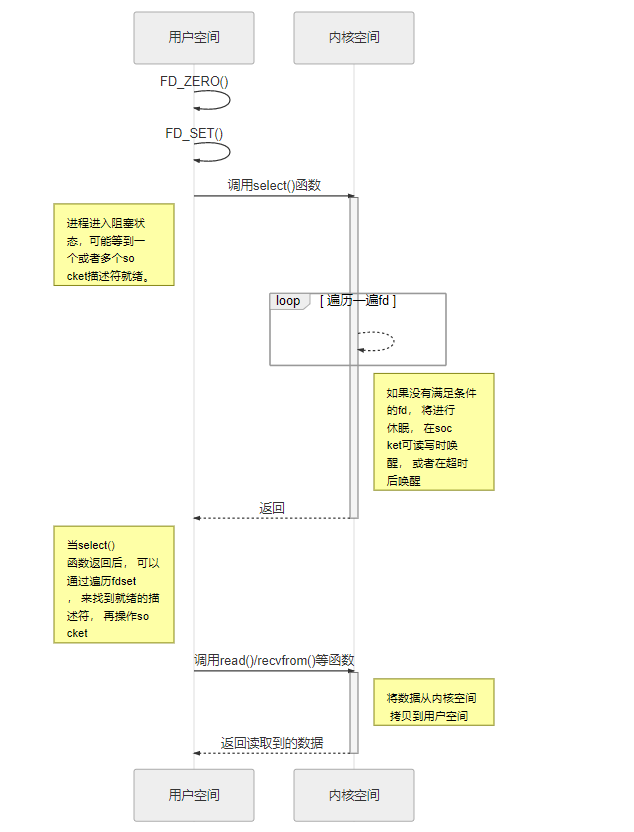
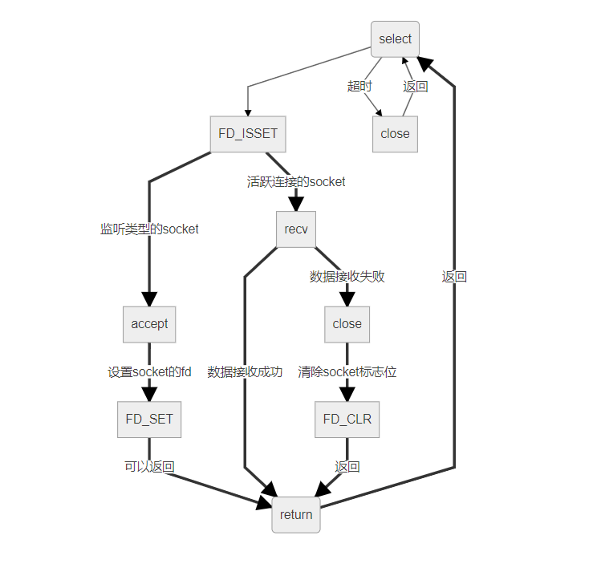

深入了解select、poll、epoll之间的区别
=====================================

前言
----

本章讨论的开发环境是 Linux 网络io

同步I/O
-------

在操作系统中，程序运行的空间分为内核空间和用户空间，用户空间所有对io操作的代码（如文件的读写、socket的收发等）都会通过系统调用进入内核空间完成实际的操作。

而且我们都知道CPU的速度远远快于硬盘、网络等I/O。在一个线程中，CPU执行代码的速度极快，然而，一旦遇到I/O操作，如读写文件、发送网络数据时，就需要等待
I/O 操作完成，才能继续进行下一步操作，这种情况称为同步 I/O。

在某个应用程序运行时，假设需要读写某个文件，此时就发生了 I/O
操作，在I/O操作的过程中，系统会将当前线程挂起，而其他需要CPU执行的代码就无法被当前线程执行了，这就是同步I/O操作，因为一个IO操作就阻塞了当前线程，导致其他代码无法执行，所以我们可以使用 **多线程或者多进程** 来并发执行代码，当某个线程/进程被挂起后，不会影响其他线程或进程。

多线程和多进程虽然解决了这种并发的问题，但是系统不能无上限地增加线程/进程。由于系统切换线程/进程的开销也很大，所以，一旦线程/进程数量过多，CPU的时间就花在线程/进程切换上了，真正运行代码的时间就少了，这样子的结果也导致系统性能严重下降。

多线程和多进程只是解决这一问题的一种方法，另一种解决I/O问题的方法是异步I/O，当然还有其他解决的方法。

异步I/O
-------

当程序需要对I/O进行操作时，它只发出I/O操作的指令，并不等待I/O操作的结果，然后就去执行其他代码了。一段时间后，当I/O返回结果时，再通知CPU进行处理。这样子用户空间中的程序不需要等待内核空间中的
I/O 完成实际操作，就可执行其他任务，提高CPU的利用率。

**简单来说就是，用户不需要等待内核完成实际对io的读写操作就直接返回了。**

阻塞I/O
-------

在linux中，默认情况下所有的socket都是阻塞的，一个典型的读操作流程大概是这样：

   socket_io001

当用户进程调用了 ``read()/recvfrom()`` 等系统调用函数，它会进入内核空间中，当这个网络I/O没有数据的时候，内核就要等待数据的到来，而在用户进程这边，整个进程会被阻塞，直到内核空间返回数据。当内核空间的数据准备好了，它就会将数据从内核空间中拷贝到用户空间，此时用户进程才解除阻塞的的状态，重新运行起来。

所以，阻塞I/O的特点就是在IO执行的两个阶段（用户空间与内核空间）都被阻塞了。

非阻塞I/O
---------

linux下，可以通过设置socket使其变为非阻塞模式，这种情况下，当内核空间并无数据的时候，它会马上返回结果而不会阻塞，此时用户进程可以根据这个结果自由配置，比如继续请求数据，或者不再继续请求。当对一个非阻塞socket执行读操作时，流程是这个样子：

   socket_io002

当用户进程调用 ``read()/recvfrom()`` 等系统调用函数时，如果内核空间中的数据还没有准备好，那么它并不会阻塞用户进程，而是立刻返回一个error。

对于应用进程来说，它发起一个 ``read()`` 操作后，并不需要等待，而是马上就得到了一个结果。用户进程判断结果是一个 ``error`` 时，它就知道内核中的数据还没有准备好，那么它可以再次调用 ``read()/recvfrom()`` 等函数。

当内核空间的数据准备好了，它就会将数据从内核空间中拷贝到用户空间，此时用户进程也就得到了数据。

所以，非阻塞I/O的特点是用户进程需要不断的 **主动询问** 内核空间的数据准备好了没有。

多路复用I/O
-----------

多路复用I/O就是我们说的 ``select，poll，epoll`` 等操作，复用的好处就在于 **单个进程** 就可以同时处理 **多个** 网络连接的I/O，能实现这种功能的原理就是 ``select、poll、epoll`` 等函数会不断的 **轮询** 它们所负责的所有 ``socket`` ，当某个 ``socket`` 有数据到达了，就通知用户进程。

一般来说I/O复用多用于以下情况：

1. 当客户处理多个描述符时。

2. 服务器在高并发处理网络连接的时候。

3. 服务器既要处理监听套接口，又要处理已连接套接口，一般也要用到I/O复用。

4. 如果一个服务器即要处理TCP，又要处理UDP，一般要使用I/O复用。

5. 如果一个服务器要处理多个服务或多个协议，一般要使用I/O复用。

与多进程和多线程技术相比， **I/O多路复用技术的最大优势是系统开销小，系统不必创建进程/线程，也不必维护这些进程/线程** ，从而大大减小了系统的开销。但select，poll，epoll本质上都是同步I/O，因为他们都需要 **在读写事件就绪后自己负责进行读写** ，也就是说这个读写过程是 **阻塞** 的，而 **异步I/O则无需自己负责进行读写，异步I/O的实现会负责把数据从内核拷贝到用户空间** 。

select
~~~~~~

用直白的话来介绍select：select机制会监听它所负责的所有socket，当其中一个socket或者多个socket可读或者可写的时候，它就会返回，而如果所有的socket都是不可读或者不可写的时候，这个进程就会被阻塞，直到超时或者socket可读写，当select函数返回后，可以通过遍历fdset，来找到就绪的描述符。

select整个处理过程如下
^^^^^^^^^^^^^^^^^^^^^^

   socket_io003

1. 用户进程调用 ``select()`` 函数，如果当前没有可读写的socket，则用户进程进入阻塞状态。
2. 对于内核空间来说，它会从用户空间拷贝 ``fd_set`` 到内核空间，然后在内核中遍历一遍所有的socket描述符，如果没有满足条件的socket描述符，内核将进行休眠，当设备驱动发生自身资源可读写后，会唤醒其等待队列上睡眠的内核进程，即在socket可读写时唤醒，或者在超时后唤醒。
3. 返回 ``select()`` 函数的调用结果给用户进程，返回就绪 ``socket`` 描述符的数目，超时返回0，出错返回-1。
4. 注意，在 ``select()`` 函数返回后还是需要轮询去找到就绪的 ``socket`` 描述符的，此时用户进程才可以去操作 ``socket`` 。

select目前几乎在所有的平台上支持，其良好跨平台支持也是它的一个优点。

当然select也有很多缺点： 1.
单个进程能够监视的文件描述符的数量存在最大限制，在Linux上一般为1024，可以通过修改宏定义甚至重新编译内核的方式提升这一限制，但是这样也会造成效率的降低。
2.
需要维护一个用来存放大量fd的数据结构，这样会使得用户空间和内核空间在传递该结构时复制开销大。
3.
每次在有socket描述符活跃的时候，都需要遍历一遍所有的fd找到该描述符，这会带来大量的时间消耗（时间复杂度是O(n)，并且伴随着描述符越多，这开销呈线性增长）

对应内核来说，整个处理的流程如下：

   socket_io004

select函数原型：
^^^^^^^^^^^^^^^^

.. code:: c

    int select(int maxfdp1,fd_set *readset,fd_set *writeset,fd_set *exceptset,const struct timeval *timeout)

参数说明：

-  maxfdp1指定感兴趣的socket描述符个数，它的值是套接字最大socket描述符加1，socket描述符0、1、2
   ... maxfdp1-1均将被设置为感兴趣（即会查看他们是否可读、可写）。

-  readset：指定这个socket描述符是可读的时候才返回。

-  writeset：指定这个socket描述符是可写的时候才返回。

-  exceptset：指定这个socket描述符是异常条件时候才返回。

-  timeout：指定了超时的时间，当超时了也会返回。

如果对某一个的条件不感兴趣，就可以把它设为空指针。

返回值：就绪 ``socket`` 描述符的数目，超时返回0，出错返回-1。

select的缺点
^^^^^^^^^^^^

1. 每次调用 ``select`` ，都需要把 ``fd`` 集合从用户态拷贝到内核态，这个开销在 ``fd`` 很多时会很大。

2. 同时每次调用 ``select`` 都需要在内核遍历传递进来的所有 ``fd`` ，这个开销在 ``fd`` 很多时也很大。

3. 每次在 ``select()`` 函数返回后，都要通过遍历文件描述符来获取已经就绪的 ``socket`` 。

4. ``select`` 支持的文件描述符数量太小了，默认是 ``1024`` 。

poll
~~~~

``poll`` 的实现和 ``select`` 非常相似，只是描述fd集合的方式不同， ``poll`` 使用 ``pollfd`` 结构而不是 ``select`` 的 ``fd_set`` 结构，poll不限制socket描述符的个数，因为它是使用链表维护这些socket描述符的，其他的都差不多和 ``select()`` 函数一样， ``poll()`` 函数返回后，需要轮询 ``pollfd`` 来获取就绪的描述符，根据描述符的状态进行处理，但是poll没有最大文件描述符数量的限制。 ``poll`` 和 ``select`` 同样存在一个缺点就是，包含大量文件描述符的数组被整体复制于用户态和内核的地址空间之间，而不论这些文件描述符是否就绪，它的开销随着文件描述符数量的增加而线性增大。

函数原型：

.. code:: c

    int poll (struct pollfd *fds, unsigned int nfds, int timeout);

epoll
~~~~~

epoll的原理
^^^^^^^^^^^

其实相对于 ``select`` 和 ``poll`` 来说， ``epoll`` 更加灵活，但是核心的原理都是当socket描述符就绪（可读、可写、出现异常），就会通知应用进程，告诉他哪个socket描述符就绪，只是通知处理的方式不同而已。

epoll使用一个 **epfd** （epoll文件描述符）管理多个socket描述符，epoll不限制socket描述符的个数， **将用户空间的socket描述符的事件存放到内核的一个事件表中** ，这样在用户空间和内核空间的copy只需一次。当epoll记录的socket产生就绪的时候，epoll会通过callback的方式来激活这个fd，这样子在epoll_wait便可以收到通知，告知应用层哪个socket就绪了，这种通知的方式是可以直接得到那个socket就绪的，因此相比于 ``select`` 和 ``poll`` ，它不需要遍历socket列表，时间复杂度是O(1)，不会因为记录的socket增多而导致开销变大。

epoll的操作模式
^^^^^^^^^^^^^^^

epoll对socket描述符的操作有两种模式： **LT（level trigger）和ET（edge
trigger）** 。LT模式是默认模式，LT模式与ET模式的区别如下：

-  LT模式：即水平出发模式，当epoll_wait检测到socket描述符处于就绪时就通知应用程序，应用程序可以不立即处理它。下次调用epoll_wait时，还会再次产生通知。

-  ET模式：即边缘触发模式，当epoll_wait检测到socket描述符处于就绪时就通知应用程序，应用程序 **必须** 立即处理它。如果不处理，下次调用epoll_wait时，不会再次产生通知。

**ET模式在很大程度上减少了epoll事件被重复触发的次数，因此效率要比LT模式高** 。epoll工作在ET模式的时候，必须使用非阻塞套接口，以避免由于一个文件句柄的阻塞读/阻塞写操作把处理多个文件描述符的任务饿死。

epoll的函数
^^^^^^^^^^^

``epoll`` 只有 ``epoll_create()、epoll_ctl()、epoll_wait()``
3个系统调用函数。

epoll_create()
'''''''''''''''

.. code:: c

    int epoll_create(int size);

创建一个epoll的 **epfd** （epoll文件描述符，或者称之为句柄），当创建好epoll句柄后，它就是会占用一个fd值，必须调用close()关闭，否则可能导致fd被耗尽，这也是为什么我们前面所讲的是： **epoll使用一个epfd管理多个socket描述符** 。

size参数用来告诉内核这个监听的数目一共有多大，它其实是在内核申请一空间，用来存放用户想监听的socket
fd上是否可读可行或者其他异常，只要有足够的内存空间，size可以随意设置大小，1G的内存上能监听约10万个端口。

epoll_ctl()
''''''''''''

该函数用于控制某个epoll文件描述符上的事件，可以注册事件，修改事件，以及删除事件。

.. code:: c

    int epoll_ctl(int epfd, int op, int fd, struct epoll_event *event);

参数：

-  epdf：由epoll_create()函数返回的epoll文件描述符（句柄）。

-  op：op是操作的选项，目前有以下三个选项：

-  EPOLL_CTL_ADD：注册要监听的目标socket描述符fd到epoll句柄中。

-  EPOLL_CTL_MOD：修改epoll句柄已经注册的fd的监听事件。

-  EPOLL_CTL_DEL：从epoll句柄删除已经注册的socket描述符。

-  fd：指定监听的socket描述符。

-  event：event结构如下：

   .. code:: c

       typedef union epoll_data {
           void        *ptr;
           int          fd;
           uint32_t     u32;
           uint64_t     u64;
       } epoll_data_t;

       struct epoll_event {
           uint32_t     events;      /* Epoll events */
           epoll_data_t data;        /* User data variable */
       };

   -  events可以是以下几个宏的集合：

      -  EPOLLIN：表示对应的文件描述符可以读（包括对端SOCKET正常关闭）。

      -  EPOLLOUT：表示对应的文件描述符可以写。

      -  EPOLLPRI：表示对应的文件描述符有紧急的数据可读（这里应该表示有带外数据到来）。

      -  EPOLLERR：表示对应的文件描述符发生错误。

      -  EPOLLHUP：表示对应的文件描述符被挂断。

      -  EPOLLET： 将EPOLL设为边缘触发(Edge
         Triggered)模式，这是相对于水平触发(Level Triggered)来说的。

      -  EPOLLONESHOT：只监听一次事件，当监听完这次事件之后，如果还需要继续监听这个socket的话，需要再次把这个socket加入到EPOLL队列里。

epoll_wait()
'''''''''''''

.. code:: c

    int epoll_wait(int epfd, struct epoll_event *events,
                   int maxevents, int timeout);

epoll_wait()函数的作用就是等待监听的事件的发生，类似于调用select()函数。

参数： - events：用来从内核得到事件的集合。

-  maxevents：告知内核这个events有多大，这个maxevents的值不能大于创建epoll_create()时的指定的size。

-  timeout：超时时间。

-  函数的返回值表示需要处理的事件数目，如返回0表示已超时。

epoll为什么更高效
^^^^^^^^^^^^^^^^^

1. 当我们调用 ``epoll_wait()`` 函数返回的不是实际的描述符，而是一个代表就绪描述符数量的值，这个时候需要去 ``epoll`` 指定的一个数组中依次取得相应数量的socket描述符即可，而不需要遍历扫描所有的socket描述符，因此这里的时间复杂度是O(1)。

2. 此外还使用了内存映射（ ``mmap`` ）技术，这样便彻底省掉了这些socket描述符在系统调用时拷贝的开销（因为从用户空间到内核空间需要拷贝操作）。mmap将用户空间的一块地址和内核空间的一块地址同时映射到相同的一块物理内存地址（不管是用户空间还是内核空间都是虚拟地址，最终要通过地址映射映射到物理地址），使得这块物理内存对内核和对用户均可见，减少用户态和内核态之间的数据交换，不需要依赖拷贝，这样子内核可以直接看到epoll监听的socket描述符，效率极高。

3. 另一个本质的改进在于 ``epoll`` 采用基于事件的就绪通知方式。在 ``select/poll`` 中，进程只有在调用一定的方法后，内核才对所有监视的socket描述符进行扫描，而 ``epoll`` 事先通过 ``epoll_ctl()`` 来注册一个socket描述符，一旦检测到epoll管理的socket描述符就绪时，内核会采用类似 ``callback`` 的回调机制，迅速激活这个socket描述符，当进程调用 ``epoll_wait()`` 时便可以得到通知，也就是说epoll最大的优点就在于它 **只管就绪的socket描述符，而跟socket描述符的总数无关** 。

