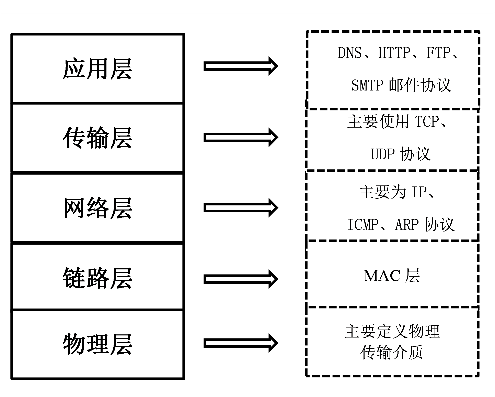
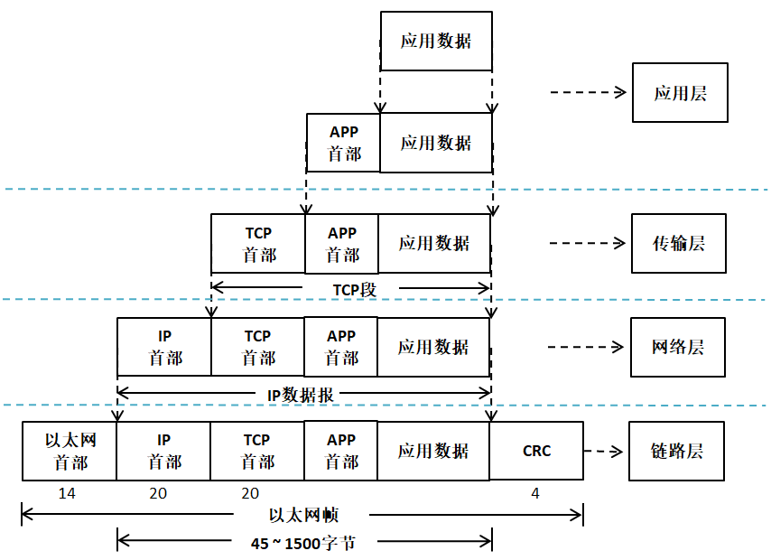
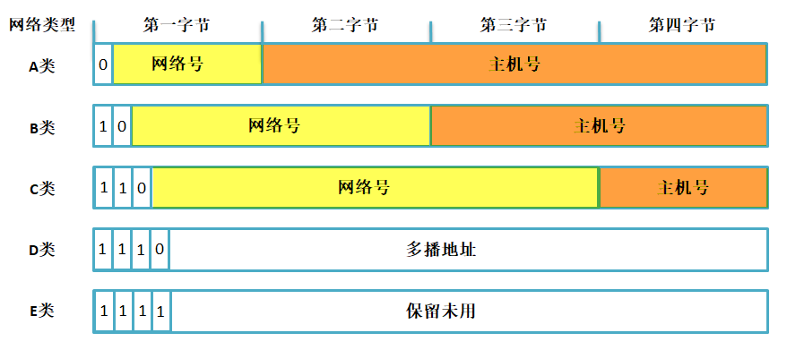
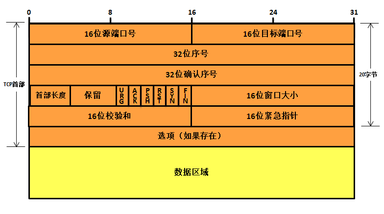
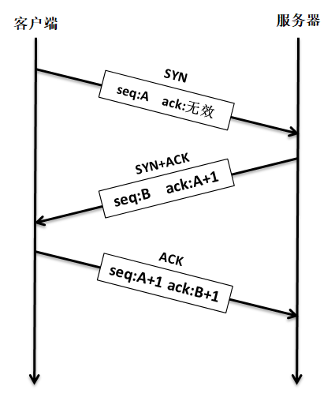
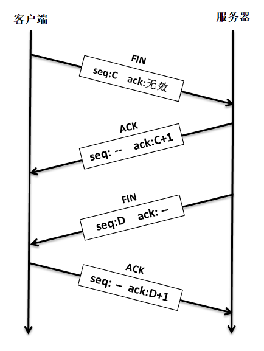
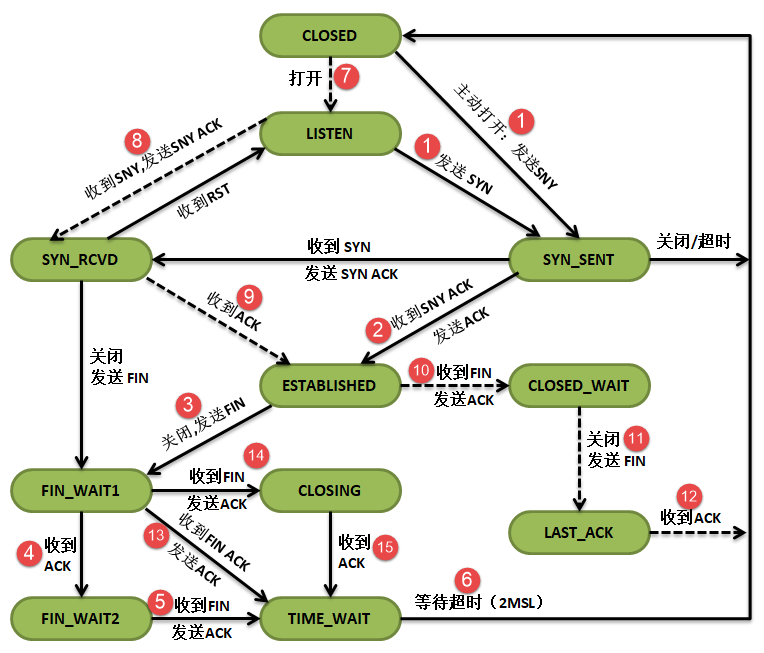

网络编程
========

互联网对人类社会产生的巨大变革，大家是有目共睹的，它几乎改变了人类生活的方方面面。互联网通信的本质是数字通信，任何数字通信都离不开通信协议的制定，通信设备只有按照约定的、统一的方式去封装和解析信息，才能实现通信。互联网通信所要遵守的众多协议，被统称为TCP/IP。

网络相关知识简介
----------------

因为网络的知识太庞大了，想要介绍清除得写好几本书，在这里就简单提及一下就好了。

TCP/IP是一个协议族，包含众多的协议。但对于网络应用开发人员，可能听到更多的是其中的应用层协议，比如HTTP、FTP、MQTT等。

比如：

HTTP协议是Hyper Text Transfer
Protocol（超文本传输协议）的缩写，HTTP的应用最为广泛。比如大家日常使用电脑时的一个常规操作：打开电脑，打开浏览器，输入网址，最后按下回车，这一刻你就开启了HTTP通信。HTTP协议工作于架构之上，（服务端也称作为服务器端，除非特别说明，否则本书出现的“服务端”即为“服务器端”），浏览器作为HTTP客户端通过URL向HTTP服务端即WEB服务器发送所有请求。Web服务器根据接收到的请求后，向客户端发送响应信息。借助这种浏览器和服务器之间的HTTP通信，我们能够足不出户地获得来自世界各个角落的信息。另外，网页不仅仅是大型服务器的专利，
在物联网风潮盛行的今天，许多随处可见的小型设备（空调、冰箱、插座、路由器等），都内嵌网页，在物理链路畅通的情况下，用户可以用手机、平板电脑上的浏览器随时随地监控这些设备。

FTP（File Transfer
Protocol）是文件传输协议的简称。FTP是工作在应用层的网络协议。FTP使得主机间可以共享文件，用于在两台设备之间传输文件（双向传输）。它也是一个客户端-服务端框架系统。用户可以通过一个支持FTP协议的客户端程序，连接到在远程主机上的FTP服务端程序，通过客户端程序向服务端程序发出命令，服务端程序执行用户所发出的命令，并将执行的结果返回到客户机。FTP除了基本的文件上传/下载功能外，还有目录操作、权限设置、身份验证机制，许多网盘的文件传输功能都是基于FTP实现的。

在物联网发展的处期，物联网场景中的设备使用何种应用层协议进行通信一直是备受争议的话题。很多开发人员习惯了网页的开发模式，于是经常选择HTTP作为通信方式。使用HTTP有以下不利因素：HTTP是一种同步协议，设备需要等待服务器的响应才可以进行下一步的工作，然而在设备数量多、网络不可靠的场景下，实现同步通信很困难；HTTP是单向的，设备只能主动向服务器发出数据，无法被动的接收来自网络的数据，这不适用于实时控制的场合；HTTP是有许多帧头和规则的重量级协议，实现在设备中需要耗费大量的系统资源。基于上述的形势，MQTT和COAP等轻量级、异步的通信协议便得到了物联网设备开发商的宠爱，尤其是MQTT。MQTT（消息队列遥测传输）是IBM公司于1990年设计并推出的一款通信协议，于2014年正式成为了一个OASIS开放标准。近年来，MQTT的应用呈现出爆炸性的增长势头，大有一统物联网的趋势。另外，MQTT在物联网以外的其他领域也得到了广泛的应用，比如许多公司在制作手机APP时，会使用MQTT来实现消息推送、即时聊天等功能。

嵌入式设备接入互联网的需求越来越大，有以下几点原因：

1. 近些年，各种带网络接入功能的MCU、SoC层出不穷，开源轻量的TCP/IP协议栈日趋成熟和完善，云平台的市场越来越繁荣，这些因素大大降低了嵌入式设备的入网成本，也为许多资源受限的低端设备接入互联网提供了可能。
2. “物联网+”的风潮日渐盛行，设备能够被远程监控，这一点已经成为许多产品的技术要求。
3. 人们对于设备“智能性”的追求越来越高，当今热门的大数据、图像处理、语音识别、机器学习等功能都可以被集成在云端，成为云平台能提供的服务。终端设备大多是计算、存储能力有限的设备，这些设备如果想要获取“智能”，最便捷的办法就是接入云平台，利用各项云服务。

互联网的基础就是TCP/IP。TCP/IP是一个非常复杂的协议族，即便我们能把它的设计思想和实现原理都解释得清清楚楚，你也不见得有时间和精力去学习它，所以本书的写作重点不在于对TCP/IP的解读，而在于对它的应用。另外，TCP/IP的复杂性也决定了它并不是那么简单就能用好的东西，即便我们只关注应用开发，也依然需要对它的许多概念和设计思想有所了解，才能编写出正确、高效、健壮性好的应用程序。

互联网对人类社会产生的巨大变革，大家是有目共睹的，它几乎改变了人类生活的方方面面。互联网通信的本质是数字通信，任何数字通信都离不开通信协议的制定，通信设备只有按照约定的、统一的方式去封装和解析信息，才能实现通信。互联网通信所要遵守的众多协议，被统称为TCP/IP。

网络协议的分层模型
~~~~~~~~~~~~~~~~~~

TCP/IP是一个庞大的协议族，它是众多网络协议的集合，包括：ARP、IP、ICMP、UDP、TCP、DNS、DHCP、HTTP、FTP、MQTT等等。这些协议按照功能，可以被划分为几个不同的层次，如图所示。比如HTTP、FTP、MQTT，它们隶属于应用层，。那么TCP/IP为什么需要分层，分层又是依靠什么依据呢？

   tcpip001
TCP/IP协议栈中不同协议所完成的功能是不一样的，
某些协议的实现要依赖于其它协议，依据这种依赖关系，可以将协议栈分层。在图中，低层协议为相邻的上层协议提供服务，是上层协议得以实现的基础。

其中，物理层（PHY）规定了传输信号所需要的物理电平、介质特征；

链路层（MAC）规定了数据帧能被网卡接收的条件，最常见的方式是利用网卡的MAC地址，发送方会在欲发送的数据帧的首部加上接收方网卡的MAC地址信息，接收方只有监听到属于自己的MAC地址信息后，才会去接收并处理该数据。

每台网络设备都应该有自己的网络地址，网络层规定了主机的网络地址该如何定义，以及如何在网络地址和MAC地址之间进行映射，即ARP协议；网络层实现了数据包在主机之间的传递，而一台主机内部可能运行着多个网络程序。

传输层可以区分数据包是属于哪一个应用程序的，可以说传输层实现了数据包端到端的传递。另外，数据包在传输过程中可能会出现丢包、乱序和重复的现象，网络层并没有提供应对这些错误的机制，而传输层可以解决这些问题，如TCP协议；

应用层以下的工作完成了数据的传递工作，应用层则决定了你如何应用和处理这些数据，之所以会有许多的应用层协议，是因为互联网中传递的数据种类很多、差异很大、应用场景十分多样。

协议层报文间的封装与拆封
~~~~~~~~~~~~~~~~~~~~~~~~

在这里，我们简单解释一下在数据的发送和接收过程中，TCP/IP都做了哪些事儿。

当用户发送数据时，将数据向下交给传输层，这是处于应用层的操作，而应用层也有相关的协议，对用户的数据进行封装，比如MQTT、HTTP等协议，最后应用层通过调用传输层的接口来将数据递交到传输层中。传输层会在数据前面加上传输层首部（此处以TCP协议为例，图中的传输层首部为TCP首部，也可以是UDP首部），然后向下交给网络层。同样地，网络层会在数据前面加上网络层首部（IP首部），然后将数据向下交给链路层，链路层会对数据进行最后一次封装，即在数据前面加上链路层首部（此处使用以太网接口为例），然后将数据交给网卡。最后，网卡将数据转换成物理链路上的电平信号，数据就这样被发送到了网络中。数据的发送过程，可以概括为TCP/IP的各层协议对数据进行封装的过程，如图所示：

   tcpip002
当设备的网卡接收到某个数据包后，它会将其放置在网卡的接收缓存中，并告知TCP/IP内核。然后TCP/IP内核就开始工作了，它会将数据包从接收缓存中取出，并逐层解析数据包中的协议首部信息，并最终将数据交给某个应用程序。数据的接收过程与发送过程正好相反，可以概括为TCP/IP的各层协议对数据进行解析的过程。

IP协议
------

IP协议（Internet
Protocol），又称之为网际协议，IP协议处于IP层工作，它是整个TCP/IP协议栈的核心协议，上层协议都要依赖IP协议提供的服务，IP协议负责将数据报从源主机发送到目标主机，通过IP地址作为唯一识别码，简单来说，不同主机之间的IP地址是不一样的，在发送数据报的过程中，IP协议还可能对数据报进行分片处理，同时在接收数据报的时候还可能需要对分片的数据报进行重装等等。

IP协议是一种无连接的不可靠数据报交付协议，协议本身不提供任何的错误检查与恢复机制。

IP地址简述
~~~~~~~~~~

在TCP/IP设计之初，为了标识互联网中的每台主机的身份，设计人员为每个接入网络中的主机都分配一个IP地址（Internet
Protocol
Address），是一个32位的整数地址，只有合法的IP地址才能接入互联网中并且与其他主机进行通信，IP地址是软件地址，不是硬件地址，硬件MAC地址是存储在网卡中的，应用于本地网络中寻找目标主机。而IP地址能让一个网络中的主机能够与另一个网络中的主机进行通信，无需理会这些主机之间的MAC地址。

在学习IP地址之前，我们需要简述一下主机与路由器连入网络的通信的方法：一台主机通常只有一条链路连接到网络，一般只有一个网卡；当主机中想发送一个数据报时，它就在该链路上发送，一个网卡对应一个MAC地址与IP地址，当然，主机也可能有多个网卡，这样子主机就有多个MAC地址与IP地址。

每个IP地址长度为32比特（4字节），因此总共有2^32个可能的IP地址，大约有40亿个IP地址能被使用的。这些地址一般按所谓点分十进制记法（dotted-decimal
notation）书写，即地址中的每个字节用它的十进制形式书写，各字节间以点分隔开。例如，
IP地址为192.168.0.122，192是该地址第一个8比特的十进制等价数，168是该地址第二个8比特的十进制等价数，依次类推。

IP地址编址
~~~~~~~~~~

在全球的互联网中，每个主机都要唯一的一个IP地址作为身份识别，那么这么多IP地址是怎么样分配的呢？这不可能是随意自由选择IP地址的，实际上每个主机的IP地址的一部分都由其所在的子网决定的，所以又出现了IP地址分类编址的概念，网络的类型决定了IP
地址将如何划分成网络部分和节点部分，在分类编址中，设计者把所有的IP地址划分为5大类，分别为A、B、C、D、E五类，每一类地址都觉定了其中IP地址的一部分组成，具体见：

   tcpip003
A 类网络地址的第一个字节的第一位必须为0 ，因此， A
类网络地址第一个字节的取值范围为0~127（注意：但0 和127 不是有效的A
类网络地址号），A类地址总共有128个网络号，其中3个网络号用作特殊用途，因此可以在互联网上使用的还有125个，而每一个网络号后面的3字节主机号表示能用于A类网络地址不同网络号的的主机数量（多达2^24-2
=
16777214个），所以总的来说A类网络支持的主机数量为125*16777214=2097151750个，大约占据了40亿IP地址的半壁江山，这些IP地址通常被分配给世界上超大型的机构使用，但是通常没有任何一个机构能使用那么大量的IP地址，所以A类地址的很多IP地址都会被白白浪费掉。

B 类网络地址的第一个字节的第一位必须为1 ，且第二位必须为0，因此， B
类网络地址第一个字节的取值范围为128~191，前2字节剩余的14bit表示网络号，多达16384个网络号，其中16个网络号被保留使用，因此可以分配给企业使用的网络号有16368个，每一个网络号中可以拥有2^16-2
=65534个主机，总的来说B类网络支持的主机个数为16368*65534=1072660512，大约占据了所有IP地址的四分之一。

C类网络地址的第一个字节的第一位必须为1，第二位必须为1，第三位必须为0，因此C类网络第一个字节的取值范围为192~223，C类地址的前三个字节用于表示网络号（剩下的21bit），所以拥有2097152个网络号，但是其中的256个网络号被保留出来，因此C类地址的可用网络号为2096896个，每个网络号下的主机个数为254，因此C类网络支持的主机数量为532611584，大约占据了所有IP地址的八分之一。

D类IP地址的第一个字节前四位为1110，那么它第一个字节的取值范围为224~239，约占据了所有IP地址的十六分之一，它是一个专门保留的地址，它并不指向特定的网络，目前这一类地址被用于多播。

E类IP地址的第一个字节前四位必须为1111，那么它第一个字节的取值范围为240~255，约占据了所有IP地址的十六分之一，是为将来使用而保留的，其中32bit全为1的IP地址（255.255.255.255）用作广播地址。

+--------+--------------------+--------------------+--------------+--------------+------------+
| 类别   | 第一字节(二进制)   | 第一字节取值范围   | 网络号个数   | 主机号个数   | 适用范围   |
+========+====================+====================+==============+==============+============+
| A类    | 0XXX XXXX          | 0~127              | 125          | 16777214     | 大型网络   |
+--------+--------------------+--------------------+--------------+--------------+------------+
| B类    | 10XX XXXX          | 128~191            | 16368        | 65534        | 中型网络   |
+--------+--------------------+--------------------+--------------+--------------+------------+
| C类    | 110X XXXX          | 192~223            | 2097152      | 254          | 小型网络   |
+--------+--------------------+--------------------+--------------+--------------+------------+
| D类    | 1110 XXXX          | 224~239            | —            | —            | 多播       |
+--------+--------------------+--------------------+--------------+--------------+------------+
| E类    | 1111 XXXX          | 240~255            | —            | —            | 保留       |
+--------+--------------------+--------------------+--------------+--------------+------------+

特殊IP地址
~~~~~~~~~~

除了上述的网络地址外，还有一些特殊用途的地址，这些地址是不允许分配给任何一个网络的主机使用的，下面简单介绍几个常见的特殊地址。

受限广播地址
^^^^^^^^^^^^

广播通信是一对所有的通信方式，受限广播地址用于定义整个互联网，如果设备想使IP数据报被整个网络所接收，就发送这个目的地址全为1的广播包，但这样会给整个互联网带来灾难性的负担，所以在任何情况下，路由器都会禁止转发目的地址为255.255.255.255的广播数据包，因此这样的数据包仅会出现在本地网络中（局域网），255.255.255.255这个地址指本网段内的所有主机，
相当于“房子里面的人都听着”通知所有主机。

注意：此处不要与以太网的广播地址（255-255-255-255-255-255）混淆了。

直接广播地址
^^^^^^^^^^^^

受限广播地址是网络号与主机号都为1的地址，但是直接广播地址是主机号全为1而得到的地址，广播地址代表本网络内的所有主机，使用该地址可以向网络内的所有主机发送数据，比如一个IP地址是192.168.0.181，这是C类地址，所以它的主机号只有一个字节，那么对主机号全取1得到一个广播地址192.168.0.255，向这个地址发送数据就能让同一网络下的所有主机接收到。

A、B、C三类地址的广播地址结构如下：

-  A类地址的广播地址为：XXX.255.255.255（XXX为A类地址的第一个字节取值范围）。
-  A类地址的广播地址为：XXX.
   XXX.255.255（XXX为B类地址的前两个字节取值范围）。
-  A类地址的广播地址为：XXX. XXX.
   XXX.255（XXX为C类地址的前三个字节取值范围）。

注意：这个地址在IP数据报中只能作为目的地址。另外，直接广播地址使一个网段中可分配给设备的地址数减少了1个。

多播地址
^^^^^^^^

多播地址用在一对多的通信中，即一个发送者，多个接收者，不论接受者员数量的多少，发送者只发送一次数据包。多播地址属于分类编址中的D类地址，
D类地址只能用作目的地址，而不能作为主机中的源地址。

环回地址
^^^^^^^^

127网段的所有地址都称为环回地址，主要用来测试网络协议是否工作正常的作用。比如在电脑中使用ping
命令去ping
127.1.1.1就可以测试本地TCP/IP协议是否正常。用通俗的话表示，就是“我自己”，不能以127网段中的IP地址作为主机地址，因此A类地址又少了一个可用网络号。

本网络本主机
^^^^^^^^^^^^

IP地址32bit全为0的地址（0.0.0.0）表示的是本网络本主机，这个IP地址在IP数据报中只能用作源IP地址，这发生在当设备启动时但又不知道自己的IP地址情况下。在使用DHCP分配IP地址的网络环境中，这样的地址是很常见的，主机为了获得一个可用的IP地址，就给DHCP服务器发送IP数据报，并用这样的地址（0.0.0.0）作为源地址，目的地址为255.255.255.255（因为主机这时还不知道DHCP服务器的IP地址），然后DHCP服务器就会知道这个主机暂时没有IP地址，那么就会分配一个IP给这个主机。

UDP协议
-------

UDP 是User Datagram Protocol的简称，
中文名是用户数据报协议，是一种无连接、不可靠的协议，它只是简单地实现从一端主机到另一端主机的数据传输功能，这些数据通过IP层发送，在网络中传输，到达目标主机的顺序是无法预知的，因此需要应用程序对这些数据进行排序处理，这就带来了很大的不方便，此外，UDP协议更没有流量控制、拥塞控制等功能，在发送的一端，UDP只是把上层应用的数据封装到UDP报文中，在差错检测方面，仅仅是对数据进行了简单的校验，然后将其封装到IP数据报中发送出去。而在接收端，无论是否收到数据，它都不会产生一个应答发送给源主机，并且如果接收到数据发送校验错误，那么接收端就会丢弃该UDP报文，也不会告诉源主机，这样子传输的数据是无法保障其准确性的，如果想要其准确性，那么就需要应用程序来保障了。
UDP协议的特点：

1. 无连接、不可靠。
2. 尽可能提供交付数据服务，出现差错直接丢弃，无反馈。
3. 面向报文，发送方的UDP拿到上层数据直接添加个UDP首部，然后进行校验后就递交给IP层，而接收的一方在接收到UDP报文后简单进行校验，然后直接去除数据递交给上层应用。
4. 支持一对一，一对多，多对一，多对多的交互通信。
5. 速度快，UDP没有TCP的握手、确认、窗口、重传、拥塞控制等机制，UDP是一个无状态的传输协议，所以它在传递数据时非常快，即使在网络拥塞的时候UDP也不会降低发送的数据。

UDP虽然有很多缺点，但是也不排除其能用于很多场合，因为在如今的网络环境下，UDP协议传输出现错误的概率是很小的，并且它的实时性是非常好，常用于实时视频的传输，比如直播、网络电话等，因为即使是出现了数据丢失的情况，导致视频卡帧，这也不是什么大不了的事情，所以，UDP协议还是会被应用与对传输速度有要求，并且可以容忍出现差错的数据传输中。

TCP协议
-------

TCP协议简介
~~~~~~~~~~~

TCP与UDP一样，都是传输层的协议，但是提供的服务却大不相同，UDP为上层应用提供的是一种不可靠的，无连接的服务，而TCP则提供一种面向连接、可靠的字节流传输服务，TCP让两个主机建立连接的关系，应用数据以数据流的形式进行传输，这与UDP协议是不一样：

-  UDP运载的数据是以报文的形式，各个报文在网络中互不相干传输，UDP每收到一个报文就递交给上层应用，因此如果对于大量数据来说，应用层的重装是非常麻烦的，因为UDP报文在网络中到达目标主机的顺序是不一样的；
-  而TCP采用数据流的形式传输，先后发出的数据在网络中虽然也是互不相干的传输，但是这些数据本身携带的信息却是紧密联系的，TCP协议会给每个传输的字节进行编号，当然啦，两个主机方向上的数据编号是彼此独立的，在传输的过程中，发送方把数据的起始编号与长度放在TCP报文中，在接收方将所有数据按照编号组装起来，然后返回一个确认，当所有数据接收完成后才将数据递交到应用层中。

TCP的特性
~~~~~~~~~

连接机制
^^^^^^^^

TCP是一个面向连接的协议，无论哪一方向另一方发送数据之前，都必须先在双方之间建立一个连接，否则将无法发送数据，一个TCP连接必须有双方IP地址与端口号，就像打电话一样，必须知道双方的电话号码才会打电话，关于具体的连接我们在后文讲解。

确认与重传
^^^^^^^^^^

一个完整的TCP传输必须有数据的交互，接收方在接收到数据之后必须正面进行确认，向发送方报告接收的结果，而发送方在发送数据之后必须等待接收方的确认，同时发送的时候会启动一个定时器，在指定超时时间内没收到确认，发送方就会认为发送失败，然后进行重发操作，这就是重传报文。

TCP提供可靠的运输层，但它依赖的是IP层的服务，IP数据报的传输是无连接、不可靠的，因此它要通过确认来知道接收方确实已经收到数据了。但数据和确认都有可能会丢失，因此TCP通过在发送时设置一个超时机制（定时器）来解决这种问题，如果当超时时间到达的时候还没有收到对方的确认，它就重传该数据。

缓冲机制
^^^^^^^^

在发送方想要发送数据的时候，由于应用程序的数据大小、类型都是不可预估的，而TCP协议提供了缓冲机制来处理这些数据，如在数据量很小的时候，TCP会将数据存储在一个缓冲空间中，等到数据量足够大的时候在进行发送数据，这样子能提供传输的效率并且减少网络中的通信量，而且在数据发送出去的时候并不会立即删除数据，还是让数据保存在缓冲区中，因为发送出去的数据不一定能被接收方正确接收，它需要等待到接收方的确认再将数据删除。同样的，在接收方也需要有同样的缓冲机制，因为在网络中传输的数据报到达的时间是不一样的，而且TCP协议还需要把这些数据报组装成完整的数据，然后再递交到应用层中。

全双工通信
^^^^^^^^^^

在TCP连接建立后，那么两个主机就是对等的，任何一个主机都可以向另一个主机发送数据，数据是双向流通的，所以TCP协议是一个全双工的协议，这种机制为TCP协议传输数据带来很大的方便，一般来说，TCP协议的确认是通过捎带的方式来实现，即接收方把确认信息放到反向传来的是数据报文中，不必单独为确认信息申请一个报文，捎带机制减少了网络中的通信流量。由于双方主机是对等的存在，那么任意一方都可以断开连接，此时这个方向上的数据流就断开了，但是另一个
方向上的数据仍是连通的状态，这种情况就称之为半双工。

流量控制
^^^^^^^^

在前面讲过，一条TCP连接每一侧的主机都设置了缓冲区域。当该接收方收到数据后，它就将数据放入接收缓冲区，当确认这段数据是正常的时候，就会向发送方返回一个确认。并且向相关的应用层递交该数据，但不一定是数据刚一到达就立即递交。事实上，接收方应用也许正忙于其他任务，甚至要过很长时间后才会去处理这些数据。这样子如果接收方处理这些数据时相对缓慢，而发送方发送得太多、太快，就会很容易地使接收方的接收缓冲区发生溢出。

因此TCP提供了流量控制服务（flow-control
service）以消除发送方使接收方缓冲区溢出的可能性。流量控制是一个速度匹配服务，即发送方的发送速率与接收方应用程序的读取速率相匹配，TCP通过让发送方维护一个称为接收窗口（receive
window）的变量来提供流量控制，是的，你没看错，是接收窗口（rwnd），它用于给发送方一个指示：接收方还能接收多少数据，接收方会将此窗口值放在
TCP
报文的首部中的窗口字段，然后传递给发送方，这个窗口的大小是在发送数据的时候动态调整的。

那可能有人问，这个窗口既然是动态调整的，那有没有可能是0，这样子发送方不就是没法继续发送数据到接收方了？为了解决这个问题，TCP协议的规范中有些要求，当接收方主机的接收窗口为0时，发送方继续发送只有一个字节的报文段，这些报文段将被接收方接收，直到缓存清空，并在确认报文中包含一个非0的接收窗口值。

流量控制是双方通信之间的控制信息，这是很有必要的，比如两个新能不对等的主机，建立了TCP协议连接，但是其中一个主机一直发送数据，但是接收的主机来不及处理，这样子的处理就不是最佳的，因此，TCP协议中使用滑动窗口的流量控制方法，它允许接收方根据自身的处理能力来确定能接收数据的多少，因此会告诉发送方可以发送多少数据过来，即窗口的大小，而发送方尽可能将数据都多发到对方那里，所以发送方会根据这个窗口的大小发送对应的数据
，通俗地来说就是接收方告诉发送方“我还有能力处理那么多的数据，你就发那么多数据给我就行了，不要发多了，否则我处理不了”。

差错控制
^^^^^^^^

除了确认与重传之外，TCP协议也会采用校验和的方式来检验数据的有效性，主机在接收数据的时候，会将重复的报文丢弃，将乱序的报文重组，发现某段报文丢失了会请求发送方进行重发，因此在TCP往上层协议递交的数据是顺序的、无差错的完整数据。

拥塞控制
^^^^^^^^

什么是拥塞？当数据从一个大的管道（如一个快速局域网）向一个较小的管道（如一个较慢的广域网）发送时便会发生拥塞。当多个输入流到达一个路由器，而路由器的输出流小于这些输入流的总和时也会发生拥塞，这种是网络状况的原因。
如果一个主机还是以很大的流量给另一个主机发送数据，但是其中间的路由器通道很小，无法承受这样大的数据流量的时候，就会导致拥塞的发生，这样子就导致了接收方无法在超时时间内完成接收（接收方此时完全有能力处理大量数据），而发送方又进行重传，这样子就导致了链路上的更加拥塞，延迟发送方必须实现一直自适应的机制，在网络中拥塞的情况下调整自身的发送速度，这种形式对发送方的控制被称为拥塞控制（congestion
control），与前面我们说的流量控制是非常相似的，而且TCP协议采取的措施也非常相似，均是限制发送方的发送速度。

端口号的概念
------------

TCP协议的连接是包括上层应用间的连接，简单来说，TCP连接是两个不同主机的应用连接，而传输层与上层协议是通过端口号进行识别的，如IP协议中以IP地址作为识别一样，端口号的取值范围是0~65535，这些端口标识着上层应用的不同线程，一个主机内可能只有一个IP地址，但是可能有多个端口号，每个端口号表示不同的应用线程。一台拥有IP地址的主机可以提供许多服务，比如Web服务、FTP服务、SMTP服务等，这些服务完全可以通过1个IP地址来实现，主机是怎样区分不同的网络服务呢？显然不能只靠IP地址，因为IP
地址只能识别一台主机而非主机提供的服务，这些服务就是主机上的应用线程，因此是通过“IP地址+端口号”来区分主机不同的线程。

常见的TCP协议端口号有21、53、80等等，更多端口描述具体见表格，其中80端口号是我们日常生活中最常见的一个端口号，它也是HTTP服务器默认开放的端口。

+----------+----------+----------------------------------------------------------------------------------------------------------------------------------------------------------------------------------------------------------+
| 端口号   | 协议     | 说明                                                                                                                                                                                                     |
+==========+==========+==========================================================================================================================================================================================================+
| 20/21    | FTP      | 文件传输协议，使得主机间可以共享文件。                                                                                                                                                                   |
+----------+----------+----------------------------------------------------------------------------------------------------------------------------------------------------------------------------------------------------------+
| 23       | Telnet   | 终端远程登录，它为用户提供了在本地计算机上完成远程主机工作的能力。                                                                                                                                       |
+----------+----------+----------------------------------------------------------------------------------------------------------------------------------------------------------------------------------------------------------+
| 25       | SMTP     | 简单邮件传输协议，它帮助每台计算机在发送或中转信件时找到下一个目的地。                                                                                                                                   |
+----------+----------+----------------------------------------------------------------------------------------------------------------------------------------------------------------------------------------------------------+
| 69       | TFTP     | 普通文件传输协议。                                                                                                                                                                                       |
+----------+----------+----------------------------------------------------------------------------------------------------------------------------------------------------------------------------------------------------------+
| 80       | HTTP     | 超文本传输协议，通过使用网页浏览器、网络爬虫或者其它的工具，客户端发起一个HTTP请求到服务器上指定端口（默认端口为80），应答的服务器上存储着一些资源，比如HTML文件和图像，那么就会返回这些数据到客户端。   |
+----------+----------+----------------------------------------------------------------------------------------------------------------------------------------------------------------------------------------------------------+
| 110      | POP3     | 邮局协议版本3，本协议主要用于支持使用客户端远程管理在服务器上的电子邮件。                                                                                                                                |
+----------+----------+----------------------------------------------------------------------------------------------------------------------------------------------------------------------------------------------------------+

举个例子，我们访问 http://www.firebbs.cn 这个网站，如果我们在浏览器中输入 http://www.firebbs.cn:80 ，访问这个服务器的80端口，我们还是会进入一样的页面，但是如果我们输入 http://www.firebbs.cn:90 去访问这个服务器的90端口，这是不允许访问的。

TCP报文段
---------

TCP报文段由 ``首部 + 数据区域`` 组成，TCP报文段的首部我们称之为TCP首部，其首部内容很丰富，各个字段都有不一样的含义，如果不计算选项字段，一般来说TCP首部只有20个字节，具体见图：

   tcpip004
每个TCP报文段都包含源主机和目标主机的端口号，用于寻找发送端和接收端应用线程，这两个值加上IP首部中的源IP地址和目标IP地址就能确定唯一一个TCP连接。

序号字段用来标识从TCP发送端向TCP接收端发送的数据字节流，它的值表示在这个报文段中的第一个数据字节所处位置吗，根据接收到的数据区域长度，就能计算出报文最后一个数据所处的序号，因为TCP协议会对发送或者接收的数据进行编号（按字节的形式），那么使用序号对每个字节进行计数，就能很轻易管理这些数据。序号是32
bit的无符号整数。

当建立一个新的连接时，TCP报文段首部的
SYN标志变1，序号字段包含由这个主机随机选择的初始序号ISN（Initial
Sequence Number）。该主机要发送数据的第一个字节序号为
ISN+1，因为SYN标志会占用一个序号，在这里我们只需要了解一下即可，后面会讲解的。

既然TCP协议给每个传输的字节都了编号，那么确认序号就包含接收端所期望收到的下一个序号，因此，确认序号应当是上次已成功收到数据的最后一个字节序号加
1。当然，只有ACK标志为
1时确认序号字段才有效，TCP为应用层提供全双工服务，这意味数据能在两个方向上独立地进行传输，因此确认序号通常会与反向数据（即接收端传输给发送端的数据）封装在同一个报文中（即捎带），所以连接的每一端都必须保持每个方向上的传输数据序号准确性。

首部长度字段占据4bit空间，它指出了TCP报文段首部长度，以字节为单位，最大能记录15*4=60字节的首部长度，因此，TCP报文段首部最大长度为60字节。在字段后接下来有6bit空间是保留未用的。

此外还有6bit空间，是TCP报文段首部的标志字段，用于标志一些信息： -
URG：首部中的紧急指针字段标志，如果是1表示紧急指针字段有效。 -
ACK：首部中的确认序号字段标志，如果是1表示确认序号字段有效。 -
PSH：该字段置一表示接收方应该尽快将这个报文段交给应用层。 -
RST：重新建立TCP连接。 - SYN：用同步序号发起连接。 - FIN：中止连接。

TCP的流量控制由连接的每一端通过声明的窗口大小来提供，窗口大小为字节数，起始于确认序号字段指明的值，这个值是接收端正期望接收的数据序号，发送方根据窗口大小调整发送数据，以实现流量控制。窗口大小是一个占据16
bit空间的字段，因而窗口最大为
65535字节，当接收方告诉发送方一个大小为0的窗口时，将完全阻止发送方的数据发送。

检验和覆盖了整个的
TCP报文段：TCP首部和TCP数据区域，由发送端计算和填写，并由接收端进行验证。

只有当URG标志置1时紧急指针才有效，紧急指针是一个正的偏移量，和序号字段中的值相加表示紧急数据最后一个字节的序号。简单来说，本TCP报文段的紧急数据在报文段数据区域中，从序号字段开始，偏移紧急指针的值结束。

选项字段我们暂时就无需理会了。

TCP建立连接
-----------

TCP是一个面向连接的协议，无论哪一方向另一方发送数据之前，都必须先在双方之间建立一条连接，俗称“握手”，可能在学习网络之前，大家或多或少都听过“三次握手”、“四次挥手”这两个词汇，那么“三次握手”、“四次挥手”是怎么样的呢？本小节将详细讨论一个
TCP连接是如何建立的以及通信结束后是如何终止的。

**“三次握手”建立连接：**

首先建立连接的过程是由客户端发起，而服务器无时无刻都在等待着客户端的连接，其示意图具体见图，TCP连接一般来说会经历以下过程：

   tcpip005
第一步：客户端的TCP首先向服务器端的TCP发送一个特殊的TCP报文段。该报文段中不包含应用层数据，但是在报文段的首部中的SYN标志位会被置为1。因此，这个特殊报文段被称为SYN报文段（我们暂且称之为握手请求报文）。另外，客户会随机地选择一个初始序号（ISN，假设为A），并将此序号放置于该SYN报文段的序号字段中；但SYN报文段中的ACK标志位0，此时它的确认序号段是无效的。该报文段会被封装在一个IP数据报中，然后发送给目标服务器。

第二步：一旦服务器收到了客户端发出的SYN报文段，知道客户端要请求握手了，服务器便会从SYN报文段中提取对应的信息，为该TCP连接分配TCP缓存和变量，并向该客户TCP发送允许连接的报文段（握手应答报文）。这个报文段同样也不包含任何应用层数据，但是，在报文段的首部却包含3个重要的信息。

1. SYN与ACK标志都被置为1。
2. 将TCP报文段首部的确认序号字段设置为A+1（这个A（ISN）是从握手请求报文中得到）。
3. 服务器随机选择自己的初始序号（ISN，注意此ISN是服务器端的ISN，假设为B），并将其放置到TCP报文段首部的序号字段中。

这个允许连接的报文段实际上表明了：“我收到了你发起建立连接的请求，初始序号为A，我同意建立该TCP连接，我自己的初始序号是B。”该允许连接的报文段有时被称为SYN
ACK报文段（SYN ACK
segment），同时由于ACK标志位1，所以TCP报文段首部的窗口大小字段是有效的。

第三步：当客户端收到服务器的握手应答报文后，会将ACK标志置位，此时客户端的TCP报文段的
ACK标志被设置为1，而对于SYN标志，因为连接已经建立了，所以该标志会被置为0，同时客户端也要给该TCP连接分配缓存和变量，并且客户端还需要返回一个应答报文段，这个报文对服务器的应答报文段作出应答，将TCP报文段首部的确认序号字段设置为B+1，同时也会告知服务器的窗口大小。

    补充提示：在三次握手的第三个阶段可以在报文段数据区域中携带客户到服务器的数据。

在完成握手后，客户端与服务器就建立了连接，同时双方都得到了彼此的窗口大小，序列号等信息，在传输TCP报文段的时候，每个TCP报文段首部的SYN标志都会被置0，因为它只用于发起连接，同步序号。

TCP终止连接
-----------

建立一个连接需要三次握手，而终止一个连接要经过
四次挥手（有一些书上也会称为“四次握手”），这由 TCP的特性造成的，因为
TCP连接是全双工连接的服务，因此每个方向上的连接必须单独关闭。当一端完成它的数据发送任务后就能发送一个
FIN报文段（可以称之为终止连接请求，其实就是FIN标志位被设置为1）来终止这个方向上的连接。另一端收到一个
FIN报文段，它必须通知应用层对方几经终止了那个方向的连接，发送FIN报文段通常是应用层进行关闭的结果。

注意了：客户端发送一个FIN报文段只意味着在这一方向上没有数据流动，一个
TCP连接在发送一个 FIN后仍能接收数据，但是在实际应用中只有很少的
TCP应用程序这样做。

“四次挥手”终止连接具体过程如下：

   tcpip006
第一步：客户端发出一个FIN报文段主动进行关闭连接，此时报文段的FIN标志位为1，假设序号为C，一般来说ACK标志也会被置一，但确认序号字段是无效的。

第二步：当服务器收到这个
FIN报文段，它发回一个ACK报文段（此报文段是终止连接应答），确认序号为收到的序号加
1（C+1），和SYN一样，一个FIN将占用一个序号，此时断开客户端->服务器的方向连接。

第三步：服务器会向应用程序请求关闭与这个客户端的连接，接着服务器就会发送一个FIN报文段（这个报文段是服务器向客户端发出，请求终止连接），此时假设序号为D，ACK标志虽然也为1，但是确认序号字段是无效的。

第四步：客户端返回一个ACK报文段来确认终止连接的请求，ACK标志置一，并将确认序号设置为收到序号加1（D+1），此时断开服务器->客户端的方向连接。

TCP状态
-------

TCP协议根据连接时接收到报文的不同类型，采取相应动作也不同，还要处理各个状态的关系，如当收到握手报文时候、超时的时候、用户主动关闭的时候等都需要不一样的状态去采取不一样的处理。

TCP协议的状态如下：

-  LISTENING状态：提供某种服务，侦听远方TCP端口的连接请求，当提供的服务没有被连接时，处于LISTENING状态，端口是开放的，等待被连接。

-  SYN_SENT
   (客户端状态)：客户端调用connect()函数，将会发送一个SYN请求建立一个连接，在发送连接请求后等待匹配的连接请求，此时状态为SYN_SENT.

-  SYN_RECEIVED
   (服务端状态)：在收到和发送一个连接请求后，等待对方对连接请求的确认，当服务器收到客户端发送的同步信号时，将标志位ACK和SYN置1发送给客户端，此时服务器端处于SYN_RCVD状态，如果连接成功了就变为ESTABLISHED，正常情况下SYN_RCVD状态非常短暂。

-  ESTABLISHED状态：这个状态是处于稳定连接状态，建立连接的TCP协议两端的主机都是处于这个状态，它们相互知道彼此的窗口大小、序列号、最大报文段等信息。

-  FIN_WAIT_1与FIN_WAIT_2状态：处于这个状态一般都是单向请求终止连接，然后主机等待对方的回应，而如果对方产生应答，则主机状态转移为FIN_WAIT_2，此时{主机->对方}方向上的TCP连接就断开，但是{对方->主机}方向上的连接还是存在的。此处有一个注意的地方：如果主机处于FIN_WAIT_2状态，说明主机已经发出了FIN报文段，并且对方也已对它进行确认，除非主机是在实行半关闭状态，否则将等待对方主机的应用层处理关闭连接，因为对方已经意识到它已收到FIN报文段，它需要主机发一个
   FIN
   来关闭{对方->主机}方向上的连接。只有当另一端的进程完成这个关闭，主机这端才会从FIN_WAIT_2状态进入TIME_WAIT状态。否则这意味着主机这端可能永远保持这个FIN_WAIT_2状态，另一端的主机也将处于
   CLOSE_WAIT状态，并一直保持这个状态直到应用层决定进行关闭。

-  CLOSE-WAIT状态：等待从本地用户发来的连接中断请求
   ，被动关闭端TCP接到FIN后，就发出ACK以回应FIN请求(它的接收也作为文件结束符传递给上层应用程序),并进入CLOSE_WAIT.

-  TIME_WAIT状态：TIME_WAIT状态也称为
   2MSL等待状态。每个具体TCP连接的实现必须选择一个TCP报文段最大生存时间MSL（Maximum
   Segment
   Lifetime），如IP数据报中的TTL字段，表示报文在网络中生存的时间，它是任何报文段被丢弃前在网络内的最长时间，这个时间是有限的，为什么需要等待呢？我们知道IP数据报是不可靠的，而TCP报文段是封装在IP数据报中，TCP协议必须保证发出的ACK报文段是正确被对方接收，
   因此处于该状态的主机必须在这个状态停留最长时间为2倍的MSL，以防最后这个ACK丢失，因为TCP协议必须保证数据能准确送达目的地。

讲了那么多理论，下面就结合图文来详解一下TCP协议在建立连接与终止连接的时候所有的状态转移处理是怎么样的，具体见：

   tcpip007
对图中的补充说明（很重要，要牢牢记住）：

-  虚线：表示服务器的状态转移。
-  实线：表示客户端的状态转移。
-  图中所有“关闭”、“打开”都是应用程序主动处理。
-  图中所有的“超时”都是内核超时处理。

**三次握手过程：**

-  图中(7)：服务器的应用程序主动使服务器进入监听状态，等待客户端的连接请求。
-  图中(1)：首先客户端的应用程序会主动发起连接，发送SNY报文段给服务器，在发送之后就进入SYN_SENT状态等待服务器的SNY
   ACK报文段进行确认，如果在指定超时时间内服务器不进行应答确认，那么客户端将关闭连接。
-  图中(8)：处于监听状态的服务器收到客户端的连接请求（SNY报文段），那么服务器就返回一个SNY
   ACK报文段应答客户端的响应，并且服务器进入SYN_RCVD状态。
-  图中(1)：如果客户端收到了服务器的SNY
   ACK报文段，那么就进入ESTABLISHED稳定连接状态，并向服务器发送一个ACK报文段。
-  图中(9)：同时，服务器收到来自客户端的ACK报文段，表示连接成功，进入ESTABLISHED稳定连接状态，这正是我们建立连接的三次握手过程。

**四次挥手过程：**

-  图中(3)：一般来说，都是客户端主动发送一个FIN报文段来终止连接，此时客户端从ESTABLISHED稳定连接状态转移为FIN_WAIT_1状态，并且等待来自服务器的应答确认。
-  图中(10)：服务器收到FIN报文段，知道客户端请求终止连接，那么将返回一个ACK报文段到客户端确认终止连接，并且服务器状态由稳定状态转移为CLOSE_WAIT等待终止连接状态。
-  图中(4)：客户端收到确认报文段后，进入FIN_WAIT_2状态，等待来自服务器的主动请求终止连接，此时 ``{客户端->服务器}`` 方向上的连接已经断开。
-  图中(11)：一般来说，当客户端终止了连接之后，服务器也会终止 ``{客户端->服务器}`` 方向上的连接，因此服务器的原因程序会主动关闭该方向上的连接，发送一个FIN报文段给客户端。
-  图中(5)：处于FIN_WAIT_2的客户端收到FIN报文段后，发送一个ACK报文段给服务器。
-  图中(12)：服务器收到ACK报文段，就直接关闭，此时 ``{客户端->服务器}`` 方向上的连接已经终止，进入CLOSED状态。
-  图中(6)：客户端还会等待2MSL，以防ACK报文段没被服务器收到，这就是四次挥手的全部过程。
   注意：对于图中(13)(14)(15)的这些状态都是一些比较特殊的状态，我们暂时就不讲解了，总的来说都是一样的。

    对TCP协议的简单讲解就到这里，上面讲解了那么多内容，其实是非常非常简单非常非常基础的，具体还有更多TCP协议的特点就去看对应的专业书籍。
