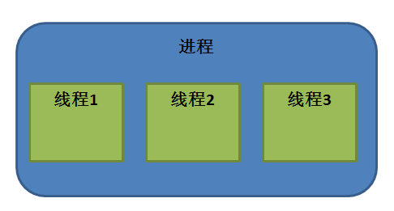

线程
====

线程和进程
----------

从很多Linux的书籍我们都可以这样子描述进程和线程的：进程是资源管理的最小单位，线程是程序执行的最小单位。

没错，这些确实是线程与进程之间的区别，这个描述非常言简意赅，在操作系统设计上，从进程演化出线程，最主要的目的就是减小进程上下文切换开销，这又是怎么一回事呢？在前面的文章已经提到，进程是资源管理的最小单位，那么每个进程都拥有自己的数据段、代码段和堆栈段，这必然就造成了进程在进行切换时都需要有比较复杂的上下文切换等动作，因为要保存当前进程上下文的内容，还要恢复另一个进程的上下文，如果是经常切换进程的话，这样子的开销就过于庞大，因为在进程切换上下文时，需要重新映射虚拟地址空间、进出OS内核、寄存器切换，还会干扰处理器的缓存机制，因此为了进一步减少CPU在进程切换时的额外开销，因此Linux进程演化出了另一个概念——线程。

线程是操作系统能够调度和执行的基本单位，在Linux中也被称之为轻量级进程。在Linux系统中，一个进程至少需要一个线程作为它的指令执行体，进程管理着资源（比如cpu、内存、文件等等），而将线程分配到某个cpu上执行。一个进程可以拥有多个线程，它还可以同时使用多个cpu来执行各个线程，以达到最大程度的并行，提高工作的效率；同时，即使是在单cpu的机器上，也依然可以采用多线程模型来设计程序，使设计更简洁、功能更完备，程序的执行效率也更高。

从上面的这些概念我们不难得出一个非常重要的结论：线程的本质是一个进程内部的一个控制序列，它是进程里面的东西，一个进程可以拥有一个进程或者多个进程，那么它们的关系就如图所示：

   进程与线程
回顾一下进程相关的知识：当进程执行fork()函数创建一个进程时，将创建出该进程的一份新副本。这个新进程拥有自己的变量和自己的PID，它的执行几乎完全独立于父进程，这样子得到一个新的进程开销是非常大的。而当在进程中创建一个新线程时，新的执行线程将拥有自己的栈，但与它的创建者共享全局变量、文件描述符、信号处理函数和当前目录状态，也就是说，它只使用当前进程的资源，而不是产生当前进程的副本。

Linux系统中的每个进程都有独立的地址空间，一个进程崩溃后，在系统的保护模式下并不会对系统中其它进程产生影响，而线程只是一个进程内部的一个控制序列，当进程崩溃后，线程也随之崩溃，所以一个多进程的程序要比多线程的程序健壮，但在进程切换时，耗费资源较大，效率要差一些。但在某些场合下对于一些要求同时进行并且又要共享某些变量的并发操作，只能用线程，不能用进程。

**总的来说：**

-  一个程序至少有一个进程,一个进程至少有一个线程。
-  线程使用的资源是进程的资源，进程崩溃线程也随之崩溃。
-  线程的上下文切换，要比进程更加快速，因为本质上，线程很多资源都是共享进程的，所以切换时，需要保存和切换的项是很少的。

创建线程
--------

在讲解线程编程之前，先了解一个标准：可移植操作系统接口（英语：Portable
Operating System
Interface，缩写为POSIX），POSIX是IEEE为要在各种UNIX操作系统上运行软件，而定义API的一系列互相关联的标准的总称，其正式称呼为IEEE
Std 1003，而国际标准名称为ISO/IEC
9945。此标准源于一个大约开始于1985年的项目。POSIX这个名称是由理查德·斯托曼（RMS）应IEEE的要求而提议的一个易于记忆的名称。它基本上是Portable
Operating System
Interface（可移植操作系统接口）的缩写，而X则表明其对Unix API的传承。

    注：以上介绍来自维基百科：https://zh.wikipedia.org/wiki/POSIX

在Linux系统下的多线程遵循POSIX标准，而其中的一套常用的线程库是 pthread
，它是一套通用的线程库，是由 POSIX
提出的，因此具有很好的可移植性，我们学习多线程编程，就是使用它，必须包含以下头文件：

.. code:: c

        #include <pthread.h>

除此之外在链接时需要使用库libpthread.a。因为pthread的库不是Linux系统的库，所以在编译时要加上
-lpthread 选项。

**pthread_create()**

pthread_create()函数是用于创建一个线程的，创建线程实际上就是确定调用该线程函数的入口点，在线程创建后，就开始运行相关的线程函数。若线程创建成功，则返回0。若线程创建失败，则返回对应的错误代码。

**函数原型：**

.. code:: c

        int pthread_create(pthread_t *thread, const pthread_attr_t *attr,
                            void *(*start_routine) (void *), void *arg);

**参数：**

-  thread：指向线程标识符的指针。
-  attr：设置线程属性。
-  start_routine：start_routine是一个函数指针，指向要运行的线程入口。
-  运行线程时传入的参数。

线程属性
--------

Linux中线程属性结构如下:

.. code:: c

    typedef struct
    {
        int                   etachstate;      //线程的分离状态
        int                   schedpolicy;     //线程调度策略
        structsched_param     schedparam;      //线程的调度参数
        int                   inheritsched;    //线程的继承性
        int                   scope;           //线程的作用域
        size_t                guardsize;       //线程栈末尾的警戒缓冲区大小
        int                   stackaddr_set;   //线程的栈设置
        void*                 stackaddr;       //线程栈的位置
        size_t                stacksize;       //线程栈的大小
    }pthread_attr_t;

注意：因为pthread并非Linux系统的默认库，而是POSIX线程库。在Linux中将其作为一个库来使用，因此加上
-lpthread（或-pthread）以显式指定链接该库。函数在执行错误时的错误信息将作为返回值返回，并不修改系统全局变量errno，当然也无法使用perror()打印错误信息。

线程的属性非常多，而且其属性值不能直接设置，须使用相关函数进行操作，线程属性主要包括如下属性：作用域（scope）、栈大小（stack
size）、栈地址（stack
address）、优先级（priority）、分离的状态（detached
state）、调度策略和参数（scheduling policy and
parameters）。默认的属性为非绑定、非分离、1M的堆栈大小、与父进程同样级别的优先级。下面简单讲解一下与线程属性相关的API接口：

+------------------------------------+----------------------------------------+
| API                                | 描述                                   |
+====================================+========================================+
| pthread_attr_init()              | 初始化一个线程对象的属性               |
+------------------------------------+----------------------------------------+
| pthread_attr_destroy()           | 销毁一个线程属性对象                   |
+------------------------------------+----------------------------------------+
| pthread_attr_getaffinity_np()   | 获取线程间的CPU亲缘性                  |
+------------------------------------+----------------------------------------+
| pthread_attr_setaffinity_np()   | 设置线程的CPU亲缘性                    |
+------------------------------------+----------------------------------------+
| pthread_attr_getdetachstate()    | 获取线程分离状态属性                   |
+------------------------------------+----------------------------------------+
| pthread_attr_setdetachstate()    | 修改线程分离状态属性                   |
+------------------------------------+----------------------------------------+
| pthread_attr_getguardsize()      | 获取线程的栈保护区大小                 |
+------------------------------------+----------------------------------------+
| pthread_attr_setguardsize()      | 设置线程的栈保护区大小                 |
+------------------------------------+----------------------------------------+
| pthread_attr_getscope()          | 获取线程的作用域                       |
+------------------------------------+----------------------------------------+
| pthread_attr_setscope()          | 设置线程的作用域                       |
+------------------------------------+----------------------------------------+
| pthread_attr_getstack()          | 获取线程的堆栈信息（栈地址和栈大小）   |
+------------------------------------+----------------------------------------+
| pthread_attr_setstack()          | 设置线程堆栈区                         |
+------------------------------------+----------------------------------------+
| pthread_attr_getstacksize()      | 获取线程堆栈大小                       |
+------------------------------------+----------------------------------------+
| pthread_attr_setstacksize()      | 设置线程堆栈大小                       |
+------------------------------------+----------------------------------------+
| pthread_attr_getschedpolicy()    | 获取线程的调度策略                     |
+------------------------------------+----------------------------------------+
| pthread_attr_setschedpolicy()    | 设置线程的调度策略                     |
+------------------------------------+----------------------------------------+
| pthread_attr_setschedparam()     | 获取线程的调度优先级                   |
+------------------------------------+----------------------------------------+
| pthread_attr_getschedparam()     | 设置线程的调度优先级                   |
+------------------------------------+----------------------------------------+
| pthread_attr_getinheritsched()   | 获取线程是否继承调度属性               |
+------------------------------------+----------------------------------------+
| pthread_attr_getinheritsched()   | 设置线程是否继承调度属性               |
+------------------------------------+----------------------------------------+

    当然啦，如果不是特别需要的话，可以不需要考虑线程相关属性的，使用默认的属性即可。

初始化一个线程对象的属性
~~~~~~~~~~~~~~~~~~~~~~~~

**函数原型：**

.. code:: c

        int pthread_attr_init(pthread_attr_t *attr);

若函数调用成功返回0，否则返回对应的错误代码。

-  attr：指向一个线程属性的指针

销毁一个线程属性对象
~~~~~~~~~~~~~~~~~~~~

销毁一个线程属性对象，经过pthread_attr_destroy()函数销毁初始化之后的pthread_attr_t结构被pthread_create()函数调用时将会返回错误。

**函数原型：**

.. code:: c

        int pthread_attr_destroy(pthread_attr_t *attr);

若函数调用成功返回0，否则返回对应的错误代码。

-  attr：指向一个线程属性的指针

线程的分离状态
--------------

什么是线程的分离状态呢？在任何一个时间点上，线程是可结合的（joinable），或者是分离的（detached）。一个可结合的线程能够被其他线程收回其资源和杀死；在被其他线程回收之前，它的存储器资源（如栈）是不释放的。相反，一个分离的线程是不能被其他线程回收或杀死的，它的存储器资源在它终止时由系统自动释放。

总而言之：线程的分离状态决定一个线程以什么样的方式来终止自己。

进程中的线程可以调用以下函数来等待某个线程的终止，获得该线程的终止状态，并收回所占的资源，如果对线程的返回状态不感兴趣，可以将rval_ptr设置为NULL。

.. code:: c

        int pthread_join(pthread_t tid, void **rval_ptr)；

除此之外线程也可以调用以下函数将此线程设置为分离状态，设置为分离状态的线程在线程结束时，操作系统会自动收回它所占的资源。设置为分离状态的线程，不能再调用pthread_join()等待其结束。

.. code:: c

        int pthread_detach(pthread_t tid)；

如果一个线程是可结合的，意味着这条线程在退出时不会自动释放自身资源，而会成为僵尸线程，同时意味着该线程的退出值可以被其他线程获取。因此，如果不需要某条线程的退出值的话，那么最好将线程设置为分离状态，以保证该线程不会成为僵尸线程。

如果在创建线程时就知道不需要了解线程的终止状态，那么可以通过修改pthread_attr_t结构中的detachstate属性，让线程以分离状态启动，调用函数如下：

.. code:: c

        int pthread_attr_setdetachstate(pthread_attr_t *attr, int detachstate)；

如果想要获取某个线程的分离状态，那么可以通过以下函数：

.. code:: c

        int pthread_attr_getdetachstate(const pthread_attr_t *attr, int *detachstate);

若函数调用成功返回0，否则返回对应的错误代码。

**参数：**

-  attr：指向一个线程属性的指针。
-  detachstate：如果值为PTHREAD_CREATE_DETACHED，则表示线程是分离状态，如果值为PTHREAD_CREATE_JOINABLE则表示线程是结合状态。

线程的调度策略
--------------

POSIX 标准指定了三种调度策略：

-  分时调度策略 (SCHED_OTHER)。
-  实时调度策略，先进先出方式调度(SCHED_FIFO)。
-  实时调度策略 ，时间片轮转方式调度(SCHED_RR)。

这个属性的默认值为SCHED_OTHER。另外两种调度方式只能用于以超级用户权限运行的进程，因为它们都具备实时调度的功能，但在行为上略有区别。

SCHED_FIFO
是基于队列的调度程序，对于每个优先级都会使用不同的队列，先进入队列的线程能优先得到运行，线程会一直占用CPU，直到有更高优先级任务到达或自己主动放弃CPU使用权。SCHED_RR
与 FIFO
相似，不同的是前者的每个线程都有一个执行时间配额，当采用SHCED_RR策略的线程的时间片用完，系统将重新分配时间片，并将该线程置于就绪队列尾，并且切换线程，放在队列尾保证了所有具有相同优先级的RR线程的调度公平。

与调度相关的API接口如下：

.. code:: c

        int pthread_attr_setinheritsched(pthread_attr_t *attr, int inheritsched);
        int pthread_attr_getinheritsched(const pthread_attr_t *attr, int *inheritsched);

        int pthread_attr_setschedpolicy(pthread_attr_t *attr, int policy);
        int pthread_attr_getschedpolicy(const pthread_attr_t *attr, int *policy);

若函数调用成功返回0，否则返回对应的错误代码。

**参数：**

-  attr：指向一个线程属性的指针。
-  inheritsched：线程是否继承调度属性，可选值分别为

-  PTHREAD_INHERIT_SCHED：调度属性将继承于创建的线程，attr中设置的调度属性将被忽略。
-  PTHREAD_EXPLICIT_SCHED：调度属性将被设置为attr中指定的属性值。

-  policy：可选值为线程的三种调度策略，SCHED_OTHER、SCHED_FIFO、SCHED_RR。

线程的优先级
------------

顾名思义，线程优先级就是这个线程得到运行的优先顺序，在Linux系统中，优先级数值越小，线程优先级越高，Linux根据线程的优先级对线程进行调度，遵循线程属性中指定的调度策略。

获取、设置线程静态优先级（staticpriority）可以使用以下函数，注意，是静态优先级，当线程的调度策略为SCHED_OTHER时，其静态优先级必须设置为0。该调度策略是Linux系统调度的默认策略，处于0优先级别的这些线程按照动态优先级被调度，之所以被称为"动态"，是因为它会随着线程的运行，根据线程的表现而发生改变，而动态优先级起始于线程的nice值，且每当一个线程已处于就绪态但被调度器调度无视时，其动态优先级会自动增加一个单位，这样能保证这些线程竞争CPU的公平性。

线程的静态优先级之所以被称为"静态"，是因为只要你不强行使用相关函数修改它，它是不会随着线程的执行而发生改变，静态优先级决定了实时线程的基本调度次序，它们是在实时调度策略中使用的。

.. code:: c

        int pthread_attr_setschedparam(pthread_attr_t *attr, const struct sched_param *param);
        int pthread_attr_getschedparam(const pthread_attr_t *attr, struct sched_param *param);

**参数：**

-  attr：指向一个线程属性的指针。
-  param：静态优先级数值。

线程优先级有以下特点：

-  新线程的优先级为默认为0。
-  新线程不继承父线程调度优先级(PTHREAD_EXPLICIT_SCHED)
-  当线程的调度策略为SCHED_OTHER时，不允许修改线程优先级，仅当调度策略为实时（即SCHED_RR或SCHED_FIFO）时才有效，并可以在运行时通过pthread_setschedparam()函数来改变，默认为0。

线程栈
------

线程栈是非常重要的资源，它可以存放函数形参、局部变量、线程切换现场寄存器等数据，在前文我们也说过了，线程使用的是进程的内存空间，那么一个进程有n个线程，默认的线程栈大小是1M，那么就有可能导致进程的内存空间是不够的，因此在有多线程的情况下，我们可以适当减小某些线程栈的大小，防止进程的内存空间不足，而某些线程可能需要完成很大量的工作，或者线程调用的函数会分配很大的局部变量，亦或是函数调用层次很深时，需要的栈空间可能会很大，那么也可以增大线程栈的大小。

获取、设置线程栈大小可以使用以下函数：

.. code:: c

        int pthread_attr_setstacksize(pthread_attr_t *attr, size_t stacksize);
        int pthread_attr_getstacksize(const pthread_attr_t *attr, size_t *stacksize);

**参数：**

-  attr：指向一个线程属性的指针。
-  stacksize：线程栈的大小。

线程退出
--------

在线程创建后，系统就开始运行相关的线程函数，在该函数运行完之后，该线程也就退出了，这是线程的一种隐式退出的方法，这与我们进程的退出差不多，进程完成工作后就会退出。而另一种退出线程的方法是使用pthread_exit()函数，让线程显式退出，这是线程的主动行为。这里要注意的是，在使用线程函数时，不能随意使用exit()退出函数来进行出错处理，这是因为exit()函数的作用是使调用进程终止，而一个进程往往包含多个线程，因此，在使用exit()之后，该进程中的所有线程都会被退出，因此在线程中只能调用线程退出函数pthread_exit()而不是调用进程退出函数exit()。

函数原型：

.. code:: c

    void pthread_exit(void *retval);

**参数：**

-  retval：如果retval不为空，则会将线程的退出值保存到retval中，如果不关心线程的退出值，形参为NULL即可。

一般情况下，进程中各个线程的运行是相互独立的，线程的终止并不会相互通知，也不会影响其他的线程，终止的线程所占用的资源不会随着线程的终止而归还系统，而是仍为线程所在的进程持有，这是因为一个进程中的多个线程是共享数据段的。从前面的文章我们知道进程之间可以使用wait()系统调用来等待其他进程结束一样，线程也有类似的函数：

.. code:: c

        int pthread_join(pthread_t tid, void **rval_ptr)；

如果某个线程想要等待另一个线程退出，并且获取它的退出值，那么就可以使用pthread_join()函数完成，以阻塞的方式等待thread指定的线程结束，当函数返回时，被等待线程的资源将被收回，如果进程已经结束，那么该函数会立即返回。并且thread指定的线程必须是可结合状态的，该函数执行成功返回0，否则返回对应的错误代码。

**参数：**

-  thread: 线程标识符，即线程ID，标识唯一线程。
-  retval: 用户定义的指针，用来存储被等待线程的返回值。

需要注意的是一个可结合状态的线程所占用的内存仅当有线程对其执行立pthread_join()后才会释放，因此为了避免内存泄漏，所有线程的终止时，要么已被设为DETACHED，要么使用pthread_join()来回收资源。

线程实验
--------

我们在日常使用的情况下，若非特别需要，几乎不需要修改线程的属性的，我们今天做一个线程的实验，实验中创建一个进程，线程的属性是默认属性，在线程执行完毕后就退出，代码如下：

.. code:: c

    #include <unistd.h>
    #include <fcntl.h>
    #include <stdio.h>
    #include <stdlib.h>
    #include <pthread.h>

    void *test_thread(void *arg)
    {
        int num = (unsigned long long)arg; /** sizeof(void*) == 8 and sizeof(int) == 4 (64 bits) */

        printf("arg is %d\n", num);

        pthread_exit(NULL);
    }

    int main(void)
    {
        pthread_t thread;
        void *thread_return;
        int arg = 520;
        int res;

        printf("start create thread\n");

        res = pthread_create(&thread, NULL, test_thread, (void*)(unsigned long long)(arg));
        if(res != 0)
        {
            printf("create thread fail\n");
            exit(res);
        }

        printf("create treads success\n");
        printf("waiting for threads to finish...\n");

        res = pthread_join(thread, &thread_return);
        if(res != 0)
        {
            printf("thread exit fail\n");
            exit(res);
        }

        printf("thread exit ok\n");

        return 0;
    }

进入\ ``system_programing/thread``\ 目录下执行make编译源码，然后运行，实验现象如下：

.. code:: bash

    ➜  thread git:(master) ✗ ./targets 

    start create thread
    create treads success
    waiting for threads to finish...
    arg is 520
    thread exit ok

